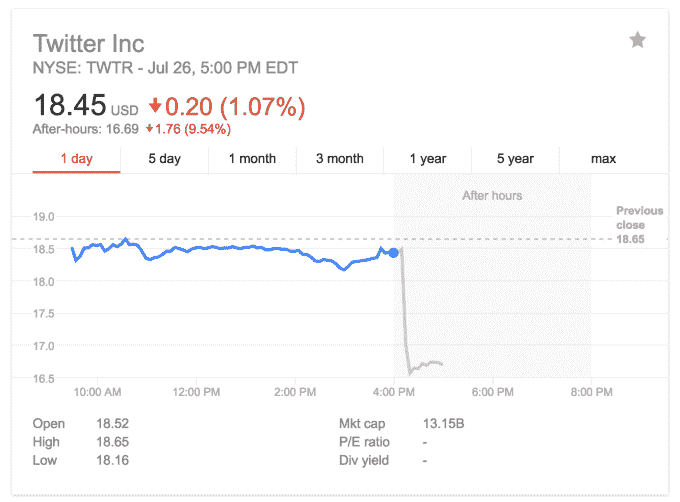

# 压倒 Twitter 的新数据:收入增长率从 60%降至 20%

> 原文：<https://web.archive.org/web/https://techcrunch.com/2016/07/26/shrinking-wings/>

# 压倒 Twitter 的新数字:收入增长率从 60%下降到 20%

Twitter 有一个新的数据正在扼杀其股价，继糟糕的收益之后，其股价在盘后时间下跌了 9.5%。

首先是仍然困扰 it 的用户增长问题。Twitter 的月用户数本季度增长不到 1%，今年仅增长 3%，至 3.13 亿 MAU。但是现在它的[广告收入增长](https://web.archive.org/web/20230406032633/http://www.recode.net/2016/4/27/11586476/twitter-is-going-to-have-a-hard-time-fixing-its-ad-problem)问题已经恶化。

现在 Twitter 正面临着一场**总收入增长危机。**

今天，它宣布其年同比收入增长率仅为 19.9%，从 5.02 亿美元增长到 6.02 亿美元。这低于一年前 60.93%的收入增长率和两年前 124.12%的增长率。

没有几十个新用户向其展示广告，一些营销人员质疑 Twitter 更容易出错的格式(如赞助推文)的表现，其收入增长直线下降，华尔街对此一点也不喜欢。

Twitter 将不得不希望来自其与 NFL、MLB 和 NHL 等联盟的日益增长的[直播体育合作伙伴](https://web.archive.org/web/20230406032633/https://techcrunch.com/2016/07/25/twitter-mlb-nhl/)的视频广告收入能够拯救它。屏幕上方流畅而有用的流格式，下面是相关推文的河流，将第一个和第二个屏幕结合成一种令人上瘾的体验。Twitter 为观看民主党和共和党全国代表大会提供了类似的体验，并可以继续扩展格式，以包括电视节目首播等戏剧性内容。

如果 Twitter 能够说服用户在它的应用程序中而不是在电视上观看，穿插的视频广告可能会要价很高，这可能会挽救其收入增长率