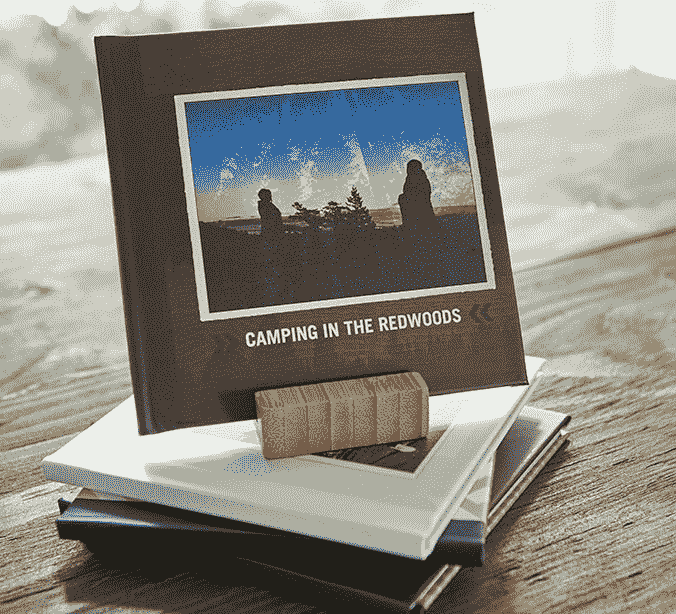

# Shutterfly 推出 TripPix，这是一种从你的 iPhone 上创建旅行相册的快捷方式 

> 原文：<https://web.archive.org/web/https://techcrunch.com/2015/06/10/shutterfly-launches-trippix-a-quick-way-to-create-travel-photo-books-from-your-iphone/>

如今，我们的许多手机照片被抓拍、分享，然后被遗忘。但是照片出版公司 Shutterfly 已经建立了一项业务，基于一些人希望对他们的照片做更多事情的想法——将它们变成印刷品、卡片、礼物、书籍等等。今天，Shutterfly 发布了一款针对年轻人群的新应用，名为 [TripPix](https://web.archive.org/web/20221007035522/http://www.shutterfly.com/TripPix/) ，它可以将旅行照片变成价格实惠的相册，而不必摆弄布局或从各种纸张类型或其他选项中进行选择。

任何曾经在网上建立过相册的人都知道，这最终会是一个耗时的过程。你不仅要从几十张糟糕的照片中筛选出值得收录的照片，还要找出它们应该出现在页面上的什么位置，并定制带有标题和文字的条目。

TripPix 旨在减少制作这本书所需的时间。该公司表示，你可以在大约 5 分钟内拍摄 15 至 30 张照片，然后将它们变成一本旅行书籍，而不是花几个小时来创作。测试过程就像描述的那样简单。启动应用程序后，您无需创建帐户即可开始使用——您只需让它访问您的照片库，然后开始点击您想要包含的照片。

在你选择了至少十五种之后，你从三种“风格”中选择一种来描述你的旅行——“大冒险”、“城市故事”或“大逃亡”这些将决定这本书的封面和整体外观。

TripPix 使用您照片的位置数据，让您可以选择在相册中的照片旁边添加一张地图——例如，这非常适合您从一个城市到另一个城市的旅行。若要选择哪些照片将包含地图，您只需轻按该照片组旁边的勾号。

[gallery ids="1169588，1169587，1169586，1169585，1169589"]

然后，你加上和你一起的其他人的名字，点击图标来报告你旅行期间的天气情况。您还可以点击图标，指示您在那里做了什么(例如，博物馆、购物、观光、表演、动物园、体育、公园等。)显然是针对年轻人群的，甚至还有“自拍”和“High Times”选项，并配有一个盆栽叶子图标。其他图标包括交通和餐饮模式的图标。这些图标用于装饰书中的页面。

在给这本书命名后，它就可以发货了。这本 6×6 的书定价合理，为 19.99 美元，包括免费送货，一周内送达。它还配有一个竹制支架，你可以把它支撑起来展示。

当我试用时，我能够在不到五分钟的时间内完成图书创作部分——这个过程的较长部分涉及到建立你的 Shutterfly 帐户，如果你还没有的话，当你准备订购时。

如今市场上有很多制作相册的工具，包括 Shutterfly 本身、MixBook、Snapfish，甚至更大的零售商，如沃尔玛和沃尔格林，消费者可以在网上或通过店内自助终端购买图书。

但 TripPix 似乎最有竞争力的是 MixBook 的马赛克应用程序，它提供一个 7×7 的相册，里面有 20 张照片，售价 20 美元(不含运费)。两者都旨在提供一种使用智能手机照片构建图书的廉价而快速的方式，但 Shutterfly 的免费送货意味着它在价格上比 Mosaic 略低。(也小了一点。)然而，Mosaic 的书旨在展示任何种类的照片，而 TripPix 显然是为旅行故事定制的。

TripPix 是 iTunes 上的免费下载。