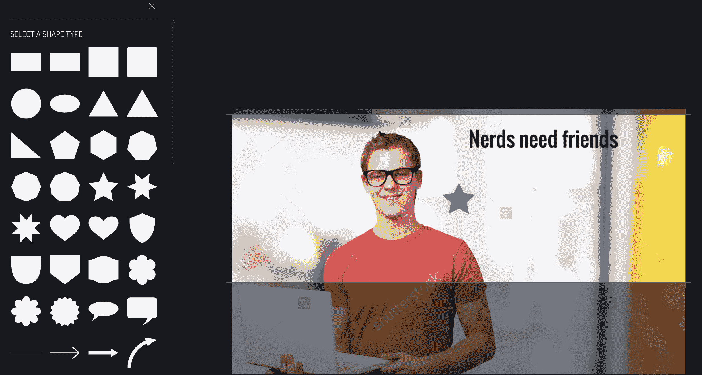

# Shutterstock 增加了一个图像编辑器，可以将你的库存照片清空

> 原文：<https://web.archive.org/web/https://techcrunch.com/2017/01/26/shutterstock-adds-an-image-editor-to-unstock-your-stock-photos/>

# Shutterstock 添加了一个图像编辑器来取消库存照片

股票图片网站 [Shutterstock](https://web.archive.org/web/20230326200811/http://shutterstock.com/editor) 自 2003 年就已经存在，但现在股票图片网站得到了 21 世纪的升级。该网站现在有一个内置的照片编辑器，可以让你为社交媒体、分享和博客创建巧妙的图片。

这个工具相当简单——你可以给照片添加文字和图像，还可以添加滤镜——但是很有趣。驱动力很简单:用户会为下载付费，但在试图编辑时却被卡住了。通过让编辑器变得非常简单——事实也确实如此——他们可以为库存图片提供更多的可用性。

“我们开始听到客户说，他们想要更多的工具和功能来帮助他们创造完美的形象。下载后，许多人仍然需要对他们的图像进行裁剪、调整大小或添加滤镜，”首席产品官凯瑟琳·乌尔里希说。“这些编辑工作正在其他地方进行。有了 Editor，我们不仅简化了流程，还让非设计人员更直观、更容易地执行基本设计技术。我们消除了障碍，让顾客能够在购买前预览作品。”

“这是 Shutterstock 首次进入工作流来帮助解决客户的问题。"

该工具很受希望快速下载和创建图像的小型企业主的欢迎。该编辑器包括多个模板和主题，以及为脸书、Instagram 和 Twitter 预先裁剪的大小。我们的目标是让编辑网站上的数千张照片变得非常简单，无需下载图像编辑器或购买 Pixelmator 或 Photoshop 等工具。就像我们玩过的其他在线编辑工具一样，包括 [Gravit](https://web.archive.org/web/20230326200811/https://techcrunch.com/2016/01/22/gravit-lets-you-illustrate-in-your-abode-or-on-the-road/) 它相当有限，但正在变得越来越好——这可以说是目前大多数基于浏览器的工具。

[gallery ids="1443899，1443898，1443896，1443895，1443894"]