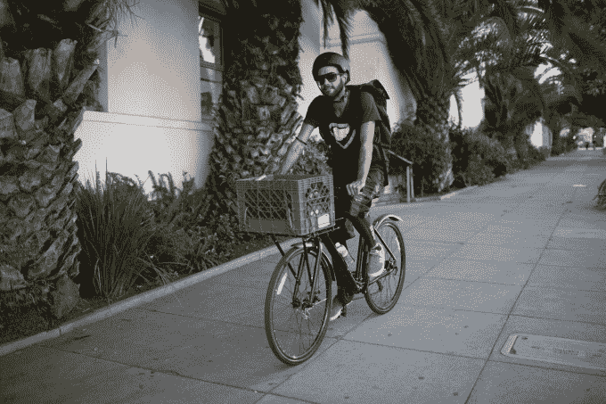
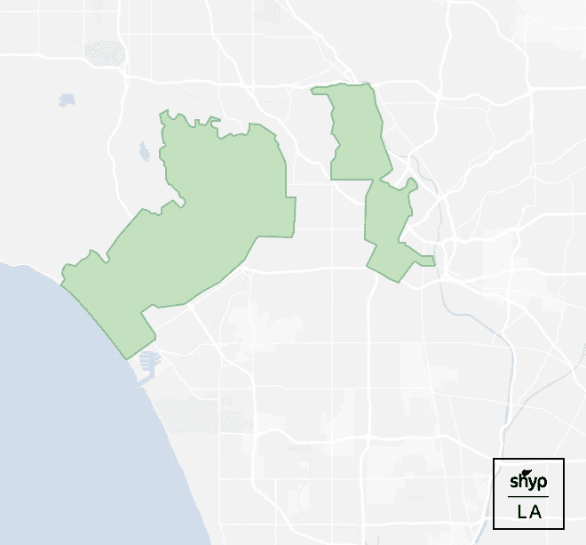

# Shyp 确认融资 5000 万美元，在洛杉矶推出测试服务 

> 原文：<https://web.archive.org/web/https://techcrunch.com/2015/04/21/shyp-launches-beta-service-in-los-angeles/>

# Shyp 确认融资 5000 万美元，在洛杉矶推出测试服务

按需航运服务 [Shyp](https://web.archive.org/web/20221205164952/http://www.shyp.com/) 今天在它的第四个城市洛杉机推出服务。

除了宣布在洛杉矶推出之外，Shyp 还[证实它已经筹集了另外 5000 万美元](https://web.archive.org/web/20221205164952/http://blog.shyp.com/shyp-50-million-series-b/)的资金，正如[几周前报道的](https://web.archive.org/web/20221205164952/https://beta.techcrunch.com/2015/04/02/sources-shyp-is-raising-50-million-at-a-250-million-valuation/)。kleiner Perkins cau field&Byers 领投了 B 轮融资，之前的投资者也包括 Homebrew 和 Sherpa Ventures。这一轮使 Shyp 的总资金达到 6220 万美元。KPCB 的约翰·杜尔登将加入 Shyp 的董事会。

这家初创公司的快递员将在圣莫尼卡、威尼斯、西好莱坞、贝弗利山的部分地区和市中心收取包裹和退货。总的来说，Shyp 称之为测试版的这一早期项目将在南加州的第一个落脚点覆盖 70 平方英里。

Shyp 营销负责人 Lauren Sherman 告诉 TechCrunch，在洛杉矶启动的团队正在解决比以前任何进入新城市的团队更多的早期兴趣。自从在迈阿密推出以来，他们已经在自己的网站上为该地区建立了一个页面[，并且他们已经从对这项服务感兴趣的人那里收集了“数千”封电子邮件和邮政编码。](https://web.archive.org/web/20221205164952/http://www.shyp.com/LA)

这个集合实际上是 Shyp 决定首先解决洛杉矶的哪些部分的方法。根据这些数据，它决定上述地区是最受关注的地区。由于它带来了对充当快递员感兴趣的人，它安排他们覆盖特定的区域，这样快递员可以跳过城市臭名昭著的交通，只专注于收集当地的包裹。移动货车作为收集的第二层，从他们所在地区的快递员那里收取包裹，而不是让他们返回基站实际发送东西。

鉴于 Shyp 是作为测试版推出的，并不是洛杉矶服务区域的每个人今天都可以访问 Shyp。谢尔曼表示，推广将在未来几周内进行，随着该服务调整其快递和货车位置以最好地满足早期需求，新的潜在客户将加入用户群。

