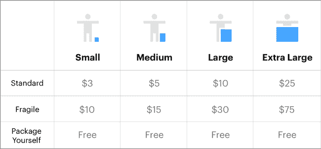
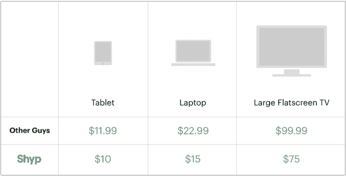

# Shyp 向所有客户推出新的包装定价模式

> 原文：<https://web.archive.org/web/https://techcrunch.com/2016/05/02/shyp-rolls-out-its-new-packaging-pricing-model-to-all-customers/>

# Shyp 向所有客户推出其新的包装定价模式

Shyp 已经向所有客户推出了新的包装定价模型，包括基于公司提供的包装的可变运输定价。

Shyp 仍然在尝试它的商业模式，当然，随着时间的推移，这些调整会越来越多。按需服务的单位经济学并不像 5 美元的费用(加上邮费)那么简单，它需要一种更精细的方法，而不是一种一刀切的模型。随着时间的推移，这并不是 Shyp 对其商业模式做出的唯一改变——它最近为其在线退货额外收取了 5 美元的手续费。当然，所有这一切都在不断变化，因为 Shyp 努力找出在不疏远其用户基础的情况下赚钱的最佳方式。

在过去的四个月里，新的定价已经向一批批客户推出，但今天该公司完成了推出，并在一篇博客文章中公布了新的定价。Shyp 在 1 月份左右开始向客户推出新的定价。公司[在《快公司》的一篇文章](https://web.archive.org/web/20230321050850/http://www.fastcompany.com/3055813/most-innovative-companies/how-shyp-is-shaking-up-shipping)中开玩笑说，它将在那个时候开始对其包装进行更多的模块化定价。今天，我们通过电子邮件通知了其余客户新的价格。

基本上，对于更大或更易碎的包装，包装成本会更贵。当然，这很有道理——运输一辆自行车比运输一台笔记本电脑或一套小银器更难，也更贵。Shyp 快递员必须更加小心易碎的包裹，这需要更多的时间和资源。因此，随着该公司在其运营的城市开始盈利，它会对其运输模式做出一些改变也就不足为奇了。

最终的推出与一篇正式宣布价格变化的博客文章相吻合。自己包装货物的客户仍然不会支付包装费用，而是只需支付 5 美元的上门取件和保险费用。

Shyp 的一名代表说，自从推出新的包装费，该公司已经看到了 10%的用户谁有价格更新转换增加。这意味着那些收取打包费的用户，以及对费用的解释，应用内会话转化为实际取件的时间增加了 10%。一位代表说，该公司将此归功于对包装的信心。

Shyp 还签署了一些大规模交易，这将有助于提高其出货量。Shyp 最近正式与易贝整合，允许卖家通过其取件服务运送包裹。Shyp 的发货在 6 月 30 日之前对易贝卖家仍然是免费的，该公司早些时候表示，在试点期间使用该集成的近一半人从未在易贝销售过产品。该公司表示，在试点期间，现有卖家的产品出货量增加了 60%。

所有这些都是为了寻找改善该公司商业模式的方法，事实证明，与最初的宣传相比，该公司需要一种略有不同的方法来实现盈利。该公司最近撤出了迈阿密，尽管它在早些时候的一篇文章中告诉 Fast Company[它的月环比增长率约为 20%](https://web.archive.org/web/20230321050850/http://www.fastcompany.com/3055813/most-innovative-companies/how-shyp-is-shaking-up-shipping)。Shyp [最近在一轮融资中筹集了 5000 万美元，对该公司的估值为 2.5 亿美元](https://web.archive.org/web/20230321050850/https://techcrunch.com/2015/04/02/sources-shyp-is-raising-50-million-at-a-250-million-valuation/)——如果它要证明这一估值是合理的，它将需要继续调整其商业模式，因为它正在寻找一种成为一家盈利、持久公司的方法。