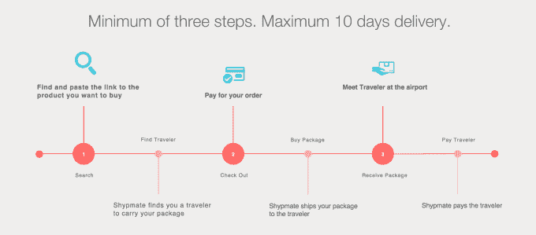

# Shypmate 付钱给旅行者，让他们把产品带到加纳和尼日利亚

> 原文：<https://web.archive.org/web/https://techcrunch.com/2016/01/28/shypmate-pays-travelers-to-bring-products-to-ghana-and-nigeria/>

作为 Y Combinator 2016 年冬季批次的一部分，Shypmate 是一种快速、低成本的国际运输解决方案，依靠日常生活中的人们将物品从美国运输到加纳和尼日利亚。

为什么是加纳和尼日利亚？Shypmate 联合创始人佩里奥格乌切告诉 TechCrunch，创始团队(见上图)的成员来自加纳和尼日利亚，他们熟悉这两个非洲市场，并且需要这种服务。T4 的 Shypmate 说，尼日利亚的购物者平均需要五周时间才能收到来自美国的包裹。这也是一个非常昂贵的过程。

Ogwuche 说，在 Shypmate 的测试中，DHL 将一双价值 50 美元的鞋子运送到加纳，耗时约一周，花费 250 美元。使用 Shypmate，运输成本仅为 25 美元。Shypmate 保证在从零售商处收到商品后的 5-10 天内发货，但平均发货时间只有 3-5 天。其次，尼日利亚和加纳的人在美国买不到很多东西，因为一些商店，比如 H&M 和 Zara，不会向这些国家发货。

Ogwuche 说:“美国成百上千的其他商店，人们真的想从他们那里买东西，但他们不会送到那些国家。”“所以人们最终做的是试图做我们试图解决的同样的事情。他们试图找到下来的人或找到亲戚，他们把它运送给一个亲戚，这个亲戚保管它几个月[直到他们来到加纳或尼日利亚]。它已经在以非常低效的方式和非常低的规模发生。”

对于加纳和尼日利亚的购物者来说，他们所需要做的就是给 Shypmate 发送一个链接，指向他们想要购买的任何东西。Shypmate 负责从购买到交付的整个过程。旅行者最初可能会想到的一些恐惧可能是，“但如果我最终携带了非法物品怎么办？”Shypmate 经常被问到这个问题，这是不可能的，Ogwuche 说。

“这些物品不是来自人，”奥格武切说。“我们不提供不是通过 Shypmate 购买的商品。旅行者带的东西来自可信的电子商务商店，比如亚马逊、Zara 或易贝，或者任何在线商店。他们直接来自他们。”

对美国人来说是这样的:假设你计划去加纳或尼日利亚旅行，你的行李中有一些额外的空间。你可以去 Shypmate 和[注册成为旅行者](https://web.archive.org/web/20230323015509/http://www.shypmate.com/traveler)，分享你的航班信息，并为你提供接收物品的最佳地址。在你被批准之前，Shypmate 会进行背景调查。

一旦你到达加纳或尼日利亚，购物者会在机场迎接你。一旦交易完成，你将得到 Shypmate 所得的 70%。平均而言，Shypmate 旅行者每次旅行能赚 100 美元。一个害羞的旅行者 11 月去了加纳，最后赚了 370 美元。(旁注:当 Ogwuche 告诉我这件事时，我惊讶得目瞪口呆，因为去年 8 月我去加纳和尼日利亚时，在飞机票上花了大约 1000 美元。那 370 美元对抵消我的旅行费用来说是很不错的。)

在过去的两个月里，Shypmate 已经促成了 150 多项交易，保证了 100%的满意度，并且每周增长 10%。到目前为止，人们已经将 Shypmate 用于鞋子、织物、iPhones、笔记本电脑、珠宝和其他产品。对于购物者来说，Shypmate 的费用是基于产品的重量、大小和价格，以及旅行者携带产品的意愿。Shypmate 的业务取决于实际上有多少人从美国前往加纳和尼日利亚。Ogwuche 说，一年中，超过 20 万人从美国前往尼日利亚或加纳。

“供应部分不会成为问题，”Ogwuche 说。“事实是，我们每周都有几名游客，他们可以满足很多需求。总的来说，我们有 35 个左右的旅行者，他们满足了我们所有的 100 多批货物。你只需要少量的游客就能满足大量的需求。”

在 Y Combinator 之后，Shypmate 可能会搬到纽约，那里直飞加纳和尼日利亚的航班比旧金山湾区多。Shypmate 还希望将其产品扩展到其他国家。

“我们对此有一个全球视野，”奥格武切说。“这不仅仅是非洲国家需要的。我们已经收到了来自世界各地的人的请求，像在香港，在最随机的地方说他们需要这种东西。人们想从不同的地方买到很多他们买不到的东西，比如澳大利亚的葡萄酒，或者这种古龙水，他们不一定在美国销售，但在迪拜销售。”

目前，如果你在美国，并计划去加纳或尼日利亚旅行，你可能希望[考虑注册成为一名 Shypmate 旅行者](https://web.archive.org/web/20230323015509/http://www.shypmate.com/)，以帮助抵消你的旅行费用。