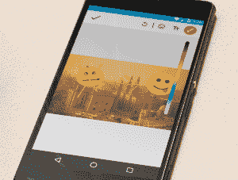

# Android 更新信号避开审查，添加贴纸和涂鸦 

> 原文：<https://web.archive.org/web/https://techcrunch.com/2016/12/22/signal-for-android-egypt-uae-stickers/>

# Android 更新的信号避开了审查，增加了贴纸和涂鸦

随着对网络隐私的主流兴趣的增长， [Signal](https://web.archive.org/web/20221006234906/https://beta.techcrunch.com/tag/signal/) 也想随之增长。本周，这款应用增加了两个功能，一个是对国际审查的严肃回应，另一个是一套轻便、松散的功能，旨在让这款应用对那些可能不熟悉加密技术的人更加友好。

正如 [Open Whisper Systems 博客](https://web.archive.org/web/20221006234906/https://whispersystems.org/blog/doodles-stickers-censorship/)上的一篇帖子所详述的那样，最新的 Signal 更新(目前仅适用于 Android)通过在之前构建[域来绕过埃及和阿联酋国家支持的审查，这是该应用的使用将自己伪装成另一项服务的互联网流量的一种方式。](https://web.archive.org/web/20221006234906/https://www.bamsoftware.com/papers/fronting/)

Signal 在博文中解释说:“随着足够多的大规模服务成为领域前沿，禁用 Signal 开始看起来像禁用互联网。”“当这些用户向 www.google.com 发送信号消息时，它将看起来像一个普通的 HTTPS 请求。”

除了审查变通办法，Signal 更新了它的 Android 应用程序，增加了一些有趣的功能，允许用户在 Snapchat、脸书和其他主流社交应用程序的照片上添加贴纸和涂鸦。

以下是 Android 的 [Signal 版本 3.25.3 的完整变更列表:](https://web.archive.org/web/20221006234906/https://play.google.com/store/apps/details?id=org.thoughtcrime.securesms&hl=en)

*   支持添加贴纸和涂鸦的图像。
*   更新表情包！
*   支持视频缩略图。
*   对彩信使用缩减采样 gif。
*   支持在埃及和阿联酋规避审查
*   错误修复和性能改进。

就真正的私人消息服务而言，Signal 现在特别适合广泛采用。首先，该应用的用户界面更像苹果的 Messages 应用，而不是更神秘的加密通信形式，如 [PGP](https://web.archive.org/web/20221006234906/https://beta.techcrunch.com/tag/pgp/) 。Open Whisper 系统还为新的知名应用提供端到端功能，如 [Facebook Messenger](https://web.archive.org/web/20221006234906/https://beta.techcrunch.com/2016/07/08/messenger-adds-end-to-end-encryption/) 、 [Allo](https://web.archive.org/web/20221006234906/https://beta.techcrunch.com/2016/05/19/google-engineer-says-hell-push-for-default-end-to-end-encryption-in-allo/) 和 [WhatsApp](https://web.archive.org/web/20221006234906/https://beta.techcrunch.com/2016/04/05/whatsapp-completes-end-to-end-encryption-rollout/) 。除此之外，Signal 本身在最近几个月已经起飞，在选举之后有相当大的用户增长。

Signal 的开源根源和强大的隐私保护使其成为隐私领域知名人士的最爱，这也促进了其采用。一个完美的 [EFF 记分卡评级](https://web.archive.org/web/20221006234906/https://www.eff.org/node/82654)(旧评级，该组织正在制定当前记分卡)和爱德华·斯诺登的认可也不会有什么坏处。如果这还不足以说服你，看，贴纸！