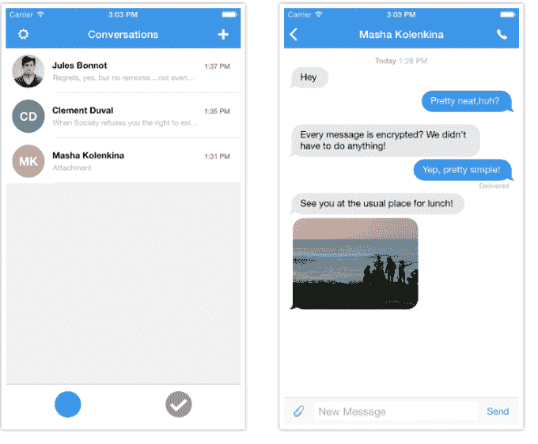

# Signal 让你的 iPhone 电话和短信免受政府间谍的骚扰

> 原文：<https://web.archive.org/web/https://techcrunch.com/2015/03/05/signal-keeps-your-iphone-calls-and-texts-safe-from-government-spies/>

# 信号保护你的 iPhone 电话和短信免受政府间谍的骚扰

不想让别人把你的短信、图片、视频或电话对话交给政府？有一个应用程序可以解决这个问题。

一个名为 Signal 的 iOS 应用程序是 Open Whisper Systems 的一个项目，Open Whisper Systems 是一个非营利性的黑客团体，致力于使窥探政府的眼睛更难获得你的信息。作为保护你隐私的综合解决方案，它得到了美国公民自由联盟和 T2 电子前沿基金会的高度评价。

该应用程序的第二个版本于本周在 App Store 上发布，它可以在 iPhone 之间免费发送加密的群组、文本、图片和视频消息。对于那些想在 Android 上与朋友分享的人来说，这个社区组织目前有两个 Android 应用程序——text secure 和 red phone——需要结合起来才能做和 Signal 在 iOS 上做的一样的事情。TextSecure 是短信解决方案，RedPhone 是加密电话解决方案。该计划是将这两个应用程序合并成一个 Android 应用程序，供 Signal 用户使用。

最近的安全漏洞和其他事件促使大量承诺手机之间加密通信的应用程序出现。荷兰 SIM 卡制造商金雅拓只是众多涉嫌政府黑客攻击的[公司中的一家。](https://web.archive.org/web/20230225041924/https://techcrunch.com/2015/02/19/the-nsa-reportedly-stole-millions-of-sim-encryption-keys-to-gather-private-data/)

与此同时，在爱德华·斯诺登(Edward Snowden)披露美国国家安全局从几家硅谷科技巨头那里获取美国公民的私人数据后，几家科技公司决定采取隐私措施。创造信号是为了让那种大规模收集变得太难。

“即使我们想，我们也不能把你的信息交给任何人，”创始人莫邪·马林斯派克在电话中告诉我。

马林斯派克熟悉加密技术。他创立了基于云的密码破解服务 [ChapCrack](https://web.archive.org/web/20230225041924/https://github.com/moxie0/chapcrack/blob/master/README.md) ，并且之前负责 Twitter 的安全团队。

“我们的想法是将信息扰乱得如此之好，以至于不值得继续下去。马林斯派克说:“我们想让你的信息变得不值得追踪。

还有其他的加密应用和工具，如 [CryptoCat](https://web.archive.org/web/20230225041924/https://crypto.cat/) 、 [iMessage](iMessage%20) 或 [PGP](https://web.archive.org/web/20230225041924/http://en.wikipedia.org/wiki/Pretty_Good_Privacy) (相当好的隐私)用来保护你的隐私。但是 Signal 在它的安全信息记分卡上达到了电子前沿基金会的所有七项安全标准。

让 NSA 在获取你的数据的斗争中更加沮丧的是，Signal 的代码是开源的。这意味着任何人都可以去 [GitHub](https://web.archive.org/web/20230225041924/https://github.com/whispersystems/signal-ios) 使用源代码创建加密应用。WhatsApp [最近将](https://web.archive.org/web/20230225041924/https://techcrunch.com/2014/11/18/end-to-end-for-everyone/) Open Whisper 系统的代码整合到其应用的安卓版本中。

马林斯派克说:“我们希望尽可能多的人在他们的应用程序中嵌入这一功能，这样就没有人能获取你的信息。”。