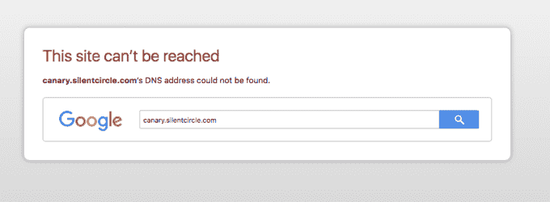
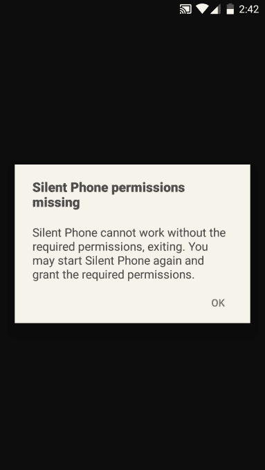

# Silent Circle 默默地熄灭了它的权证金丝雀——但声称这是一个“商业决定”

> 原文：<https://web.archive.org/web/https://techcrunch.com/2016/07/05/silent-circle-silently-snuffs-out-its-warrant-canary-but-claims-its-a-business-decision/>

Silent Circle 是加密消息应用程序和安全加固 Android 智能手机 Blackphone 的制造商，它已经停止了其[权证金丝雀](https://web.archive.org/web/20230217193440/https://canary.silentcircle.com/)。

尝试访问之前托管过的[页面会导致以下通知:](https://web.archive.org/web/20230217193440/https://canary.silentcircle.com/)

在 2013 年斯诺登披露政府监控项目的程度后，权证金丝雀开始流行，作为一种默认的途径，向用户表明服务可能因政府要求用户数据而受到损害。

金丝雀是美国禁言令的一个变通办法，该禁令禁止公司公开披露用户请求的授权，方法是发布一份明确声明，表明他们迄今为止没有收到任何用户数据的授权——如果金丝雀被移除或没有更新，则允许发出相反的信号。

至少理论上是这样；虽然金丝雀可能最终会造成混乱，而不是提高透明度，因为它只能提供部分信号，而不是明确的确认。“自我感觉良好的安全剧场”是我听到的针对他们的一种批评。

TechCrunch 被一位读者告知 Silent Circle 的死金丝雀，然而该公司声称，停止金丝雀是“商业决定”——不是因为它收到了“任何授权”。

“我们没有收到获取用户数据的授权令，”Silent Circle 总法律顾问马特·尼德曼(Matt Neiderman)告诉 TechCrunch。“作为我们专注于提供企业软件平台的一部分，我们一段时间前停止了我们的认股权证金丝雀。该决定是一项商业决定，与我们尚未收到的任何用户数据授权无关。”

该公司之前在权证金丝雀上遇到过问题，包括去年 3 月[在更新中遗漏了一份声明，他们随后补充了这份声明。所以它在这里已经有一段曲折的历史了。](https://web.archive.org/web/20230217193440/http://www.zdnet.com/article/silent-circle-denies-secret-gag-order-data-warrant/)

在之前的一些问题发生时，奈德曼声称该公司没有收到“任何类型”的认股权证。但他在最近一次事件中的否认措辞可能不那么明确。我们已经要求他确认 Silent Circle 是否已经收到了任何类型的搜查令，并将更新这个帖子的任何回复。

**更新:**奈德曼进一步补充道:“我们还没有收到搜查令。我们前一段时间做出的停止[认股权证金丝雀]的决定不会产生任何安全风险，这是一个商业决定，将我们自己定位为一家专注于企业的软件公司，提供安全的通信，并为企业客户提供符合任何法律信息要求的工具和能力。我们的服务或隐私级别没有任何变化。由于我们采用了同行评审的端到端加密技术，从定义上来说，我们无权访问也不能向任何人提供客户数据，而且我们的端到端加密技术仍然是公开的开源技术，可供同行评审和测试。我们不会向任何人提供后门，无论我们是否有权证金丝雀，我们也不会这样做。句号。”

同样值得注意的是，该公司的总部并不在美国——之前它将总部从加勒比海搬到了瑞士，因为据[称](https://web.archive.org/web/20230217193440/http://www.bizjournals.com/washington/blog/techflash/2014/05/silent-circle-switzerland-mike-janke.html)瑞士是欧洲国家“世界上最好的”宪法隐私保护。(然而，其他总部不在美国的加密通信公司，如德国的 [Tutanota](https://web.archive.org/web/20230217193440/https://tutanota.com/blog/posts/transparency-report) ，出于透明和良好实践的目的，继续保留权证金丝雀，尽管它们在所在国不受法律禁令的限制。)

在讨论 Silent Circle 停止其权证金丝雀的决定时，英国安全评论员 Graham Cluley 表示这一举动看起来很奇怪。

> 这似乎是一个奇怪的商业决定。

“我认为，像 Silent Circle 这样的公司会有足够的常识，知道如果它停止发行金丝雀权证，会有很多人担心。因此，明智的做法是——如果这是某种商业决定，我无法想象养一只权证金丝雀真的需要这么多工作——应该是公开、开放和透明的，”他说。“但悄悄地消灭它似乎有些奇怪。

“如果这真的是一个商业决定，为什么不公开呢？尤其是对于一家在这种圈子里工作的公司来说……你会(也)预料到停止这样的事情可能会对他们的业务不利。可能会引起顾客的担忧。因此，这似乎是一个奇怪的商业决定。”

总部位于瑞士的加密电子邮件服务 ProtonMail 的联合创始人安迪·延(Andy Yen)也很难相信 Silent Circle 迄今不会收到任何逮捕令。

“ProtonMail 已经收到了约 30 份认股权证，仅上个季度就收到了 10 多份。我们现在每个月都会收到几封。他告诉 TechCrunch:“Silent Circle 声称他们从未被授权获取用户数据，这令人难以置信。

ProtonMail 维护着一份[透明度报告](https://web.archive.org/web/20230217193440/https://protonmail.com/blog/transparency-report/)，列出了用户数据访问和保留请求的总数，并细分了多少请求被批准，多少请求被拒绝，多少请求具有法律约束力。

“对用户透明应该是任何安全公司的核心支柱，尤其是处理敏感个人数据的公司。我理解有时需要做出“商业决定”，但我们强烈反对 Silent Circle 为了商业利益而取消透明度的立场。我们也是一家总部位于瑞士的公司，我想不出任何商业理由来支持这一举动，”Yen 补充道。

“声称他们没有收到任何逮捕令是非常可疑的。要么没有人使用 Blackphone，要么他们没有完全诚实。”

将 TechCrunch 指向死亡金丝雀的同一名线人还声称，最近对 Blackphone 默认应用程序的静默操作系统更新需要增加安全权限，例如访问摄像头，用户不再能够禁用摄像头。

[Silent OS 3.0](https://web.archive.org/web/20230217193440/https://www.silentcircle.com/blog/introducing-silent-os-3-0-and-the-privacy-meter/) 于 6 月底发布，据称包括各种安全修复和功能，如集成到安全中心的新隐私测量仪，当存在安全/隐私威胁时，它会通知用户并指示严重性和减轻威胁的潜在行动，以及 CIDS(蜂窝入侵检测系统)，以警告蜂窝网络接口中的潜在威胁，如弱加密和通过静默短信跟踪设备。它基于谷歌最新发布的移动平台 Android Marshmallow 6.0.1，并且还为 Silent OS 的平台带来了各种 UX 变化。

在 Silent Circle 的[博客文章](https://web.archive.org/web/20230217193440/https://www.silentcircle.com/blog/introducing-silent-os-3-0-and-the-privacy-meter/)中没有明确提到关于主要平台更新的增加的权限。我们已经要求 Silent Circle 确认它是否在 Silent OS 中增加了其应用程序的权限，如果是，出于什么目的，并将根据任何回应更新此帖子。

[Cluley](https://web.archive.org/web/20230217193440/https://www.grahamcluley.com/) 告诉 TechCrunch，可能需要增加应用程序权限来支持平台上的新功能，但再次表示，责任将落在这样一个显然专注于安全的公司身上，要非常清楚它在这里的意图。

“举例来说，如果他们更改权限，你会希望他们得到某种解释，说明为什么需要访问你的摄像头。也许是为了扫描二维码，也许是为了未来的某种面部识别生物特征，”他说。

“我们确实必须小心应用程序，小心新权限悄悄潜入的可能性，以及人们没有意识到他们正在授予比最初安装应用程序时更多的权限。所以我认为需要一些透明度。”

"在那种气候下，金丝雀难道不是一件好事吗？"他补充道。

最近几个月，Silent Circle 经历了一些重大的员工变动，失去了两位关键的联合创始人:资深加密专家乔恩·卡拉斯(Jon Callas)和首席科学家哈维尔·阿圭拉(Javier Agüera)。我们也听到了更大范围裁员的报道，尽管尚不清楚联合创始人的离开是否是自愿的(卡拉斯后来在苹果公司担任了一个职位)。

此外，一个商业伙伴上个月在纽约州法院对 Silent Circle 提起诉讼，声称该公司迄今已从投资者那里筹集了 8000 万美元(最近一次是在 2015 年 2 月从[获得 5000 万美元)，根据](https://web.archive.org/web/20230217193440/https://techcrunch.com/2015/02/26/silent-circle-buys-geeksphone-out-of-blackphone-joint-venture/) [Law360 网站](https://web.archive.org/web/20230217193440/https://www.law360.com/articles/810967)的一份报告，该公司未能支付 500 万美元的债务。该诉讼进一步声称，在几笔主要分销交易告吹后，该公司正考虑破产。

关于诉讼，内德曼补充说:“我们发现我们的前伴侣提出的索赔既不幸又在法律和事实上被误导了。如你所知，我们正与纽约的外部律师合作应对。正如你所料，我们不能讨论未决诉讼，但我们反对纽约的行动，并期望它会以有利于我们的方式解决。”

*这篇文章更新了附加评论*