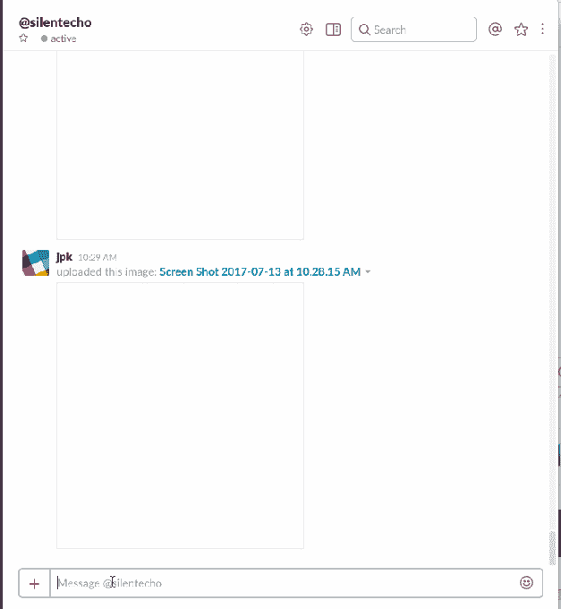
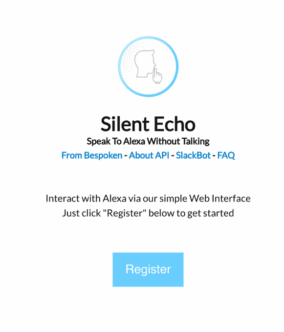

# Silent Echo 允许您通过 Slack 与 Alexa 聊天 

> 原文：<https://web.archive.org/web/https://techcrunch.com/2017/07/21/silent-echo-lets-you-chat-with-alexa-over-slack/>

想通过 Slack 和 Alexa 聊天？一个名为 [Silent Echo](https://web.archive.org/web/20221207034744/https://silentechobot.bespoken.io/slack_auth) 的新机器人现在让这成为可能。这个想法是，有时候你想与亚马逊的虚拟助手 Alexa 进行交互，但你不想通过语音进行交互。例如，如果房间里的东西太吵，Alexa 无法正确听到你的声音，或者，如果你需要非常安静的东西。

这项服务没有提供 Alexa 在其他平台上提供的全部功能，比如亚马逊的 Echo speaker。例如，Silent Echo 不能让你控制 Spotify 或其他音乐服务，也不能处理使用 Alexa 技能，因为它的会话时间很短，需要多次转弯。

但是有些事情 [Silent Echo](https://web.archive.org/web/20221207034744/https://silentecho.bespoken.io/#unregistered) 可以处理，比如控制智能家居设备的能力或者与 Alexa 技能互动的能力——包括出于测试目的，因为开发人员可能需要这样做。

事实上，Silent Echo 的想法来自 [Bespoken](https://web.archive.org/web/20221207034744/https://bespoken.tools/) ，一家提供开发语音应用工具的公司。Bespoken 去年从互动音频广告公司 XappMedia 剥离出来，此后发布了许多开源命令行工具，已被近 700 名语音应用程序开发人员采用。这些工具帮助 Bespoken 获得其 SaaS 产品的曝光率，这是一个针对 Alexa 和谷歌 Home voice 应用程序的日志和监控软件解决方案。

如今，大约有 150 家客户正在使用该软件，主要是与更大品牌合作开发语音应用的机构。

根据 Bespoken 的创始人兼首席执行官 John Kelvie 的说法，该团队最初构建了 Silent Echo 的 [web 客户端版本](https://web.archive.org/web/20221207034744/https://silentecho.bespoken.io/)，以支持该公司企业语音应用解决方案中的一些功能。但是很多人问他们是否可以为 Slack 提供一个版本，这导致了新 Slackbot 的诞生。

一旦安装在 Slack 中，你就可以直接给无声的 Echo 机器人发消息，或者在群聊中通过发送消息到@silentecho 来呼叫它。

该机器人的工作原理是使用文本到语音转换将你在 Slack 中输入的内容转换成音频，然后使用亚马逊自己的 API 发送到 Alexa。Alexa 返回的音频回复然后使用语音到文本转换回文本。

这是一种使用 Alexa 的非官方方式——所以从技术上讲，这是一种黑客行为。然而，凯尔维说，这一切都是通过“公开可用的程序”来完成的。“我们没有做任何偷偷摸摸的事情，也没有依赖任何私有 API 或漏洞，”他解释道。

本质上，Silent Echo 的行为就像一个虚拟的 Alexa 设备，所以它与你自己的 Alexa 帐户绑定在一起。这意味着它可以访问你的亚马逊账户信息和你添加的任何技能。

但是为了安全起见，与 Silent Echo 的群聊交互使用一个通用的 Silent Echo 实例，它链接到一个拥有有限权限的 Amazon 帐户。你仍然可以在这个版本中添加技能，但不包括那些需要你将它们与个人账户联系起来的技能——例如，让你在家里订购披萨的技能。

您应该知道，请求和响应被[存储在](https://web.archive.org/web/20221207034744/https://bespoken.tools/policies/privacy)Bespoken 的数据库中，该数据库不会被共享，但可能会成为政府或执法机构请求的主题。是否应该保存 Alexa 的语音记录是最近争论的话题，因为[的一份报告表明](https://web.archive.org/web/20221207034744/https://www.theinformation.com/facing-new-rivals-amazon-may-open-up-alexa-data-for-developers)亚马逊正在考虑向开发者提供私人记录数据，以帮助他们建立更好的语音应用。

然而，在 Bespoken 的情况下，它的转录本不会像回声扬声器那样拾取无关的背景噪音和声音。Kelvie 指出，它只保存打出的请求和翻译的响应，以便在用户界面上显示它们。

除了 Slackbot，Silent Echo 还可以作为 web 客户端和 [SDK](https://web.archive.org/web/20221207034744/https://github.com/bespoken/silent-echo-sdk) 使用。然而，Slackbot 很受欢迎。

“我们已经在 35 个不同的 Slack 社区中，我们有超过 1000 名用户，”凯尔维谈到 Slackbot 时说，该公司只是通过[一篇关于 7 月中旬测试版的博客文章](https://web.archive.org/web/20221207034744/https://bespoken.tools/blog/2017/07/13/silent-echo-for-alexa)公开介绍了 Slack bot。

“它正在迅速传播，”他补充说，并指出他最初并不认为这个机器人会被少数几个松散的团体使用。

“这确实让我对 Twitter 版本的接受度感到乐观，”凯尔维说。当被问及何时到达时，他满怀希望地说下周。敬请关注。

在此期间，无声回声 Slackbot 是免费使用，[在这里](https://web.archive.org/web/20221207034744/https://silentechobot.bespoken.io/slack_auth)。