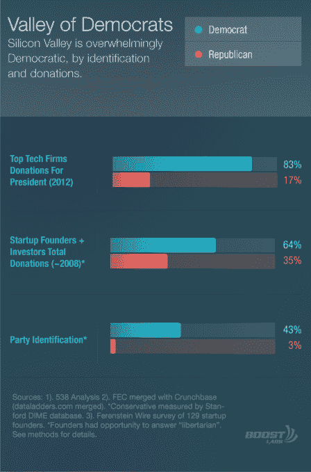
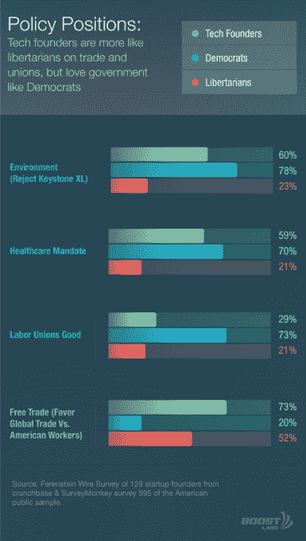
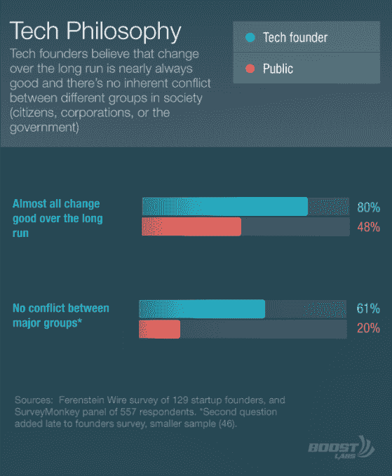
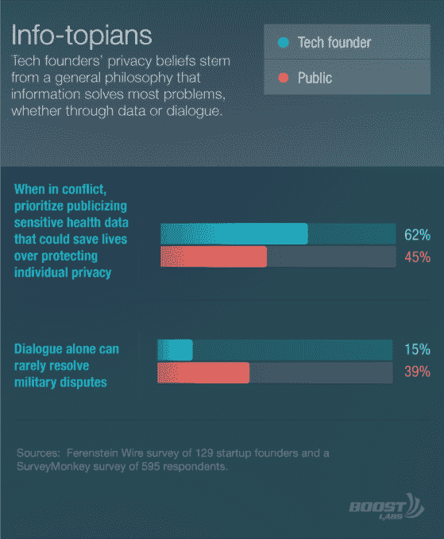
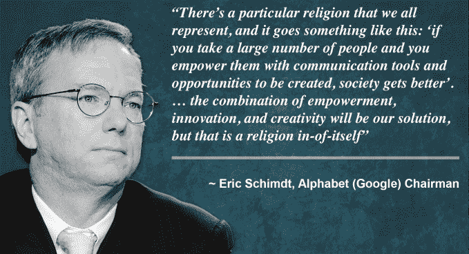

# 硅谷代表了一个全新的政治范畴

> 原文：<https://web.archive.org/web/https://techcrunch.com/2015/11/08/silicon-valley-represents-an-entirely-new-political-category/>

格里高利·费伦斯坦撰稿人

格雷戈里·费伦斯坦是旧金山的作家，通过骑士新闻中心在美洲为记者教授数学。他是《》的出版商

[The Ferenstein Wire](https://web.archive.org/web/20230320210704/https://medium.com/the-ferenstein-wire/what-is-the-ferenstein-wire-and-how-can-you-carry-it-607a54f39f51/)

.

More posts by this contributor

*本文是硅谷政治终局系列文章的一部分。

在过去的十年里，硅谷已经成为政治中的一支非凡力量，但他们多变而怪异的忠诚让 DC 当权派感到困惑。

科技巨头是工会在一系列领域的主要敌人，从高技能移民和出租车行业到自由贸易和他们对非工会特许学校的积极资助。

从哲学上来说，创立互联网公司的人(“创始人”)最好被描述为理想主义者:相信总有更好的解决方案让大多数人受益并减少冲突。在政治上，创始人拒绝工会、主权、监管、小政府和军国主义，因为所有这些都假设公民、政府、其他国家和企业之间存在某种利益冲突。

互联网创始人认为，政府的最佳角色是为非政府机构提供竞争性的直接资助，以解决社会问题，无论是这些家长经营的公立特许学校，还是向移民企业家提供替代能源创业贷款，或者是公立大学的科学研究。

然而，科技公司的首席执行官无疑是民主党最大的支持者:在 2012 年的总统选举中，顶级科技公司 83%的员工捐款流向了奥巴马。“硅谷的大多数人，大多数高管，都倾向于民主党，”PayPal 联合创始人彼得·泰尔告诉我。

为了了解这种非常规行为只是方便的政治操纵还是更符合意识形态的东西，我在一个名为 Crunchbase 的硅谷创始人详尽数据库(由 TechCrunch 创建，我在那里担任了两年首席政策记者)的帮助下，进行了第一次对科技行业的代表性政治心理学研究。

结果表明，互联网创业公司的创始人代表了民主党内完全不同的、类似自由主义的意识形态(调查详情见[方法部分](https://web.archive.org/web/20230320210704/https://medium.com/@ferenstein/ff7e0d3a1a59))。科技创业公司的创始人将政府视为公民的投资者，而不是资本主义的保护者。

创始人分享了自由意志主义者对自由市场的所有刻板热情，但他们也相信政府有责任积极帮助公民解决全球问题。

尽管美国政治传统上认为自由市场狂热与自由个人主义有着排他性的关系，但科技创始人实际上是相当集体主义的。他们认为，政府本身应该像一家高科技公司一样运营(这是无工会的硅谷资助的特许学校通常的运作方式)，从而接受资本主义无情的精英统治。

他们还认为，政府应该干预个人决策，鼓励公民接受更好的教育，更健康，更文明。

![nonbinary-intervention-competition2-[Recovered]](img/827865c59178d31ee7544328d09ac326.png)

自由主义偶像兰德·保罗在三藩市的一次竞选演说中了解到硅谷毫不掩饰地拒绝个人主义，当时他问人群，“谁是‘别管我’联盟的一员？”只有三个人鼓掌。很尴尬。

[https://www.youtube.com/watch？v=NZDN7qw6mHE]

我发现硅谷的哲学是激进的理想主义。创始人首先将自己描述为乐观主义者。

“是什么让硅谷与众不同？科技博客作者 Om Malik 写道:[创新精神的永恒乐观。“我可能是我认识的最乐观的人。我是说，我非常乐观。著名投资人马克·安德森说:“我的乐观可能有点过了，尤其是在新想法方面。”。](https://web.archive.org/web/20230320210704/https://gigaom.com/2009/12/02/what-makes-silicon-valley-special-eternal-optimism-of-the-innovative-mind/)

这种理想主义不是华丽的辞藻；它建立在关于世界的两个根深蒂固的假设之上:变化本质上是渐进的，社会中的主要群体之间没有冲突。

“我倾向于相信，大多数硅谷人都是非常长期的乐观主义者……我们会有糟糕的 20 年吗？绝对的。但是，如果你在努力进步，你的未来会比现在更好，”Linkedin 创始人雷德·霍夫曼向我解释道。

但是，这不仅仅是关于未来。这种乐观情绪也延伸到了当今社会。虽然民主党人传统上相信企业和公民之间的冲突，自由主义者害怕政府和公民之间的斗争，但创始人不承认社会中任何主要群体之间的任何冲突。事实上，当埃隆·马斯克解释他为什么要放弃特斯拉专利时，他指出，

*“如果我们都在一艘船上，船上有一些洞，我们可以从里面舀水，我们有一个很棒的水桶设计，那么即使我们比其他人舀水好得多，我们也应该分享水桶的设计。”*

这种合作的人性观对外交政策也有着迷人的含义:创始人并不支持主权。他们分享自由主义者对自由贸易的热爱，但这通常是因为他们支持任何需要所有国家合作的有约束力的联盟。

维基百科创始人吉米·多纳尔·威尔士[在推特](https://web.archive.org/web/20230320210704/https://twitter.com/jimmy_wales/status/429505544265560064)上直截了当地说，“我相信消除边界和自由贸易是通往和平的道路。障碍必然意味着暴力。”

在他们的绝对哲学核心中，硅谷的精英们相信信息是万能的。也就是说，几乎所有问题都可以通过对话、教育或创新来解决。为了衡量人们对信息的信任度，我问了两个问题:“有什么问题是一个伟大的教育体系无法单独解决的吗？”，以及“军事上的敌人通过对话解决争端的频率有多高”。

创始人们几乎一致认为，教育可以解决所有或大多数问题(从暴力到政治党派)，并坚决反对军事敌人不能说出他们的分歧的观点。

许多作家绞尽脑汁试图将硅谷不同寻常的政治分类，称之为“[准自由主义](https://web.archive.org/web/20230320210704/http://www.vox.com/2015/8/27/9214015/tech-nerds-politics)”和“[同辈进步主义](https://web.archive.org/web/20230320210704/http://www.huffingtonpost.com/catherine-bracy/whats-progressive-about-peer-progressives_b_2861146.html)”。早在 90 年代，民主党中一个痴迷于科技的派别自称为“[雅达利民主党人](https://web.archive.org/web/20230320210704/https://en.wikipedia.org/wiki/Atari_Democrat)”。

我怀疑这些术语从未被使用过，因为没有任何东西真正抓住了这种新颖的意识形态。

平心而论，尽管创始人的意识形态在美国政治中是新奇的，但也有一些相似之处。在现代政治中，它接近于政治学家所说的“[社群主义](https://web.archive.org/web/20230320210704/https://en.wikipedia.org/wiki/Communitarianism)”，即相信社区往往比政府机构更善于解决社会弊病。

这与共享经济对用优步式拼车取代公共交通或通过 Airbnb 租赁缓解住房危机的痴迷相吻合。谷歌董事长埃里克·施密特将此称为科技行业的“宗教”。

从历史上看，这些信仰更类似于欧洲文艺复兴时期的“ [【启蒙时代】](https://web.archive.org/web/20230320210704/https://en.wikipedia.org/wiki/Age_of_Enlightenment) ”，在那里，对信息的信仰实际上是一种可识别的意识形态。法国大革命后，胜利者砸毁教堂，竖起理性的纪念碑(首都“R”)。

几个世纪以来，大众智慧中的极端乐观主义一直处于休眠状态。但是，知识经济似乎赋予了这种旧的理想主义新的生命。它是许多十亿美元产业的基础。

正如脸书创始人肖恩·帕克向我解释的那样，“世界上的许多问题都是信息效率低下，这是黑客伦理。”

本系列的后续章节将探讨为什么硅谷选择民主党作为实现其目标的工具，以及知识经济的盈利能力如何使这种新的意识形态变得非常强大。

不管硅谷实际上变得多么强大，创新本身正在成为美国政治中一个独特的意识形态范畴。这不仅仅是移民和宽带接入等技术问题，而是如何按照硅谷的形象重塑美国的所有机构。

* *关于调查的更详细的 Q & A，点击* [*这里*](https://web.archive.org/web/20230320210704/https://medium.com/@ferenstein/d37ed96a9251) *以及整个系列的章节列表，点击* [*这里*](https://web.archive.org/web/20230320210704/https://medium.com/@ferenstein/1f395785f3c1) *。并且，跟随* [*费伦斯坦丝迅*](https://web.archive.org/web/20230320210704/https://tinyletter.com/ferensteinwire) *了解更多故事。*