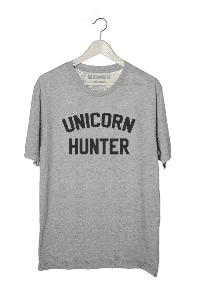

# 电子信息技术是你一直谈论制作的科技口号 t 恤

> 原文：<https://web.archive.org/web/https://techcrunch.com/2015/10/09/siliconvicts-are-the-tech-slogan-t-shirts-youve-always-talked-about-making/>

还记得那些关于硅谷的笑话吗？你总是说你会穿上 t 恤。来自马里布的衬衫公司 Siliconvicts Clothing Co. 捷足先登。从“独角兽猎人”到“编码是我的心脏”的口号，最近斯坦福大学毕业生[卡梅隆·林赛](https://web.archive.org/web/20230319181708/https://www.linkedin.com/in/crobertlindsay)的副业可能会成为你下一件最喜欢的 t 恤的来源。

今天下午，坐在斯坦福大学的校园里，穿着创业 t 恤的学生骑着自行车飞驰而过斯坦福大学，令人耳目一新的是，在[谷歌](https://web.archive.org/web/20230319181708/http://www.google.com/)和[脸书](https://web.archive.org/web/20230319181708/http://www.facebook.com/)招聘会免费赠品的海洋中，这些流行语的使用颇具讽刺意味。流行语从巧妙的双关语“黑客小妞”到冷面幽默的“咖啡+编码”。虽然除了一件衬衫之外，其他都是灰色或白色，但红色字体的“Tindered Spirit”肯定会受到人们的欢迎。

林赛解释说，这一切都是从他去年在洛杉矶痴迷街头艺术开始的。去年他经常开车去洛杉矶，与著名的街头艺术家如塑料耶稣一起工作。结合他对技术的兴趣——他在[斯坦福](https://web.archive.org/web/20230319181708/http://www.stanford.edu/)学习产品设计，他决定将两者结合起来。“我想成为技术领域的街头艺术家，但我没有勇气在墙上画画，”他坦白道。

着眼于下一个最好的事情，林赛决定把墨水放在织物上，并与科尔阿鲁蒂安合作，科尔阿鲁蒂安是林赛在马里布童年时的朋友。目前，这完全是地下运作。“在科尔(阿鲁蒂安)的地下室里，有两张装满衬衫的台球桌和一台织物打印机，”他说。

阿鲁蒂安和他的同事泰南·丹尼尔斯负责衬衫的生产和分销，这是通过一家名为#YOURBRAND 的公司进行的。

现代科技无疑让新衬衫的创意和制造变得更加容易。“我坐得越久，想到的就越多，”林赛说，今天下午我们在校园里聊天时，他扔出了至少十条新衬衫的标语。“我们直接做面料，”他补充说，并开玩笑说团队正在测试 t 恤，并迭代设计。

虽然不是很明显，但该公司的名字来自林赛在大学期间创作的一件艺术品。“我希望它前卫，我希望它酷，”他补充说，敦促我不要寻找更深层的意义。

虽然目前只是两天前启动的一个辅助项目，但团队有很大的计划。Siliconvicts 目前正在商谈将 t 恤投放到 HBO 热门系列《硅谷》中。当然，有了“咖啡因，孵化，迭代”这样的口号，衬衫将会受到帕洛阿尔托人群的欢迎。讽刺的是，在旧金山的四桶和蓝色瓶装咖啡周围穿上它们并不奇怪。

这些衬衫目前正在预售，虽然他们通常在公司网站上以每件 32 美元的价格出售，但在结账时使用折扣代码 TECHCRUNCH 可以享受 10%的折扣。然而，快速查看标签确实表明，并不是所有的都是纯棉的。尽管如此，我可以担保，他们确实很温柔。

[gallery columns = " 6 " ids = " 1221945，1221944，1221943，1221942，1221941，1221940"]