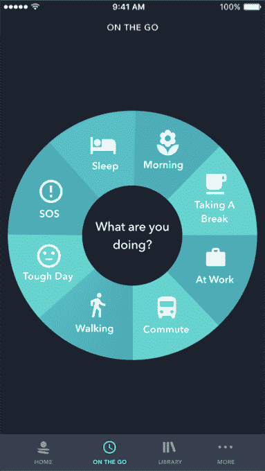

# 简单习惯是一款将注意力挤入你忙碌的一天的应用程序

> 原文：<https://web.archive.org/web/https://techcrunch.com/2016/06/22/simple-habit-is-an-app-to-squeeze-mindfulness-into-your-busy-day/>

经营一家初创公司的压力引导创始人 Yunha Kim 产生了她的下一个想法:一个名为[简单习惯](https://web.archive.org/web/20230225213932/https://itunes.apple.com/us/app/simple-habit-mindfulness-meditations/id1093360165)的正念应用程序，提供短至五分钟的音频冥想，以便忙碌的人们可以在他们的一天中挤出一点宁静。

金在去年夏天将她之前的初创公司——一款名为 [Locket](https://web.archive.org/web/20230225213932/https://techcrunch.com/2013/07/18/locket-puts-ads-on-smartphone-lock-screens-pays-you-to-use-your-phone/) 的安卓锁屏应用——出售给了移动购物初创公司 Wish [，她一直在启动这个新项目，团队从 2 月份开始在 iOS 上建设，并在 5 月份试运行测试版。](https://web.archive.org/web/20230225213932/https://techcrunch.com/2015/07/14/mobile-shopping-app-wish-buys-android-lockscreen-app-maker-locket/)

该应用程序提供了一个基本的音频指导五分钟冥想轮，用于特定的场景，如度过艰难的一天或需要睡个好觉，以及教师在其平台上上传的更完整的正念内容库——分为压力、个人成长、善良、关系和工作等主题。这里的内容可以更长。如果你想听同一个声音，也可以由老师过滤。

这个应用程序在这个新生阶段有大约 10，000 名用户，在本月由苹果公司在 App Store 上推出后，获得了一些早期的眼球。它今天正式推出测试版，加入了其他承诺在智能手机上方便引导冥想的应用程序的行列——例如 [Headspace](https://web.archive.org/web/20230225213932/https://techcrunch.com/2015/09/21/meditation-startup-headspace-raised-30-million-to-help-you-be-more-mindful/) 、 [Calm](https://web.archive.org/web/20230225213932/https://techcrunch.com/2014/06/18/meditation-resource-calm-raises-another-500000-for-an-app-that-helps-you-focus-de-stress-and-sleep/) 和 [Pause](https://web.archive.org/web/20230225213932/https://techcrunch.com/2015/10/08/pause-ustwo/) ，仅举三例。这个领域的一些初创公司也筹集了相当多的资金(去年秋天，Headspace 筹集了 3000 万美元)。

此外，苹果还于本月早些时候在 WWDC 发布了一款针对苹果手表的名为 Breathe 的休闲应用。

但是，尽管有一些形式良好和有分量的竞争，金正在努力做大——她的目标是建立一个冥想和正念的平台。

她声称，Simple Habit 是第一款将网飞/Spotify 风格的模式应用到这个领域的正念应用。因此，不是只有一个或几个老师在应用程序中提供冥想内容，而是有多个老师(目前大约有 30 个)——这种想法是为了防止内容随着时间的推移变得陈旧，从而让人们更新他们的订阅。

简单习惯的订阅费为 3.99 美元一周，11.99 美元/月和 99.99 美元/年。还有一个免费增值元素，下载者可以获得为期一周的免费试用，获得内容的子集(包括入门课程和针对一天中不同时间、精神状态和环境的特定冥想)。

“我们是第一个采用网飞/Spotify 模式的应用程序——我们将来自世界各地的数十位顶尖冥想老师引入一个平台，”她告诉 TechCrunch。“这就像 Spotify 如何将所有艺术家整合到一个平台上。比如，我们的竞争对手 Headspace 和 calendar 各只有一名教师，因此新鲜感会很快消失。”

金表示，这家初创公司目前没有任何融资计划，但她承认，鉴于该领域的竞争性质，这是它可以采用的“策略之一”。尽管它显然也希望迅速获得收入。

金不会在这个早期阶段透露付费用户的比例，但他补充道:“我们看到免费到付费的转换率比我们预期的要高。”

Simple Habit 也与众不同，它提供了比主要竞争对手更多的指导冥想，其五分钟的格式旨在让最广泛的超级忙碌的人能够在他们的日程中找到空间。(虽然，你可能会在每次会议上花费更少的时间来保持正念——但可以说，一些冥想总比没有冥想好，每天五分钟也可能会鼓励一个人随着时间的推移建立更持久的习惯)。

“我们专门为忙碌的人设计了这个应用程序，”金说。“没有太多时间冥想的人。我们希望让他们的开始变得超级简单，这样他们就可以协调他们正在做的任何事情(比如在演示、采访等之前)。所以我们恰好吸引了很多忙碌的年轻专业人士。这也是我们为企业家、律师、大学生(在工作会议中)提供冥想的原因。

“在测试期间，我们听到一些企业家用简单习惯来减轻压力，甚至有外科医生在给病人做手术前使用简单习惯，有睡眠/压力/焦虑问题的人，甚至大学生在准备考试时也使用这种方法。”

使用 Simple Habit 的平台，有一种收入分成模式来支付教师，Kim 也将其描述为“类似于 Spotify”，因为它与教师分享年度净收入的一部分。但是，当然，与 Spotify 的数百万艺术家相比，它可以分享收入的老师要少得多。教师拥有他们的内容，除非创业公司付钱给他们为应用程序创建一些特定的内容。

就新内容在平台上的流动而言，Kim 表示，教师添加内容的频率没有固定的时间表，但图书馆中的任何新内容都有一个粉红色的标签，以标记给用户。

“我们也在不断地面试、审查和引进最优秀的教师。她补充道:“这些老师中有许多在科技初创公司教授正念。”她指出，团队中的一名成员凯利·博伊斯(Kelly Boys)是谷歌正念项目的前总监，该项目名为“在你体内搜索”(SIY)。

“她负责招聘教师。这就是为什么你会看到我们平台上的很多老师都是通过谷歌的 SIY 项目接受培训的。我们有来自世界各地的 30 多名教师…我们有相当严格的审查程序。并非我们老师提交的所有录音都能通过我们的标准。”

在讨论该应用程序界面背后的设计思想时，金表示，这个想法是为了剥离冥想练习者可以使用的一些更复杂的理论/术语，以便新来者不会被陌生的概念疏远(如“打开脉轮”)。取而代之的是，他们会得到一些实用的建议来帮助他们解决当天的任何感受。

“我们应用程序的方法是基于你想要改进的目标/事情。有点像 Advil/止痛药方法，这样忙碌的人可以通过冥想这个特定的轨道来思考他们正在做的事情(也是设定意图的一个好方法)，”她补充道。

虽然目前正念/冥想的好处被广泛接受，大多数人同意这是一种对抗压力和情绪困扰的明智方法，但更紧迫的问题可能是，为什么人们需要一个应用程序来静静地坐几分钟？他们不能自己做吗，比如关掉手机一会儿？

金对这一批评的回应是，正念的新手将从引导冥想中受益——帮助他们建立习惯和学习技能，如呼吸技巧，这些技巧以后可以使他们自己调整注意力。

“我现在已经冥想了几年，但我仍然总是使用引导式冥想，因为我接触到了新的概念，我觉得我在对某人负责，随着时间的推移，我也建立了对引导式声音的依恋/关系，”她补充道。

该应用程序的其他功能包括让用户设置每日提醒以保持警惕，以及一些轻量级的分析以记录进度——该应用程序记录用户总共进行了多少次会话和分钟，以及他们连续多少天保持了他们的习惯。

金表示，下一步计划推出一款网站应用，以及 Android 版的简单习惯。