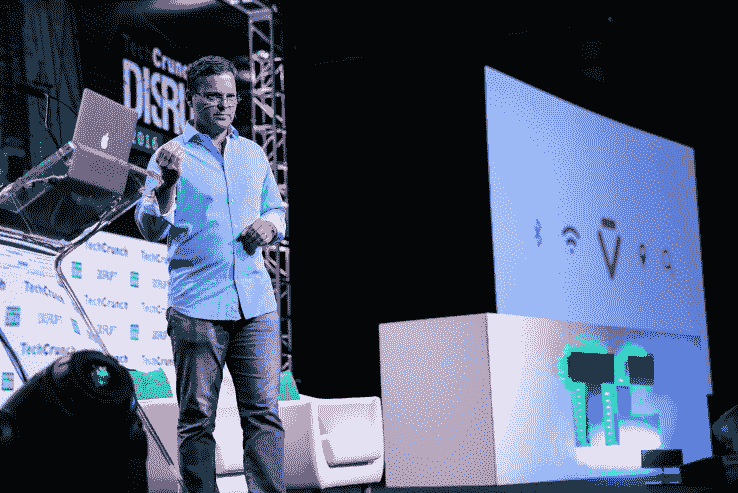

# Siri-creator 展示了 Viv 的首次公开演示，“万物智能界面”

> 原文：<https://web.archive.org/web/https://techcrunch.com/2016/05/09/siri-creator-shows-off-first-public-demo-of-viv-the-intelligent-interface-for-everything/>

语音控制辅助正在经历另一场变革，它将证明自己作为人机交互下一次变革的价值。

今天，在 TechCrunch Disrupt NY 的舞台上，Siri 的创造者[达格·基特劳斯](https://web.archive.org/web/20230317082304/https://www.crunchbase.com/person/dag-kittlaus)展示了 [Viv](https://web.archive.org/web/20230317082304/http://viv.ai/) 的首次公开演示，这是一个人工智能虚拟系统，旨在成为“万物的智能界面”

在[的现场演示中](https://web.archive.org/web/20230317082304/https://techcrunch.com/2016/05/09/heres-what-viv-looks-like-the-next-generation-ai-assistant-built-by-siri-creator/)提到了“范式”这个词至少十几次，基特劳斯谈到了下一波计算机交互方法，以及 Viv 将如何“通过对话给我们生活中无生命的物体注入生命”

现场演示没有出现任何重大故障，尽管所有问题都是在舞台上面对数百名观众说出的。

基特劳斯开始时问了一个关于今天天气如何的泛泛而谈的问题，但很快就把他对生存的要求演变成了可笑复杂的尖锐询问。

“后天下午 5 点以后，金门大桥附近的气温会不会超过 70 度？”基特劳斯在台上问道。

Viv 当时已经准备好了答案，也准备好了接下来的每一个奇怪的具体问题的答案。

Viv 作为一个平台的明显优势和与众不同的因素之一是开放欢迎第三方集成到虚拟助理领域。基特劳斯让 Viv 给一个朋友支付 20 美元，然后通过一个 [Venmo](https://web.archive.org/web/20230317082304/https://www.crunchbase.com/organization/venmo) 集成点击支付按钮，突然间，他的朋友得到了支付。

事实上，Kittlaus 明确指出“完善第三方生态系统”对他们的使命至关重要。基特劳斯说，Viv 有一天会成为用户的“主要来源”。

Viv 平台的一个明显优势是查询的“可堆叠性”。与 Siri 等短期记忆平台相反，Viv 能够接受后续问题，而不会结巴或喘着气说出几秒钟前刚刚说过的上下文。

在与 TechCrunch 主编[马修·潘扎里诺](https://web.archive.org/web/20230317082304/https://www.crunchbase.com/person/matthew-panzarino)的台上采访中，Viv 首席执行官达格·基特劳斯讨论了这位助手与其他几十位助手的区别。

Kittlaus 详细介绍了 Viv 的真正秘密是一种名为“动态程序生成”的东西，它允许人工智能助手理解意图，并生成一个程序来最好地回答查询。

基特劳斯说:“你不必按照指示编写每一段代码，你只需描述你希望它做什么就行了。”“Viv 的整个理念是，开发者可以进入并构建任何他们想要的体验。”

在整个演示过程中，与 Siri 的心理对比是不可避免的。这一最初被誉为巨大进步的东西近年来受到了更多的诽谤，因为越来越多的人抱怨 Siri 的准确性不够好，不值得依赖。

所有这一切都特别有趣，因为基特劳斯在 2007 年将基础技术从斯坦福研究所剥离出来后，共同创立了 Siri。他最初看到 Siri 的未来与他对 Viv 的设想非常相似。虽然他的公司刚推出时支持近 45 种服务，但在苹果 2010 年以 2 亿美元收购该公司后，Siri 很快就在 iOS 设备上找到了家。

Viv 在过去的四年里相对悄悄地成长。该公司去年从 [Iconiq Capital](https://web.archive.org/web/20230317082304/https://www.crunchbase.com/organization/iconiq-capital) 筹集了 1250 万美元，据《福布斯》报道，这家公司得到了脸书的马克·扎克伯格、达斯汀·莫斯科维茨和雪莉·桑德伯格、Twitter 的杰克·多西、LinkedIn 的雷德·霍夫曼等人的支持。

据[华盛顿邮报](https://web.archive.org/web/20230317082304/https://www.washingtonpost.com/news/the-switch/wp/2016/05/04/siris-creators-say-theyve-made-something-better-that-will-take-care-of-everything-for-you/)报道，Kittlaus 基本上回避了脸书和谷歌对该公司的传闻收购出价。在回答台上关于潜在追求者身份的询问时，基特劳斯回答说，“是的，你听说过他们，你可能会读到。”

也许薇薇知道。

基特劳斯没有提供大量具体信息，说明人们何时可以在金门大桥附近询问 Viv 下午 5 点后的天气情况，但他明确表示，早期集成将在“今年晚些时候”实现。