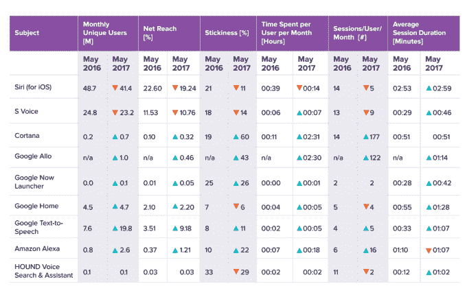
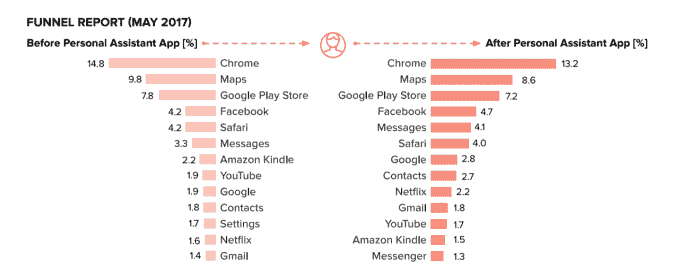
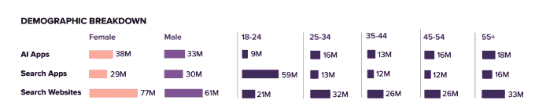

# 自去年以来，随着 Alexa 和 Cortana 的增长，Siri 的使用和参与度下降

> 原文：<https://web.archive.org/web/https://techcrunch.com/2017/07/11/siri-usage-and-engagement-dropped-since-last-year-as-alexa-and-cortana-grew/>

根据测量公司 Verto Analytics 今天早上发布的一份新报告，Siri 仍然是美国最受欢迎的虚拟助手，月活跃用户数为 4140 万，但自去年以来，它的月活跃用户数下降了 15%，即 730 万。此外，研究发现，在此期间，Siri 的参与度也下降了近一半，从 21%降至 11%。

与此同时，亚马逊 Alexa 的使用量一直在飙升，月活跃用户数增长了 325%，即月用户数从 80 万增加到 260 万，同时其用户参与度也从 10%增加到 22%。

Cortana 也有所增长，从美国的每月 20 万用户增长到 70 万，增长了 350%。它的用户参与度增加了两倍，从 19%增加到 60%。

这份新报告基于 [Verto Analytics](https://web.archive.org/web/20230313054124/http://www.vertoanalytics.com/) 从 2016 年 5 月到 2017 年 5 月从 2 万多名美国消费者收集的数据。像大多数测量公司一样，它的行为数据是从一组具有统计代表性的小组成员那里收集的，这些成员同意让他们的设备使用受到监控。这与该公司的消费者调查数据相结合，有助于更好地解释围绕该行为的用户情绪。

这就是 Verto Analytics 如何能够确定个人助理何时被使用，何时被谁使用，以及用户参与度如何。在这种情况下，其报告将参与度定义为一种“粘性”因素——一种比较每日用户与每月用户的指标。

总体而言，研究发现，基于手机的个人助理 Siri 和三星的 S-Voice 的受欢迎程度正在下降，而与家庭语音计算相关的个人助理，如 Alexa 和 Google Home 的移动应用程序，正在增长。

该公司还分析了在助手之后立即使用的应用程序，以了解人们为什么使用助手——假设助手应用程序经常用于搜索应用程序或网站。

Chrome、谷歌地图和谷歌 Play 商店是使用最多的三个应用，这可能是因为生态系统中谷歌拥有的个人助理应用数量很多。除了谷歌之外，在使用助手之后推出的其他顶级应用程序是脸书、信息和 Safari，这表明苹果设备用户在日常任务中利用了 Siri 的一些优势，如信息和网页浏览。

助手的使用在上午 10 点和下午 1 点达到高峰，从下午 2 点到晚上 7 点稳步上升，然后在晚上下降。这似乎表明了人们在从一个地方搬到另一个地方时经常使用个人助理，或者在通勤时启动谷歌地图等应用程序。

此外，研究发现，女性使用个人助理的比例略高于男性，占用户总数的 54%。

同样值得注意的是，年龄较大的群体大量采用助理，尤其是 45-54 岁和 55 岁以上的群体。事实上，助理“超级用户”，即每月花在个人助理上的时间是平均水平的两倍的人，是一名 52 岁的女性，每月花在助理应用上的时间为 1.5 小时。

因为 Verto Analytics 只分析了智能手机上助手应用的移动使用，比如 Siri、Alexa 和谷歌拥有的其他资产，所以它并没有描绘出语音助手的全貌。

它也没有计算谷歌搜索应用的使用量——这是谷歌的旗舰应用，包括语音功能。谷歌搜索和其他助理任务，如设置提醒，可以使用文本或语音来完成。Verto 可能无法分辨它何时被用作助手，或者通过语音。尽管如此，它可能是语音助手的一个受欢迎的地方，但这里没有讨论。

另外，亚马逊的 Alexa 应用程序并不是真正用来与助手互动的，而是作为一个配置和与 Echo 设备互动的控制中心。Google Home 也是如此。与此同时，Siri 可以在手机上使用，也可以在 Mac 上使用，而且很快就会在 HomePod 上使用。

但这份报告没有涉及家庭或桌面上的助手使用情况，只涉及移动设备。

也就是说，谷歌和 Siri 的大部分使用是在智能手机上，这就是为什么 Siri 的使用逐年下降很有趣。这可能是因为随着语音助手在家中越来越受欢迎，对 Siri 的需求受到了影响；或者谷歌决定在其应用程序中推出语音支持(例如谷歌搜索应用程序；Google Now 启动器；Google Allo 谷歌地图等。)加上其庞大的设备生态系统，在减少 Siri 的使用方面发挥了作用。或者也许 Siri 只是没有达到宣传的效果。

尽管如此，Siri 仍然是这个领域的个人助理，拥有比其他人更多的活跃用户，以及与移动操作系统深度集成的优势。随着 HomePod 在今年晚些时候的发射，它的数量应该会再次增长。