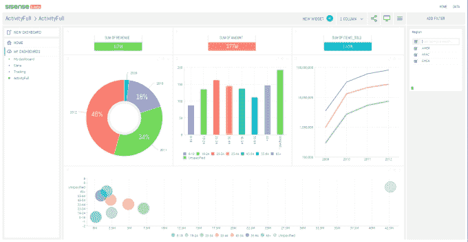

# SiSense 再融资 3000 万美元，将大数据分析带给商界人士 

> 原文：<https://web.archive.org/web/https://techcrunch.com/2014/06/12/sisense-raises-30m-more-to-take-big-data-analytics-to-businesspeople/>

商业智能初创公司 SiSense 是那些让普通商业用户(而不仅仅是数据科学家)能够获得大数据分析的公司之一，它今天宣布获得更多资金:由 DFJ 成长公司牵头的 3000 万美元的 C 轮融资，该公司是风险投资的一个分支，致力于后期投资，[最近宣布了一只新基金](https://web.archive.org/web/20221205180719/https://beta.techcrunch.com/2014/05/05/box-foursquare-spacex-backer-dfj-growth-raises-470m-for-later-stage-investments/)，我们知道它的总规模超过 5 亿美元(5 月份，它的规模“只有”4.7 亿美元)。

其他支持这家初创公司的投资者包括 Battery Ventures、Genesis Partners 和 Opus Capital。SiSense 成立于 2004 年，直到最近才开始加大对外投资的力度。它上一次融资[是在一年前](https://web.archive.org/web/20221205180719/https://beta.techcrunch.com/2013/04/03/sisense-raises-10m-to-scale-analytics-database/)，包括今天宣布的这轮融资，现在已经融资[4400 万美元](https://web.archive.org/web/20221205180719/http://www.crunchbase.com/organization/sisense)。

该公司的首席执行官 Amit Bendov 曾表示，该公司最终将进行首次公开募股，目前尚未盈利，但增长迅速。该公司预计今年的销售额将是去年的三倍，并在 2015 年实现盈利。这笔资金将用于帮助 SiSense 在美国拓展更多业务。SiSense 成立于特拉维夫，已经在纽约设立了办事处，约 70%的销售额来自美国。它计划明年初在硅谷开设办事处。

SiSense 开发的产品在两个层面上与众不同:第一个层面是它的目标客户，第二个层面是它提供服务的方式。

在客户方面，该公司是越来越多的企业初创公司中的一员，这些公司试图在数据管理方面采用一些更有趣的创新，并让普通商业用户更容易使用它们。通常，大数据分析是由工程师为工程师构建的，但我们现在看到的基本上是消费化在起作用，应用程序是在大数据堆栈上创建的，普通人可以更直接地查询数据。这个领域的其他公司包括 Looker、Origami Logic 和 Tableau Software，它们今年上市了。

SiSense 目前的客户包括易贝、ESPN 和饮料公司嘉士伯等。

本质上，SiSense 的不同之处在于它改变了用户处理大数据请求的架构。通常，许多基于云的数据分析解决方案都基于内存解决方案。相比之下，SiSense 将其中一部分转移到芯片内处理，这是一项名为“芯片内弹性立方体”处理的服务。这让用户能够从手头内存较少的机器上处理万亿字节的数据——这在新一代计算中很方便，因为人们使用平板电脑、智能手机和精简版电脑等设备来工作。

然后，这些信息被过滤到仪表盘，业务分析师和其他不一定受过数据科学或工程培训的人可以理解:

正是这两者的结合帮助 SiSense 成长，并吸引投资以加快发展。

“客户对 SiSense 及其轻松集成多个数据源的能力赞不绝口，其规模远远超过竞争对手的解决方案，并可由业务用户直接采用，几乎不需要 IT 专家的支持，”DFJ 增长董事总经理兰迪·格林(Randy Glein)在一份声明中表示。作为本轮融资的一部分，格林将加入该公司董事会。

图片: [Flickr](https://web.archive.org/web/20221205180719/https://www.flickr.com/photos/mcclanahoochie/5068845349/in/photolist-8HVa8k-zxh6L-38UJ-vQfny-vQfnt-xJW4y-ec93LQ-auiJX7-z3HAR-9Te7ZB-vQfnk-8RGpW7-dtVKQh-7zhJTX-5GSHYf-dDA3a4-fD5n8t-2ReY5h-ayx9Sq-9K9CvY-4f8Er4-7TQdJk-7M8S1-9gmbxo-9iyZaJ-39pccq-5bu7qh-4LdiSh-nLJHR-xJW1n-9gi6gB-mdqCXb-9BKGnU-7tUwtD-4ENVnr-axaZJp-KwYZS-aUCjHD-4fcavh-5YUjGM-5mVXao-6SUQ7-9gi6Et-9ZRYSR-9zXKNp-9gi7LV-8AXfdR-5T1nE5-pPDYK-wYrwq)