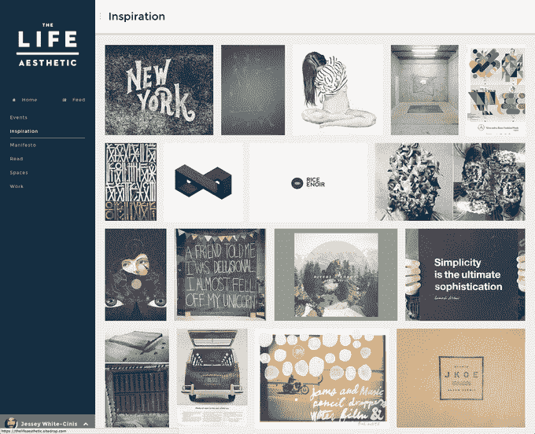
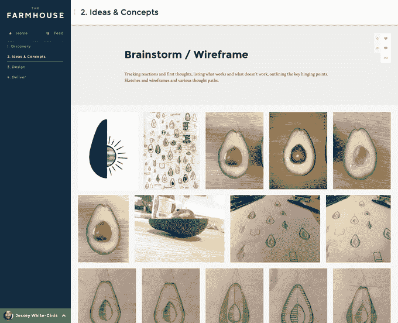
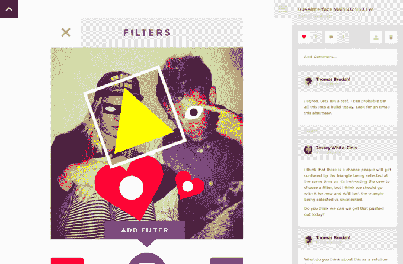

# Sitedrop 将一个 Dropbox 文件夹变成一个可视化的工作空间，在这里你可以与他人协作 

> 原文：<https://web.archive.org/web/https://techcrunch.com/2014/04/04/sitedrop-turns-a-dropbox-folder-into-a-visual-workspace-where-you-can-collaborate-with-others/>

让每个人都使用相同的项目管理软件是一个挑战，但每个人似乎都有一个 Dropbox 帐户。一家名为 [Sitedrop](https://web.archive.org/web/20221207012953/http://sitedrop.com/) 的新创公司希望建立在消费者友好服务的受欢迎程度之上，它允许你快速将任何 Dropbox 文件夹变成一个网站，在那里你可以直观地展示你的工作并与其他人合作。

Sitedrop 用户只需拖动文件或链接到 Dropbox 文件夹，就可以查看、评论、收藏甚至上传文件到在线工作区。

这家初创公司目前正由纽约的 [betaworks](https://web.archive.org/web/20221207012953/http://betaworks.com/) 孵化，自去年秋天其私人测试版首次亮相以来，其用户群一直在缓慢增长。如今，这项服务已经发展到大约 3000 个测试用户，正在更广泛地开放。

该公司的想法由 betaworks 常驻黑客 Jessey White-Cinis 创建，并由他的老商业伙伴 Thomas Brodahl 设计，这一想法源于他们在拥有十年的设计机构中面临的挫折。

“我们在设计公司经常遇到项目管理的问题，这是我们的解决方案，”White-Cinis 说。“把(用户)留在大本营并确保所有的交流都在一个地方进行几乎是不可能的，”他解释道。“但我们意识到，有一件事始终保持不变，那就是每个人都有一个共享的 Dropbox 文件夹。”

Sitedrop 的想法是让共享文件夹变得更有用，让你可以快速地把它变成一个轻量级的协作工具，同时填补 Dropbox 目前存在的一些漏洞。

注册 Sitedrop 并通过 Dropbox 认证后，您共享文件夹中的文件就可以通过一个自定义子域在线查看，这些文件可以以列表或更直观的格式显示，如幻灯片。该服务还支持 Photoshop 创建的文件预览(Dropbox 不支持)，这使得 Sitedrop 在包括摄影师和设计师在内的创意群体中广受欢迎。

Sitedrop 中的一切都是基于文件夹的，因此您可以像管理桌面上的文件一样管理这些工作区，并且您可以控制其他人是否可以将文件上传到您的网站，或者只查看您已经共享的文件。出于保护隐私的目的，这些网站还可以设置密码保护，一旦登录，用户可以通过其他工具就内容进行协作，以收藏项目和发表评论。你甚至可以将网页链接拖到你的 Dropbox 中，然后 Sitedrop 会在线呈现。

在未来的版本中，计划是支持更健壮的修改，因此您可以“时间旅行”回去查看对共享内容所做的各种更改。

White-Cinis 表示，虽然这项服务很吸引创意人士，但它类似瑞士军队的特性也让人们把它用于其他用途。“人们用它来做剪贴，做文档的维基……我也看到了一些投资组合，”他说。

目前，Sitedrop 是免费的，最多为用户提供 5 个在线工作空间。稍后，该公司将开始对额外的网站以及高端功能收费，例如支持共享视频文件。然而，现在的工作空间没有大小限制，除了拥有 Dropbox 帐户之外，也没有其他使用要求。

你可以在这里看到一些成功的例子:[xtrapp](https://web.archive.org/web/20221207012953/https://xtrapopapp.sitedrop.com/)(iOS 应用) [The Life 美学](https://web.archive.org/web/20221207012953/https://thelifeaesthetic.sitedrop.com/)(创意初创公司)[伊恩布鲁尔](https://web.archive.org/web/20221207012953/https://ianbrewer.sitedrop.com/)摄影[或者只需在这里](https://web.archive.org/web/20221207012953/http://sitedrop.com/)注册即可。