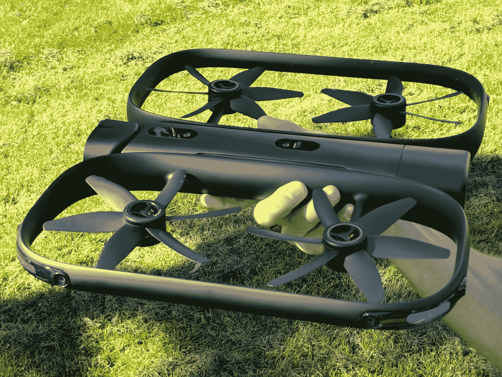

# Skydio 售价 2499 美元的“自动飞行”无人机知道你在哪里，你要去哪里

> 原文：<https://web.archive.org/web/http://techcrunch.com/2018/02/13/skydios-2499-self-flying-drone-knows-where-you-are-and-where-youre-going/>

由麻省理工学院研究人员创立并得到硅谷顶级投资者支持的四年前的自主无人机初创公司终于准备好展示它在过去几年里所做的一切。

今天， [Skydio](https://web.archive.org/web/20230403190822/https://www.skydio.com/) 展示了“R1 ”,一种号称拥有创业公司所说的“自我飞行”能力的无人机。这意味着无人机能够锁定一个人，并在拍摄视频和躲避障碍时跟踪他们。

这不仅仅意味着它在穿越一片开阔的田野时可以避开一两棵树；无人机可以跟踪你，同时在茂密的森林或仓库等城市环境中导航。

当我跑过旧金山的杰佛逊广场公园时，我有机会看到这些功能在发挥作用，当时 R1 车队正紧追不舍。无人机令人印象深刻，但让一架自主无人机独自追踪你，同时避开树枝，让你处于它的注视之下，这有点令人不安。

我的反乌托邦潜意识很可能部分是由上周末疯狂观看网飞的《改变的碳》引发的，但当我不考虑被 R1 猎杀时，我惊叹于它在 13 个机载相机作为向导的情况下导航世界的能力。

潜入它的自我飞行能力的过程非常简单。打开应用程序后，你可以通过它的 4K 30fps 相机看到无人机的视角，从那里你可以点击你自己或另一个人(即使是在一个群体中)，R1 将识别关于人类形状的特征，无论是一般的外表，颜色还是尺寸，并开始跟随。

这个想法是，你可以发射无人机，锁定自己，并滑下一座山，而 R1 跟踪你到底部，同时捕捉 4K 的镜头。

它可以以每小时 25 英里的最大速度行驶，同时保持其自主轴承，电池寿命为 16 分钟。无人机有 64GB 的机载内存。

Skydio 并不是第一架采用基于计算机视觉的技术来实现更轻松飞行的消费级无人机，但当 DJI 和其他人使用这项技术主要解决物体规避问题时，Skydio 一直在研究无人机如何自我飞行和跟踪物体。这家初创公司正在利用许多自动驾驶汽车公司一直在探索的相同技术。R1 的大脑是一个 256 核的 Nvidia TX1 处理器，这是一个已经在许多无人驾驶车辆上使用的数百美元的组件。

R1 有许多飞行模式，这些模式决定了它能够捕捉什么样的镜头。默认的“跟随”模式会建议您采取行动，而“侧面”、“环绕”和“引导”会尝试捕捉视频，同时保持一定的有利位置，这也可以根据您当前的轨迹预测您的移动。

无人机也有一些有趣的模式，如“体育场”，这是为捕捉野外运动的特定场景而设计的。在所有的专业模式中，app 还可以手动飞行(单手！)同时使用 iOS 或 Android 的手机应用程序。

这些功能无疑有助于易用性，这将使 R1 成为无人机新手的理想选择，但该产品 2499 美元的价位表明了不同的受众。“这显然不是主流价位，”Skydio 首席执行官亚当·布里(Adam Bry)告诉 TechCrunch。

目前，Skydio 正在寻找一批用户，他们对拍摄镜头而不需要单独的飞行员的想法感兴趣。Skydio 并没有通过此次发布巩固自己作为一家消费科技公司的地位，并表示他们正在积极关注商用无人机取得成功的多个不同垂直领域，包括建筑、保险、农业和安全领域。

“我们是一家拥有核心技术的技术公司，”Bry 说。“但在许多其他领域使用核心技术有一条清晰的道路。”

在发布产品的同时，Skydio 还透露，它最近完成了由 IVP 和 Playground Global 牵头的 4200 万美元的 B 轮融资。此轮投资的其他著名投资者包括英伟达、Accel、安德森·霍洛维茨和凯文·杜兰特。在这一轮融资中，该公司迄今已融资约 7000 万美元。

R1“边疆版”现在可以在 Skydio 的[网站](https://web.archive.org/web/20230403190822/https://www.skydio.com/)上订购，包括一些额外的东西，如额外的电池和推进器。