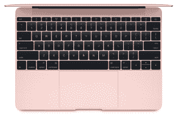

# 苹果的 MacBook 获得了 Skylake 速度提升、8GB 内存、更长的电池寿命和玫瑰金表面 

> 原文：<https://web.archive.org/web/https://techcrunch.com/2016/04/19/skylake-when-it-crumbles-we-will-stand-tall-face-it-all-together-at-skylake/>

# 苹果的 MacBook 获得了 Skylake 速度提升、8GB 内存、更长的电池寿命和玫瑰金表面

苹果的单端口 wonder MacBook 今天获得了季中升级，拥有更快的处理器、更好的显卡、更快的内存和一个多小时的电池寿命。如果你喜欢的话，你还可以第一次在 Mac 电脑上看到苹果的玫瑰金表面。

它的技术难点是， [MacBook](https://web.archive.org/web/20221208010853/http://www.apple.com/macbook/) 现在可以订购双核英特尔 M 处理器，主频高达 1.3GHz，内存为 1866 MHz，英特尔 HD Graphics 515 据称图形性能快 25%，内部存储更快。这款新设备性能更好，电池续航时间也更长，苹果称其可支持 10 小时的网络浏览或 11 小时的 iTunes 电影播放。

迷人的玫瑰金是 MacBook 系列的最新成员

你可以买到新款 MacBooks，1.1 GHz M3 处理器的起价为 1299 美元，1.2 GHz M5 的起价为 1599 美元，现在所有型号的所有配置都标配 8GB 内存。如果按单生产，您可以将处理器提升到 1.3 GHz M7。

这是对 MacBook 系列的一次微小但不错的中期更新，该系列采用了英特尔的“第六代酷睿 M”处理器，也称为 [Skylake](https://web.archive.org/web/20221208010853/http://arstechnica.com/gadgets/2015/09/skylake-for-laptops-faster-core-m-and-ultrabook-gpus-with-edram/) 。许多人一直在等待 Skylake 处理器在苹果笔记本电脑中出现，这是它的冰山一角。其他型号肯定会出现。

新款 iPads 的颜色非常漂亮，所以如果你渴望玫瑰金，那么你很幸运。笔记本电脑中最低内存量的提高应该可以很好地平息早期采用者(包括我)的一个抱怨，因为基本型号在打开一堆 Chrome 标签时或在进行内存密集型视频或音频编辑时会有点突突。

目前的 MacBook 用户不应该考虑搬家，但对于那些处于边缘的人来说，这绝对是一个不错的“修订版二”机型。苹果的 v2 产品有很长的历史，在许多小的方面做得更好，但没有出现在规格表上。苹果正在使用的组装方式或组件的细微变化反映了过去几个月的学习和支持，他们不得不在过去几个月里呼吁研究。

所以如果你对 MacBook 感兴趣，再见。如果你对 Skylake MacBook Pro 感兴趣，继续等吧，你这个肮脏的动物。