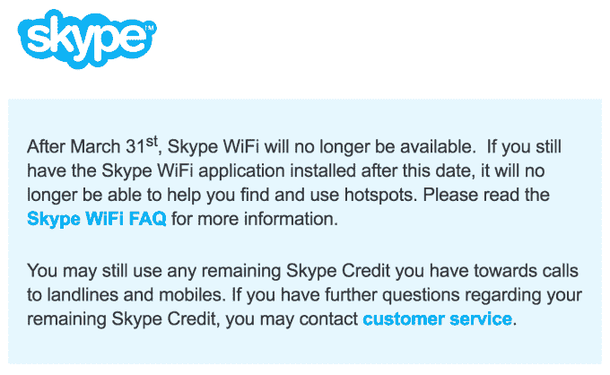

# Skype 将于 3 月 31 日停止 WiFi 服务，专注于“核心”功能

> 原文：<https://web.archive.org/web/https://techcrunch.com/2017/02/27/skype-is-killing-off-its-wifi-service-march-31-to-focus-on-core-features/>

微软(Microsoft)旗下的 Skype 服务帮助开创并普及了互联网上语音和视频通话的兴起，该服务正在取消它在随后几年添加的一项功能，该功能旨在让这项服务更加普及，尤其是在漫游用户中:3 月 31 日，该公司将取消其 WiFi 服务，该服务允许用户在付费公共热点购买 Wi-Fi 接入，费用通常低于热点所有者收取的费用。

该公司今天早些时候似乎已经开始向用户发送通知:

它所链接的页面解释说，Skype 将在全球范围内“退休”，以便该公司能够“更好地集中精力，通过我们的核心 Skype 功能为您带来最佳体验。”这也是 Skype 的一位发言人在我联系他以寻求进一步评论时给我指的页面。

如今，这些核心功能似乎都是基于推动诸如 Skype for Business 服务的高级[服务；](https://web.archive.org/web/20230326023737/https://techcrunch.com/2016/12/29/volvo-integrates-skype-for-business-in-its-90-series-vehicles/)[与其他微软服务的集成](https://web.archive.org/web/20230326023737/https://techcrunch.com/2016/11/02/teams-hands-on/)；与 Slack 竞争的应用程序(最初被称为“Skype Teams”，但最终以微软团队的名义推出)；以及更新的服务，如一个机器人开发者平台，以跟上 Messenger Joneses，以及一个低带宽版本的发展中市场。(但是…仍然没有双因素认证或[恼人的垃圾邮件错误](https://web.archive.org/web/20230326023737/https://twitter.com/OurielOhayon/status/836505547788673024)修复！)

这不应该是一个太大的惊喜。最初名为 Skype Access 并于 2009 年推出，其理念是将 Skype 应用于电话和短信领域的相同原则应用于无线互联网接入:提供与运营商相同的服务，但免费或价格更低，支付系统更顺畅。这项服务目前覆盖了全球 200 万个热点地区。

但在最近几年，Skype WiFi 服务似乎或多或少已经销声匿迹，没有什么大张旗鼓地运行，也没有关于有多少人使用它的消息。去年 9 月，[微软关闭了 Skype 的伦敦办公室](https://web.archive.org/web/20230326023737/https://techcrunch.com/2016/09/17/microsoft-will-close-its-skype-office-in-london/)，这是其总部，也是微软收购前的主要工程地点，影响了 400 个工作岗位。在这样的裁员之后，你应该预料到一些服务的关闭和整合。

与此同时，市场也发生了普遍变化。Skype WiFi 不像过去那样必要了。如今，如果你在自己的国家，如果你需要在某个地方上网，而那里没有免费的 Wi-Fi，你可以把笔记本电脑和手机连在一起；或者在你的手机上，你可以简单地使用移动数据，这比 Skype WiFi 诞生的时候更快更便宜。

2011 年 5 月，微软以 85 亿美元现金收购 Skype 后，这家软件巨头大多表示，它将一如既往地提供新的、非常受欢迎的网络电话服务。在早期，它甚至将一些开发注意力放在了 WiFi 产品上。在微软收购后的几个月，这项服务从 Skype Access 更名为 Skype WiFi(T3 ),然后不断更新，在特定地点增加了一些免费接入服务。

奇怪的是，在 2015 年，似乎微软正计划在[推出自己的跨平台 Wi-Fi 服务](https://web.archive.org/web/20230326023737/http://venturebeat.com/2015/06/02/microsoft-wifi-will-offer-hassle-free-internet-to-windows-mac-android-ios-and-windows-phone-users/)——但是[如果你访问据称它应该在的页面](https://web.archive.org/web/20230326023737/https://www.microsoftwifi.com/)，你得到的只是一个“即将推出”的通知。与此同时，微软似乎确实有一个[微软 Wi-Fi 应用](https://web.archive.org/web/20230326023737/https://www.microsoft.com/en-us/store/p/microsoft-wi-fi/9nblgggxw3p8)来搜索和使用一个数据计划下的付费公共热点，尽管它似乎只适用于运行 Windows 的个人电脑。

对于那些使用 Skype WiFi 的用户(我就是其中之一，在某些情况下，比如当我漫游时无法连接，不想为 Wi-Fi 接入支付一些疯狂的费用)，该应用程序中的功能将在 3 月 31 日之后停止扫描和使用热点，如果你是购买了 WiFi 服务点数的 Skype 用户，你可以将它用于其他 Skype 服务，比如拨打非 Skype 号码。

如果您不使用 Skype 进行其他类型的通话，并且您帐户上有信用点数的唯一原因是用于 Wi-Fi，您需要联系[客户服务](https://web.archive.org/web/20230326023737/http://go.skype.com/help.faq.contactcs)来讨论信用点数(没有明确的退款保证)。