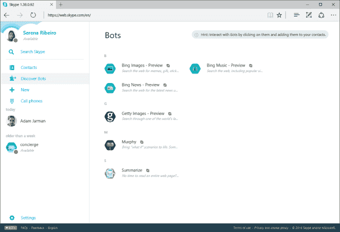

# Skype 新机器人登陆 Mac 和 web 

> 原文：<https://web.archive.org/web/https://techcrunch.com/2016/04/19/skypes-new-bots-arrive-on-mac-and-web/>

在 3 月份的微软年度构建会议上，该公司[宣布](https://web.archive.org/web/20221127141122/https://beta.techcrunch.com/2016/03/30/microsoft-is-bringing-bots-to-skype-and-everywhere-else/)计划将机器人引入 Skype 和其他通信平台，包括 Slack、Outlook、LINE 和其他平台。今天，[公司称](https://web.archive.org/web/20221127141122/http://blogs.skype.com/2016/04/19/skype-bots-now-available-on-mac-and-web/) Skype 机器人已经在另外两个平台上“预览”推出:Mac 和 Skype 网络版。这些机器人已经在手机上运行，包括 iPhone、iPad 和 Android，以及最新版本的 Skype for Windows 桌面。

除了推出更多的平台，Skype 还提到了其扩大的机器人选择，其中包括[墨菲](https://web.archive.org/web/20221127141122/https://join.skype.com/bot/df682d20-8e5b-4e4a-a283-cb59cd14cbd7?intcmp=blogs-_-generic-click-_-skype-bots-now-available-on-mac-and-web)，一个在问题不能仅靠文字回答时寻找和创建图像的机器人；还有[总结一下](https://web.archive.org/web/20221127141122/https://join.skype.com/bot/deac2ccb-5a43-4d59-82fb-f75d1cc95ec0?intcmp=blogs-_-generic-click-_-skype-bots-now-available-on-mac-and-web)，一个设计用来在你没有时间读完整个网页的时候给出网页概览的机器人。

微软表示，要在 Mac 上使用这些机器人，你可以点击软件中的联系人菜单，然后选择“添加机器人”选项。你还可以搜索或查看可用机器人的列表。

在网上，你可以选择左边工具栏上的“发现机器人”来查看可用的列表。此外，你可以访问机器人的个人资料页面(就像上面链接的那些)，并从他们的网站上选择“添加机器人”。

这些网络机器人在澳大利亚、加拿大、英国、爱尔兰、印度、新西兰、新加坡和美国都有售

不像脸书的机器人，专注于将新闻、天气、甚至购物体验之类的东西带入 Messenger ( [和糟糕的](https://web.archive.org/web/20221127141122/https://beta.techcrunch.com/2016/04/13/facebooks-new-chatbots-still-need-work/))，Skype 的机器人到目前为止更加实用，如果没有创意的话。

例如，Skype 提供了一些“Bing”机器人，可以让你在 Skype 上搜索新闻、图片或音乐。与此同时，Getty Images 机器人可以让你搜索该公司的库存摄影资源。这使它们更像是 Skype 中的实用工具，而不是像 Messenger 那样，成为与企业和品牌互动的新方式。

该公司表示，这些机器人处于“预览”阶段，这意味着这仍然是一个早期测试，你可能会遇到错误或其他问题，这些问题将在以后的版本中得到纠正。