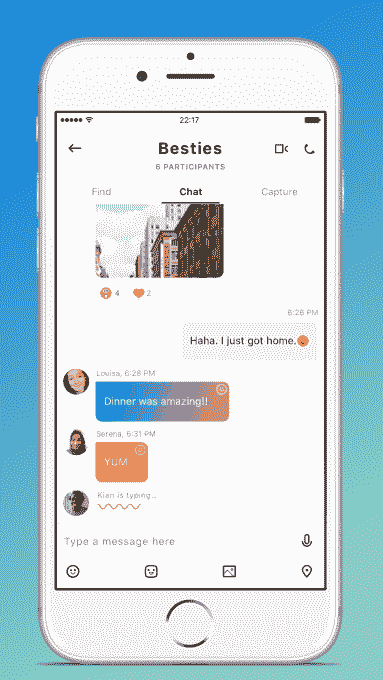
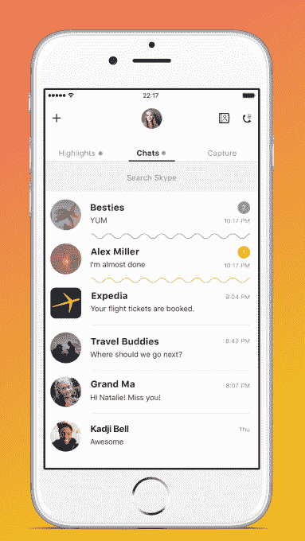
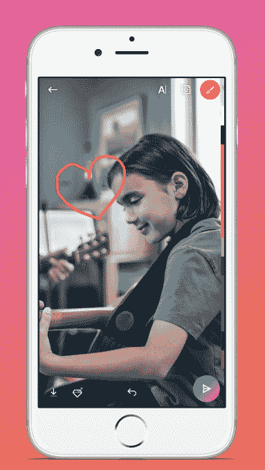
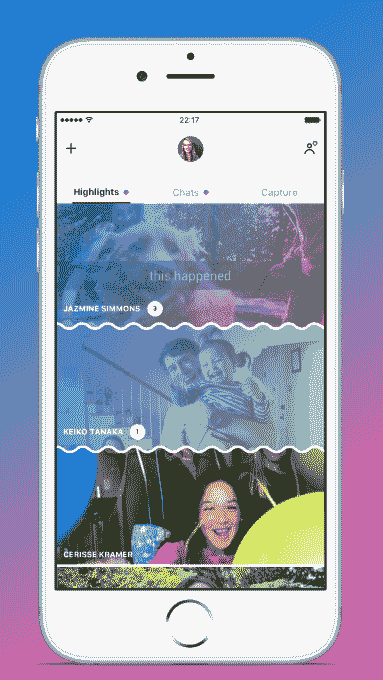
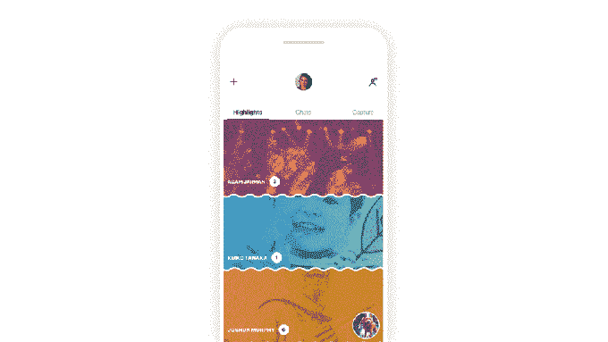
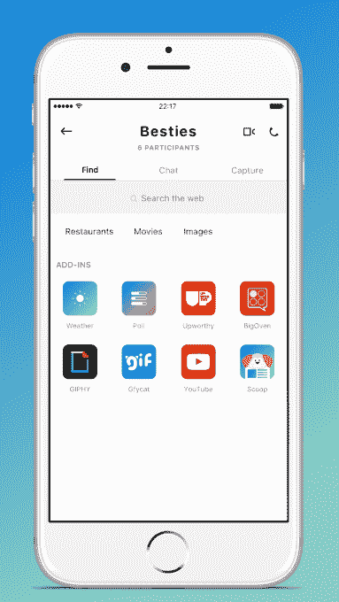

# Skype 受 Snapchat 启发的改造将摄像头移开，增加故事

> 原文：<https://web.archive.org/web/https://techcrunch.com/2017/06/01/skypes-snapchat-inspired-makeover-puts-the-camera-a-swipe-away-adds-stories/>

微软今天[发布了](https://web.archive.org/web/20230326023759/https://blogs.skype.com/news/2017/06/01/introducing-the-next-generation-of-skype)其 Skype 应用程序的全新版本，新功能明显受到了 Messenger 和 Snapchat 等即时通讯竞争对手的启发。是的，这意味着 Skype 现在有了自己的类似故事的功能，它称之为高亮显示，以及重新设计，将摄像头从你的聊天中移开。

该公司表示，Skype 的改造已经进行了一年多，这是自 2006 年引入视频分享以来该平台的最大变化。换句话说，这不一定是为了应对 Snapchat 的威胁而建立的快速复制尝试，)以及脸书在其平台上复制 Snapchat)，而是 Skype 在更长时间内一直在努力的事情。

Skype 公司副总裁 Amritansh Raghav 解释说:“如果社交网络给了你一个展示生活的舞台，那么新的 Skype 给了你一个额外的相当于当地咖啡馆或街角酒吧的地方，在那里你可以每天与人见面，加深你的关系。”“我们把这种互动称为你的个人网络，”他说。

改造的目的是让 Skype 成为一个更好的工具，在 Skype 联系更紧密的网络成员之间进行交流和分享，这个网络通常包括家人和朋友。这意味着 Skype 正在将短暂分享作为其功能集的一部分，此外还有故事和其他受摄像头启发的功能。

它今天还推出了自己的一套机器人和聊天插件，与竞争对手 Facebook Messenger 竞争。

**亮点——Skype 的报道**

在新版 Skype 应用程序中，你只需滑动一下就可以拉起摄像头——这是一种现在很熟悉的交互方式，这要归功于当今社交应用程序中的摄像头优先设计。

然后你可以抓拍一张照片或一段视频——当然，你可以用打字或手写的文字以及 Skype 自己的贴纸来装饰它——就像在其他应用程序上一样。

在新版 Skype 中，您拍摄的照片和视频可以在群聊中与个人分享，也可以发布到名为 Highlights 的新功能中。

当你从主屏幕向右滑动时相机可用，而向左滑动时高亮显示。

亮点是 Skype 自己对故事的理解——该公司很乐意承认这一点。

“就像脸书说的那样，”Raghav 说，[引用了脸书消息副总裁 David Marcus 的评论](https://web.archive.org/web/20230326023759/https://techcrunch.com/2017/03/26/camera-is-the-new-keyboard/)，他最近认为故事“绝对是一种格式，就像 feed 是一种格式一样。”

Raghav 同意。这种订阅现在被广泛应用于一系列应用中，甚至包括那些非个人社交网络的应用，比如微软的商业通讯服务 Yammer。

“有一种新的媒介已经崛起，”他谈到故事。“当你想到这种新的交互方式时，我们希望这种方式也能在这个应用程序中实现。”

然而，Skype 对故事的格式做了一些调整。

首先，它的精彩部分可以看一周，而不是一天。(不过，如果你愿意，你可以在 24 个月内查看自己的内容)。精彩部分也不会向您的整个 Skype 网络广播。相反，他们使用类似 Twitter 的关注者/追随者模型——这意味着只有那些关注你的亮点的人才能看到这些帖子。

但是，您可以选择与您手动选择的个人联系人或群组“共享”您的精彩内容，如果收件人还没有关注您的精彩内容，这将促使他们关注您的精彩内容，但不允许您向他们发送垃圾更新。

关注者也可以用表情符号对精彩帖子做出反应，就像他们对任何 Skype 帖子一样。在这里，Skype 模仿了脸书的反应——你可以竖起大拇指(喜欢)、心(喜欢),或者张贴表情符号来表达悲伤、惊讶、大笑和愤怒等反应。您也可以键入回复，然后在聊天中私下分享。

**机器人&插件**

今天推出的另一个主要功能是 Skype 机器人和插件的扩展选择。微软设想你将能够直接与其虚拟助手 Cortana 或更新的助手 Scoop 聊天，后者从 MSN.com 获取新闻。

当一个机器人被集成到聊天中时，它被称为插件。这意味着你可以在聊天中直接调用机器人，比如*“独家新闻，X 怎么了？”*(其中 *X* 是你想了解的当前新闻项目)。

在聊天中，Cortana 将能够提出建议，包括像“LOL”或“不能等待”这样的快速响应，或者其他与你的对话相关的内容。与此同时，Scoop 提供一对一的聊天，提供个性化的新闻故事建议和摘要，但也可以在群聊中分享与该群体对话相关的故事。

微软的演示展示了一些[机器人](https://web.archive.org/web/20230326023759/https://support.skype.com/en/faq/FA34655/what-skype-bots-are-available)和插件，比如 Cortana、Scoop、Gfycat、Giphy、MSN Weather、Search (Bing)、Polls、Expedia、Stubhub、BigOven (cooking)、YouTube 和 Upworthy 等等。然而，Cortana 要到 6 月份才会在美国上市。

**群聊和更多**

虽然亮点和附加功能是突出的新功能，但改版后的 Skype 有很多不同之处。

例如，你现在可以通过选择你最喜欢的颜色来个性化应用的主题，用表情符号对聊天中的任何事情做出反应，甚至在视频通话中使用表情符号做出反应——这一举动将暂时在你的窗口中覆盖一个大的表情符号和彩色背景，以便其他呼叫者看到。

现在，您还可以在视频通话时输入消息，显示方式也大致相同——这在您进行群组通话但不想通话时会很有帮助。

视频聊天也将在未来升级，以支持其他类型的互动，包括与朋友玩游戏或一起观看流媒体服务的视频。群组共同观看是许多社交应用程序试图吸引注意力的领域，包括 Tumblr 的 Cabana、YouTube 的 Uptime、Fam 等。

我们被告知，YouTube 将是第一批加入共同观看的服务之一，但 Skype 正在与其他流媒体服务就整合进行讨论。与此同时，游戏最初将利用现有的微软资产，如《我的世界》、纸牌、麻将等。

新的 Skype 今天在 Android 上可用，并将在一个月后登陆 iOS。(据我们了解，延迟是由于 iOS 无法支持分阶段推出。)

包括 Windows、Mac、Linux 和 web 在内的桌面平台将在今年夏天与 Xbox 一起获得新功能。