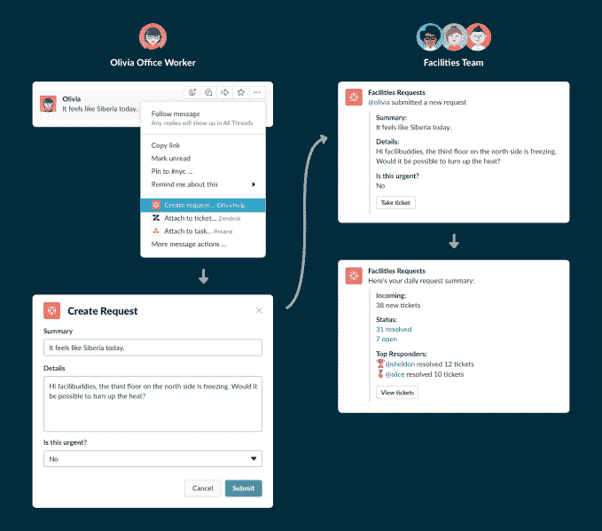

# Slack 获得任务，帮助用户在 chat  中自动完成工作任务

> 原文：<https://web.archive.org/web/https://techcrunch.com/2018/07/17/slack-acquires-missions-to-help-users-automate-work-tasks-inside-chat/>

# Slack 获得了帮助用户在聊天中自动完成工作任务的任务

随着 Slack 付费业务用户的持续增长，该公司正在寻找方法来帮助客户构建对他们的工作有意义的集成。

Slack [今天](https://web.archive.org/web/20230316161016/https://slackhq.com/slack-acquires-robot-pencils-missions-to-make-it-easy-for-non-tech-teams-to-streamline-work-80983cb6fce9)宣布，它已经收购了机器人和铅笔的[任务，](https://web.archive.org/web/20230316161016/https://missions.ai/)一款允许 Slack 用户构建工具来自动化简单例程而无需代码的应用。交易条款没有披露。

付费用户已经是 Slack 集成的忠实粉丝了。目前 Slack 应用目录中有 1500 款应用。该公司表示，该类别中 94%的用户使用应用和集成，而 65%的团队建立了自己的应用和集成。对于非技术团队来说，构建集成肯定不是一个容易处理的过程；Missions 专注于更直观的流程，减少了一些复杂性。

Missions 的技术让人们可以为任务创建工作流，这些任务通常必须在 Slack 内部讨论，然后在聊天之外进行。Slack 希望用户可以通过简化各种可重复过程来帮助团队提高生产力。

Slack 似乎在入职方面看到了这项技术的巨大潜力，确保新员工知道他们需要填写哪些文件，他们需要会见公司的哪些人，以及他们必须完成的其他任务。该应用程序帮助用户的其他潜在领域包括在招聘过程中管理批准和拒绝，以及内部票务。

该公司表示，在接下来的几个月里，他们将免费支持 Missions 的客户，因为他们开始将该技术构建到他们的平台中。你什么时候能开始玩这项技术？该公司表示，他们将在“今年晚些时候”分享更多信息