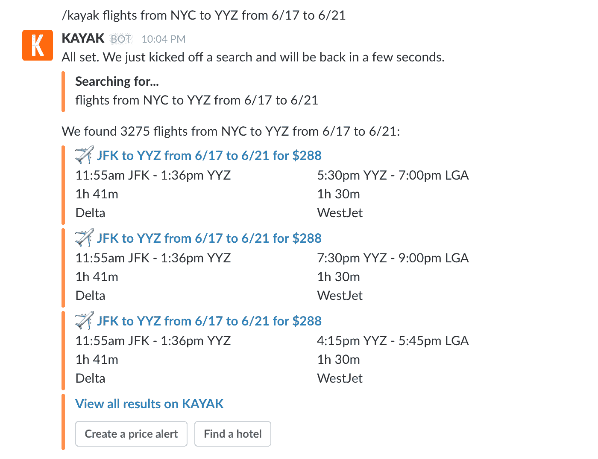

# 使用 Kayak、Trello 等消息按钮机器人时不要懈怠

> 原文：<https://web.archive.org/web/https://techcrunch.com/2016/06/21/slack-debuts-message-buttons-bots-with-trello-kayak-and-10-more-to-perform-tasks-in-its-app/>

现在，你可以通过 Slack 新的[消息按钮](https://web.archive.org/web/20221209161805/https://medium.com/slack-developer-blog/message-buttons-and-the-slack-api-ab938174af70#.8mbn5hkpg)，在 Slack 内部批准费用、分配截止日期、查询航班以及与其他企业工具互动。Slack 正在努力成为你的永远开放的门户，与自去年 12 月发布以来最大的 API 更新一起工作。

例如，只需输入“/kayak flights from NYC to BOS on 6/23”，你就会看到带有价格提醒功能的航班选项。

Slack 表示，新的消息按钮将与 12 款应用一起亮相——协作平台 Trello、旅游网站 Kayak、招聘管理服务 Greenhouse、商业智能网站 Qualtrics、联络中心解决方案 Talkdesk、事件管理网站 PagerDuty、人工智能购物助手 Kip、生产力工具 Kyber、GIF 共享应用 Riffsy、费用应用 Abacus、会计包 Current 和帮助台应用 Talkus。但该公司计划随着时间的推移增加更多应用，开发该公司称其应用目录中现有的 500 款应用。

 
新服务突出了两个有趣的趋势，一个是懈怠，一个是更广泛的发展。

Slack 目前总共拥有 300 万日活跃用户和 93 万多名付费用户，平均使用时间为 10 小时/工作日。slack 正在继续开发更多服务，使其平台更具粘性，本质上是创造更多方法，让用户在平台上停留更长时间。

这对该公司的商业模式至关重要，这种模式基于免费增值的概念，用户可以免费获得基本访问权限，但需要为更高级别的存储和其他功能付费。增加一个功能，让用户能够在 Slack 本身的应用程序中执行任务，这将让更多人继续使用它，并减少他们离开它的理由(更多地使用它意味着需要为更多的存储、安全和归档功能付费)。

https://www.youtube.com/watch?v=RBWqz2L8DZI

这带来的第二个发展是“机器人”的更大增长，本质上是自动执行任务并引导你完成特定应用程序中一系列动作的[迷你应用程序。机器人已经被整合到脸书的 messenger 等消息应用程序中，以及 Sapho 等独立服务中，Sapho 为软件开发机器人，而这些软件从一开始就不是由它们构建的。现在我们有了 Slack 对这一趋势的回答。](https://web.archive.org/web/20221209161805/https://medium.com/slack-developer-blog/message-buttons-and-the-slack-api-ab938174af70#.jqyh7vyo7)

关于每个首次亮相的应用程序将如何工作的更多细节如下，per Slack 本身:

*   **Trello** :一个可视化协作工具，让各种规模的团队分享对项目的看法。创建卡片，邀请团队成员，在 Slack 中为卡片添加截止日期和其他详细信息。
*   Kayak :世界领先的旅游搜索引擎。搜索航班、酒店、租车，通过我们的航班跟踪工具获得即时航班更新，并设置价格提醒，查看您想要的酒店或航班的价格是否发生变化，所有这些都在 Slack 范围内。
*   **温室**:寻找、面试、雇佣和引进合适的人才。Slack 用户可以配置直接发送给用户或特定 Slack 渠道的招聘通知，包括批准、新候选人、新推荐、代理提交和到期记分卡。
*   质量标准:质量标准有助于组织获得洞察力并据此采取行动。Qualtrics 应用程序允许在 Slack 内部创建和发送小型调查，以获得即时反馈。
    
*   **Talkdesk** :通过将 Talkdesk 强大的联络中心解决方案与 Slack 整合，在公司内部和外部沟通流程之间建立无缝链接。
*   **page duty**:敏捷事件管理解决方案，集成 ITOps 和 DevOps 监控堆栈，聚合事件，并将它们关联成可操作的警报，以提高运营可靠性和敏捷性。
*   **Kip** :团队购物的 AI 助手，帮助办公室助理和经理节省时间和收集办公室采购订单的挫折感。
*   Kyber:Slack 的第一个对话式生产力套件，提供项目管理、日历、提醒和待办事项。计划和跟踪您的团队项目，发送会议邀请，分配任务，以及管理您所有的待办事项、提醒和事件。
*   **Riffsy** : Riffsy 是下载量最高的 GIF 分享 app。Slack 集成允许您搜索和浏览超过 33 种语言的完美 GIF，以一种有趣的新方式分享您的想法和感受变得更加容易。
*   **Abacus** :唯一的智能费用报告解决方案，使用数据和行为分析来提出建议，并自动创建和批准费用。做任何事情，从邀请你的团队到报销批准的费用。
*   **Current** : Current 正在打造你金融生活的数字中枢。通过 Slack，您可以立即直接连接到当前团队。
*   Talkus 是你的帮助台，在空闲时。Slack 成为你的团队在你的网站上通过实时聊天或电子邮件、电话或短信与客户进行个人交流的地方。

用于批准费用的 Abacus 松弛消息按钮

Slack 告诉我们“这一发展标志着 Slack 有潜力成为每个员工每天全天开放的工具，以及每个知识工作者与同事、应用程序和所有工作流联系的方式。”

Slack 能嵌入其应用的企业工具越多，内置在 Slack 上的企业工具越多，客户就越难放弃。考虑到其核心聊天应用并不难复制，这一点至关重要。但通过依靠由宣传、reach 和投资集成应用的 Slack 基金推动的开发者生态系统，Slack 正在建立一条深深的护城河。

这是一条护城河，不仅可以防止其他企业通信工具侵入其空间，还可以将用户整天困在聊天界面中，使他们永远不会考虑取消订阅。