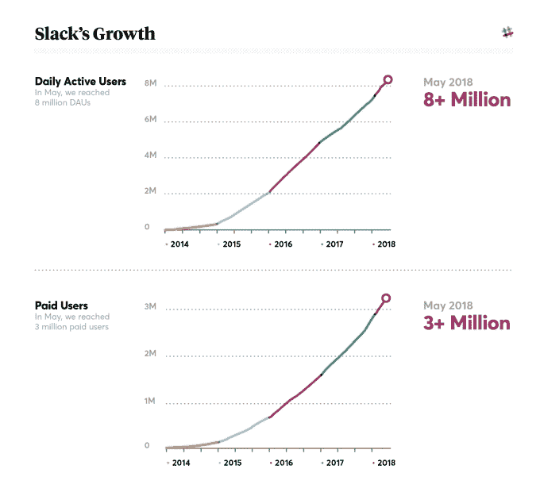

# Slack 日活跃用户达到 800 万，付费用户达到 300 万

> 原文：<https://web.archive.org/web/https://techcrunch.com/2018/05/08/slack-hits-8-million-daily-active-users-with-3-million-paid-users/>

# Slack 日活跃用户达到 800 万，付费用户达到 300 万

随着 Slack 寻求以更简单的工作场所协作工具的前景来吸引越来越大的公司，该公司表示，现在它的日活跃用户已达 800 万。

该公司表示，它还拥有 300 万付费用户。作为硅谷的宠儿，Slack 最初能够利用对更简单易用的工作场所通信工具的压抑需求。Yammer、微软和其他公司试图以更像 Web 2.0 时代的消费者工具的方式重塑内部通信，但 Slack 推出了一种最初只是一种圆滑的聊天和团队通信工具的方法。这帮助它的估值飙升至 51 亿美元，并推动其在小公司和初创公司中的首次采用。

Slack 在 9 月份表示，它拥有约 600 万名日活跃用户、5 万个团队和 200 万名付费用户，年经常性收入约为 2 亿美元。因此，在过去九个月左右的时间里，这是一个非常重要的飞跃，尽管该公司仍然需要打破这种观念，即它是一个只适合初创公司和小公司的工具。大型企业交易往往会带来更大的合同和额外的收入，因为它希望建立一个稳健的业务。Slack 一半以上的用户都在美国以外，这表明它希望继续向新的地区扩张，这些地区可能不仅仅是国内市场，还需要 Slack 这样的工具。

Slack 一直在试图推出额外的工具来支持那些较大的公司，而不是仅仅作为一个聊天工具来运营，当公司拥有数千名员工时，这种工具可能会失控。该公司在机器学习工具上进行了大量投资，以便更容易地搜索可能已经存在于一些松弛渠道或直接消息中的答案。Slack 还推出了线程 T2，这是用户期待已久的功能，虽然不清楚它将如何存在于 Slack 更简单的界面中。

已经有初创公司在寻找公司不一定能填补的利基市场。Slite 是一家初创公司，希望建立一个更简单的 notes 工具，以创建一个更智能的内部维基，[上个月筹集了 440 万美元。还有 Atlassian 的 Stride，](https://web.archive.org/web/20230316161016/https://techcrunch.com/2018/04/23/slite-raises-4-4m-to-create-a-smarter-internal-notes-tool/)[于今年二月向开发者开放。微软也有自己的竞争对手 Teams，](https://web.archive.org/web/20230316161016/https://techcrunch.com/2018/02/20/stride-atlassians-slack-competitor-opens-its-api-to-all-developers/)[继续获得相当大的更新。Slack 显然暴露了对类似工具的大量被压抑的需求，现在面临着许多竞争。](https://web.archive.org/web/20230316161016/https://techcrunch.com/2018/01/29/microsofts-slack-competitor-teams-gets-its-biggest-update-with-new-app-integrations-and-app-store/)

Slack 成立了 Slack 基金，作为吸引开发者为 Slack 开发工具的一种方式，去年年初投资了 11 家新公司。该公司一直试图创建一个强大的生态系统，开发者可以填补该公司可能缺失的利基市场，但希望专注于其核心产品。该公司表示，Slack 目录中现在有超过 1500 个应用程序。