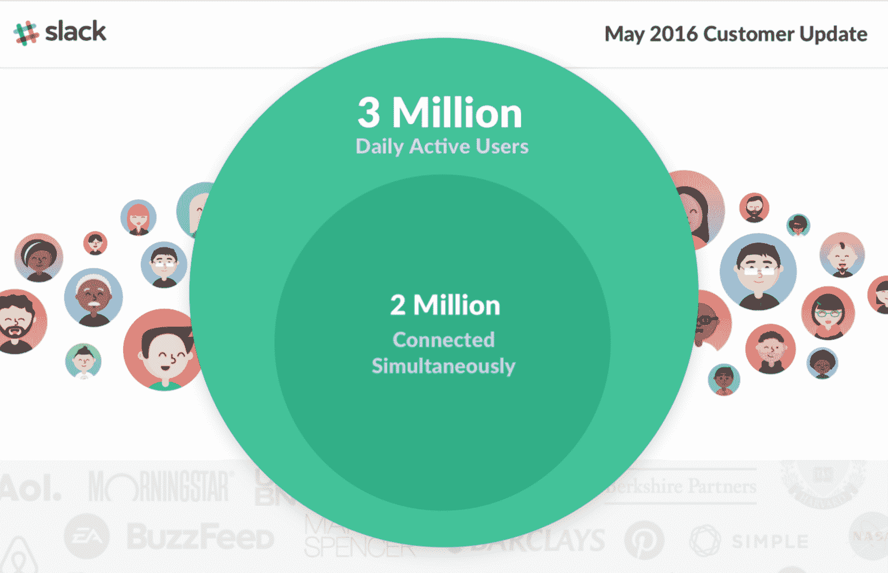

# Slack 现在有 300 万用户每天在这项服务上聊天 

> 原文：<https://web.archive.org/web/https://techcrunch.com/2016/05/25/slack-now-has-3-million-users-chatting-it-up-on-the-service-every-day/>

# Slack 现在每天有 300 万用户在这项服务上聊天

Slack 有相当多的用户在相当长的时间里登录到聊天服务。

企业通信应用今天在其公司博客上发布了[的一点更新](https://web.archive.org/web/20230120235431/https://slackhq.com/a-little-update-about-a-lot-of-people-using-slack-f16c5b331647#.b2k8ocft0)，宣布该服务仍在快速增长，在不到一年的时间里其每日活跃用户增加了两倍，在过去的 8 个月里其并发用户增加了一倍。

*   300 万用户每天使用该应用发送聊天、图像、电子表格、gif 等。
*   两百万用户同时连接

这些用户数量延续了该服务用户增长的上升趋势。在产品领域沉寂了一段时间后，Slack 在过去的几个月里努力工作，积累经验。他们已经开始增加语音和视频聊天功能，现在正致力于让 T2 的“用 Slack 登录”成为企业版的脸书通用登录。

在今年四月[又筹集了 2 亿美元](https://web.archive.org/web/20230120235431/https://techcrunch.com/2016/04/01/slack-raises-200m-at-3-8b-valuation-for-business-messaging/)资金后，该公司目前的估值为 38 亿美元。该服务已经表明，它随着用户的增长而增长，但这些数字表明，即使是每日活跃用户也可能不是一个足够相关的指标，来显示有多少用户在空闲时间跳跃。