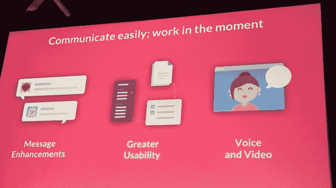

# Slack 是工作聊天的失控列车，以 38 亿美元的价格筹集了 2 亿美元

> 原文：<https://web.archive.org/web/https://techcrunch.com/2016/04/01/slack-raises-200m-at-3-8b-valuation-for-business-messaging/>

[懈怠](https://web.archive.org/web/20230125061726/https://slack.com/)火箭不会减速。该公司向 TechCrunch 证实，这家商业信息初创公司以 38 亿美元的税后估值筹集了 2 亿美元。这一轮由繁荣资本牵头，GGV、康卡斯特风险投资公司和包括 Accel、Index Ventures 和社会资本在内的 Slack 现有投资者参与其中。

这使得这家成立三年的公司的总资金达到了惊人的 5.4 亿美元。去年 4 月，Slack 的估值达到 28 亿美元。[在那一年，它看到了疯狂的 3.5 倍用户增长。](https://web.archive.org/web/20230125061726/https://techcrunch.com/2016/04/01/rocketship-emoji/)

“一如既往，随着我们继续执行雄心勃勃的增长计划，我们将借此机会进一步巩固我们的领导地位。这种资本增加了我们现有的储备，增强了我们专注于坚定的长期战略眼光的能力。”——首席执行官兼联合创始人斯图尔特·巴特菲尔德在一份声明中表示。

“我们很高兴与 Slack 合作，因为它将继续重塑团队合作方式，”繁荣资本的管理合伙人 Josh Kushner 在一份声明中说。“我们相信，在一个日益复杂的跨平台、跨团队、跨应用的世界里，Slack 将定义无缝通信的未来。”

公司客户包括美国宇航局、领英和 Spotify。我们在 TechCrunch 使用 Slack 进行内部沟通。这家总部位于旧金山的公司有 430 名员工。

Slack 在硅谷备受关注，承诺减少电子邮件，拥有 270 万每日用户，这对一家初创企业来说意义重大。该公司最近在我们一年一度的克朗彻典礼上获得了“T4 最快崛起的初创公司”的奖项

凭借其炒作、资金、用户数量和开发者势头，Slack 看起来像一列失控的火车。竞争对手或许可以复制它的核心功能，但无法复制它的网络效应或集成应用和聊天机器人的生态系统。

那些认为这种增长将持续的人可能会认为估值有点低，尽管它对当前用户的终身价值很高。Slack 可能会有一些有趣的计划，来处理其战争基金中现有的额外 2 亿美元。收购、高调招聘和铁杆 R&D 都是机会。例如，它现在正致力于推出语音聊天，并正在建立视频聊天。

现在的问题是，有人能停止懈怠吗？