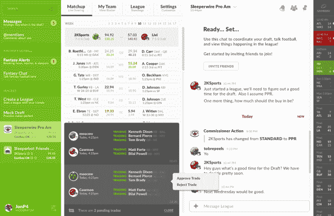

# Sleeper 是举办本赛季梦幻足球联赛的最佳场所 

> 原文：<https://web.archive.org/web/https://techcrunch.com/2017/08/11/sleeperbot-is-the-best-place-to-host-your-fantasy-football-league-this-season/>

# Sleeper 是举办本赛季梦幻足球联赛的最佳场所

Sleeper 已经从 Birchmere VC 和 Expa 获得了大约 1000 万美元的种子资金，号称拥有数十万用户，自称为体育 Slack。

它本质上是一个应用程序(和网站),让体育迷围绕他们感兴趣的不同主题进行对话。这些讨论发生在渠道中——其中一些是由公司创建的，是像幻想建议这样的一般性话题，一些是由用户创建的——像老鹰队粉丝俱乐部。

现在他们增加了另一个功能，肯定会让它对体育迷更有用——梦幻体育。从本赛季的 NFL 开始，Sleeper 在其应用程序中增加了对长达一个赛季的幻想体育的支持。

这一举动完全有道理，因为与日常的幻想运动不同，整个赛季的幻想运动是一项非常社会化的活动。

大多数人和他们一生都认识的朋友一起玩游戏，社交/聊天元素和实际游戏一样重要。这就是为什么休闲玩家使用 ESPN 或雅虎幻想这样的网站已经没有意义了——当你可以在一个地方做所有事情时，谁会想在一个应用程序中进行交易，然后切换到 iMessage 或 GroupMe 与联盟的其他人交谈呢？

因此，Sleeper 的幻想产品非常注重社交——事实上，应用程序中的几乎每个屏幕都有嵌入式聊天，所以你可以和你的联盟交谈。还有一个功能是为面对面的选秀提供动力，这在大多数朋友间的严肃幻想体育联盟中是很重要的。

虽然 fantasy 产品刚刚推出，但 Sleeper 作为一款聊天应用已经存在了一段时间，并获得了一些不错的牵引力。用户每天打开应用程序 4-5 次，每次花费 3-5 分钟——在游戏高峰期，用户平均可以花 30 分钟在应用程序上与朋友谈论体育。

Sleeper 的免费 NFL 幻想产品将在本赛季推出，其他运动将在今年晚些时候推出。你可以在 iOS 应用商店的[这里](https://web.archive.org/web/20221207201829/https://itunes.apple.com/us/app/sleeperbot-fantasy-football/id987367543)和[谷歌 Play 商店这里](https://web.archive.org/web/20221207201829/https://play.google.com/store/apps/details?id=com.sleeperbot&hl=en)下载他们的应用，或者在网上玩。

[gallery ids="1526169，1526170，1526171"]

*【更新:本文已被编辑以反映 Sleepbot 已更名为 Sleeper。]*