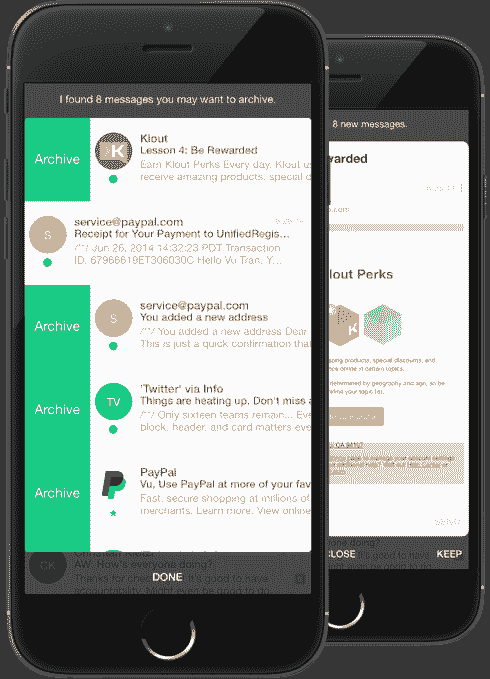

# SlideMail 是一款智能电子邮件应用

> 原文：<https://web.archive.org/web/https://techcrunch.com/2015/03/20/slidemail-is-an-intelligent-email-app-for-the-rest-of-us/>

今天发布的一款名为 [SlideMail](https://web.archive.org/web/20230401164845/http://www.slidemailapp.com/) 的新电子邮件应用旨在帮助我们这些有不良电子邮件习惯的人整理收件箱，同时智能地组织我们的邮件，并提醒我们重要的会议和其他事件。虽然其他电子邮件应用程序专注于向高级用户提供包含他们最重要电子邮件的“优先收件箱”，但 SlideMail 的做法略有不同。为了找出对你来说什么是重要的，它会观察你的电子邮件活动，了解你阅读、丢弃和存档的内容，然后随着时间的推移适应这种行为。

SlideMail 的创建者 Vu Tran 之前创建了 Y Combinator 支持的公司 Framebase，他第二次回到加速器计划，以使这款新的电子邮件应用程序启动。

他说，最初，他开始开发 [SlideMail](https://web.archive.org/web/20230401164845/http://www.slidemailapp.com/) 来解决他个人在使用电子邮件时的痛点。例如，他经常会被收件箱里的电子邮件淹没，错过重要的会议请求。然而，使用 SlideMail，该应用程序可以解析你的电子邮件文本，以查找日期、时间和其他表明即将发生的事件，甚至是即将到来的航班的措辞。

例如，如果你使用像 [Boomerang 日历](https://web.archive.org/web/20230401164845/http://boomerangcalendar.com/)这样的 Gmail 插件，技术在这里并没有什么不同——除了 Boomerang 的实现，你必须在 Gmail 的网络界面上点击带下划线的日期和时间，然后点击将该项目添加到你的谷歌日历中。不过，在 SlideMail 中，这款应用只是自动提醒你即将到来的活动。

此外，它还可以帮助定位它在地图上检测到的事件，或者当它检测到电子邮件提到即将到来的航班时，调出最新的航班时刻表。

[gallery ids="1134851，1134850，1134849"]

该应用程序还能够识别不同类型的电子邮件，如收据、时事通讯或你认识的人的个人电子邮件，这有助于分类。它的一个更好的技巧是，在首次启动应用程序时，它能够立即向你建议它认为你应该存档的电子邮件，以便更快地对收件箱进行分类。当你打开应用程序时，它会出现在你收件箱上方的一个弹出框中，从这里你可以点击它的建议旁边的“存档”或点击“完成”进入你的收件箱而不采取任何行动。

SlideMail 与当今市场上其他电子邮件应用程序的不同之处在于，你越是使用 SlideMail，它就越能适应你。Tran 解释说，如果你真的阅读并保存了时事通讯，它会更好地对它们进行优先排序。与此同时，它还会学习哪些电子邮件是你经常存档或丢弃的，然后开始建议你存档这些邮件。

“我们的目的是让电子邮件体验更加愉快、更加个性化，因为你的收件箱也是个性化的。”特兰说。

虽然收件箱管理是这款应用的重点，但 SlideMail 也有比其他手机邮件客户端提供更多隐私的优势。如今，许多应用程序会在服务器上存储你收件箱的副本，但 SlideMail 不会——所有的处理都发生在应用程序本身。如果你删除了手机上的应用程序，你的数据就没了。Tran 表示，该计划还将在未来为系统增加加密功能。

## 面向主流用户(非高级用户)的智能电子邮件

这位创始人指出，在今天推出之前，SlideMail 已经与大约 8000 多名测试人员进行了私下测试，并以每天 800 到 1000 人的速度增加新的测试人员。在测试期间，Tran 发现该应用程序实际上更能引起非技术、非高级用户群的共鸣，尽管他最初是为像他一样的高级用户开发的。

Tran 解释说，技术用户和商业用户已经根深蒂固地习惯使用他们自己的电子邮件，如果 SlideMail 不能为他们提供他们所依赖的功能，那么它就是交易的破坏者。

“所以我们将[测试版]随机分发给一些人——比如老年人和大学生。真正让我感到惊讶的是，他们的保留数字要高得多，”Tran 说。“他们喜欢的特性比技术人员喜欢的要多得多。”

他意识到也许他们用 SlideMail 瞄准了错误的人。现在，该团队正在努力让这款应用更容易被更主流的观众所接受，他们更喜欢简化的体验。

该应用目前在 iTunes 上免费下载。未来将开发 iPad 版本，然后是 Mac 版本，最后是 Android 版本。

SlideMail 的小团队包括来自流行电子邮件应用 Mailbox(已被 Dropbox 收购)的设计师。Tran 还表示，最终，这家初创公司希望为其受众开发一套生产力应用程序。