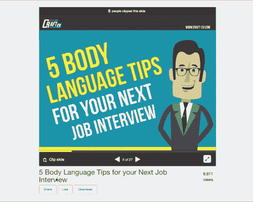
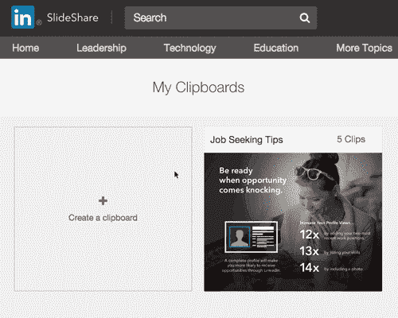
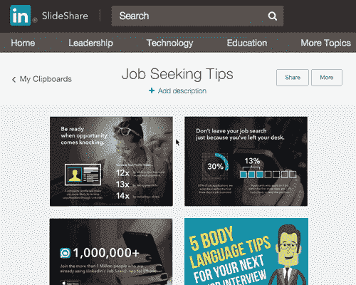

# SlideShare 更名为“LinkedIn SlideShare”，增加了一个类似 Pinterest 的剪贴板部分 

> 原文：<https://web.archive.org/web/https://techcrunch.com/2015/08/25/slideshare-rebrands-as-linkedin-slideshare-adds-a-pinterest-like-clipboard-section/>

在被 LinkedIn[收购](https://web.archive.org/web/20230114132535/https://techcrunch.com/2012/05/03/linkedin-acquires-professional-content-sharing-platform-slideshare-for-119m/)三年后，slide share morning 与专业社交网络[的更名](https://web.archive.org/web/20230114132535/https://blog.slideshare.net/2015/08/25/introducing-clipping-on-linkedin-slideshare/)(现在是“LinkedIn SlideShare”)以及允许用户从演示文稿中剪切出最佳幻灯片并保存到基于主题的剪贴板的新工具进行了更深入的整合。

新增的功能，简称为“Clipping”，已经在今天发布之前与许多 SlideShare power 用户进行了测试，这些用户已经提前使用了该工具，以便建立专注于从专业兴趣到个人灵感的一切的剪贴板。

从今天开始，任何 LinkedIn SlideShare 用户都可以这样做。

当你在网上启动一个幻灯片共享平台时，你会注意到在幻灯片的左下角有一个“剪辑幻灯片”图标。当您单击此按钮时，幻灯片会保存到您的用户配置文件下名为“我的剪贴板”的新部分在这里，您可以将浏览网站时保存的幻灯片组织到自己的剪贴板中，例如，您可以创建一个用于职业建议、求职技巧、行业统计、操作指南等的板。

例如，LinkedIn 联合创始人雷德·霍夫曼的职业战略委员会[就在这里](https://web.archive.org/web/20230114132535/http://www.slideshare.net/reidhoffman/clipboards/careers)。与此同时，演讲教练米歇尔马祖尔有一个关于公众演讲技巧的剪贴板。

当你的留言板完成后，你可以选择将它公之于众，可以搜索，也可以在社交媒体网站上分享，包括脸书、Twitter、Google+，当然还有 LinkedIn。

该功能有点像书签服务 Pinterest，它具有高度的视觉焦点和董事会创建方面，但它不允许你剪辑、保存和组织网络上的内容，剪辑功能只对 SlideShare 本身有效。

除了剪辑功能，SlideShare 现在还与 LinkedIn 进行了更深入的集成，因此您可以更多地了解最初发布内容的人。这是为了帮助你的研究，让你更好地审查内容，并确定它是否被某个话题或行业专家分享。

该公司表示，剪辑只是 SlideShare 和 LinkedIn 将更加深入整合的许多方式之一——其他功能包括更好的组织工具，将自己定位为专家或寻找你想了解更多的各种主题的专家的方式，以及 LinkedIn SlideShare 本身的其他个性化工具。

据该公司称，SlideShare 网站目前每月有 7000 万活跃用户，每月新增 40 万份演示文稿。自加入 LinkedIn 以来，该网站的内容几乎翻了一番，从 2013 年的 1000 万条增长到今天的 1800 多万条知识。

然而，品牌本身通常被认为是一种工具，而不是其自身的社交网络。事实上，其 80%的流量来自搜索，这表明今天的用户倾向于在寻求特定信息时访问 SlideShare 不一定是为了发现专家策展人或感兴趣的主题。

Clipping 和现在可共享的 My Clipboards 显然希望改变这种情况，随着进一步整合到 LinkedIn，SlideShare 可以受益于 LinkedIn 的影响力和社区，同时继续发展自己的社区。