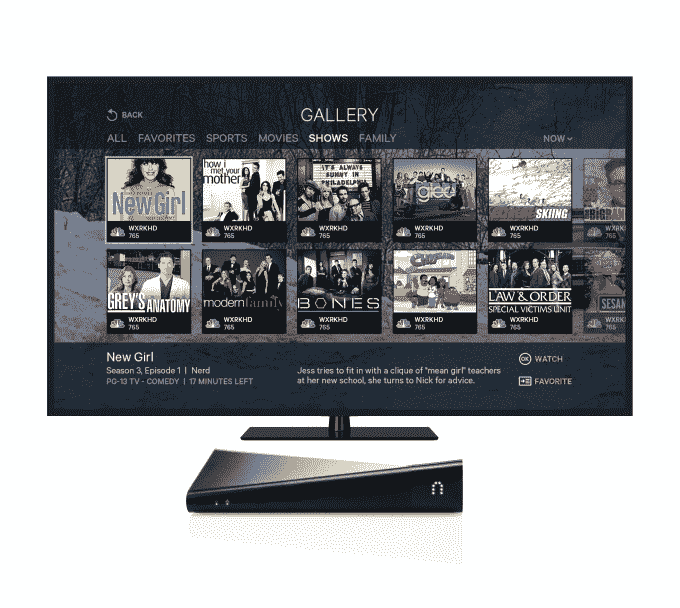

# Sling Media 推出了 150 美元的 Slingbox M1 盒子、升级的 SlingTV 用户界面和桌面应用 

> 原文：<https://web.archive.org/web/https://techcrunch.com/2014/07/15/sling-media-introduces-150-slingbox-m1-box-upgraded-slingtv-user-interface-and-a-couple-of-desktop-apps/>

Sling Media 是那种偶尔会被你遗忘的公司，但它们只是在稳步前进，偶尔会推出新产品。该公司成立于整整十年前，现在是有线电视和卫星供应商 [EchoStar](https://web.archive.org/web/20221206112716/http://www.crunchbase.com/organization/echostar) 的全资子公司，然而它仍在开发新的东西来让其用户群兴奋不已。

今天 Sling 推出了几款产品——T4 Sling box M1 和 SlingTV。

### 吊索 M1

吊索产品家族的最新成员是对其最新硬件[吊索箱 350 和 500 型号](https://web.archive.org/web/20221206112716/https://beta.techcrunch.com/2012/10/09/sling-releases-its-first-new-hardware-in-years-the-slingbox-500-and-slingbox-350/)的重申和升级。18 个月前推出的这些盒子是 Sling 多年来的第一批新硬件。

售价 150 美元的 Slingbox M1 比 Slingbox 350 便宜 30 美元，被设计成一个纯粹的流媒体设备。它可以捕捉您的视频，并将其发送到互联网上，您可以通过许多移动设备、平板电脑和连接的电视设备以及网络浏览器来访问它。

与 350 不同，它有 WiFi，便于设置，并集成了几个为桌面和移动应用程序构建的新应用程序。(稍后将详细介绍。)除了远程观看电视直播(这是 Sling 最初的存在理由)，用户还可以通过新的盒子播放和安排 DVR 录制。

### SlingTV

新的 SlingTV 基本上只是旧 Slingbox 500 的更新版本，具有漂亮的新用户界面。像 M1 一样，300 美元的 SlingTV box 可以让人们在其他设备上播放他们喜欢的直播和预先录制的电视节目。但随着最新的更新，Sling Media 正在寻求改善他们在客厅中浏览、发现和导航内容的体验。

对于没有智能电视也不打算近期购买的客户来说，SlingTV 界面可能会对他们现有的网格频道指南进行升级。新的电子节目指南包括显示节目信息的封面艺术瓷砖，还提供基于评论、节目受欢迎程度和社会活动的个性化推荐。

除了提供更直观的体验之外，新的可视化界面还允许用户根据流行程度、喜好和各种不同类型的节目进行过滤。对于电影，用户界面添加了烂番茄评分，对于体育，用户界面会立即突出显示分数、统计数据和其他信息。

当 SlingTV 上市销售时，Singbox 500 的所有者也将获得自动更新的新用户界面。

### 桌面应用和硬件可用性

除了新的硬件，Sling 还为 T2 的 Windows 电脑和 T4 的 Mac 电脑引入了新的客户端。通过这样做，Sling 将流媒体服务带出浏览器，使其更容易使用，响应更快。

**更新** : Sling [在给 TechCrunch 的一条推特](https://web.archive.org/web/20221206112716/https://twitter.com/Slingbox/status/489517652725886978)中证实，PC 和 Mac 的应用将是原生的，并将在本周末与 M1 一起推出。

它还应该使硬件更容易设置，让用户能够直接无线连接到设备，并输入他们的 WiFi 和帐户信息。(实际上，实现似乎并不像他们承诺的那么简单——我花了三个电话和几个小时让我的家人远程完成设置。)

对于那些已经知道并喜欢吊带产品的人来说，最新的硬件比已经推出的产品更上一层楼。7 月 20 日，Sling.com 和部分合作伙伴将开始销售 M1，而 SlingTV 硬件将于 8 月下旬上市。