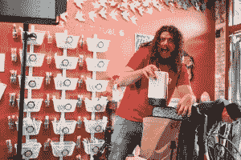

# Sling Studio 让多摄像头视频制作变得如此简单 

> 原文：<https://web.archive.org/web/https://techcrunch.com/2017/07/25/sling-tudio-in-depth-review/>

我喜欢制作视频——这是我的工作。所以，当我看到一款能让我的生活变得更轻松的产品时，我会非常兴奋，并决定拍摄一段评论。这

[Sling Studio](https://web.archive.org/web/20221207195309/https://www.myslingstudio.com/?gclid=EAIaIQobChMI47ahhpyj1QIVWLbACh31QgmLEAAYASAAEgKt0fD_BwE)

是一个有趣的小硬件，它把多摄像机视频制作的所有乐趣都装进了我的背包…这可不是开玩笑的。这个小型移动工作室的强大功能和高效率给我留下了深刻的印象。我下面有一些信息和照片，但你需要知道的一切都在视频里，所以准备好爆米花，邀请家人过来享受吧。

我把所有功能齐全的多摄像头拍摄所需的硬件都装在背包里。

## 产品的一些照片

[gallery ids="1518321，1518326，1518327，1518328，1518329，1518333，1518334，1518335"]

## 最后的想法(*如果你只是想知道我的想法，而不是看视频*):

Sling Studio 系统确实有一些限制，比如最多只能连接四个摄像头*，并且只能录制到脸书直播和 YouTube 直播。但该公司表示，将来你可以添加自己定制的 RTMP。目前你也不能添加你自己的自定义运动图形，但是可以添加静态标志和图像或者使用他们现有的有限图形。你在现实生活中和在 iPad 上看到的东西之间的滞后是非常明显的；你真的必须只专注于饲料，而不是看或听现场行动，否则它会把你搞砸了。还有一个小麻烦:如果你在不同的互联网之间切换，系统不知道也不会更新信息来告诉你当前的互联网速度——你必须手动点击来更新信息。

尽管有这些障碍，Sling 还是创造了一些东西，降低了现场切换制作的门槛，这很棒；我的意思是，只要能够把整个东西装进背包，快速设置和切换拍摄，然后编辑它，就改变了游戏规则。如果你经营一家小型制作公司，这将为你节省后期制作的时间和金钱。直播看起来很棒，而且简单干净。

全面的 Tricaster 拥有所有的铃铛，我们不会很快淘汰我们的，但如果你正在寻找 Tricaster 的可靠替代品，或者为你的生产武器库添加另一种武器，我肯定会给 Sling Studio 一个机会。

***更新:**在我的测试中，我最多只连接了四个摄像头，因为只有四个流显示在 iPad 界面上。但是你实际上可以连接多达 10 个摄像头，并在所有摄像头之间切换，所以实际上最多只能连接 10 个摄像头，这已经足够了。

## **视频演职员表**

**编剧:**蒂托·哈姆泽
**主持:**蒂托·哈姆泽
**拍摄者:**格雷戈里·马纳洛、约翰·穆里略、蒂托·哈姆泽
**编辑:**蒂托·哈姆泽

**特别感谢**米奇·伊森、乔·塞勒、凯文·亨佩尔和珍妮·柯蒂斯让我在她的茶店[露娜茶店](https://web.archive.org/web/20221207195309/https://www.lunatea.co/)拍摄。