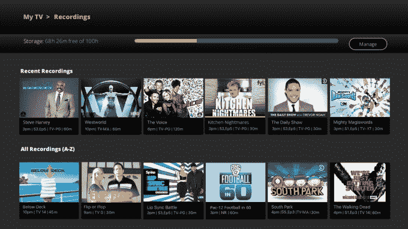

# Sling TV 推出云 DVR，与竞争对手展开较量

> 原文：<https://web.archive.org/web/https://techcrunch.com/2016/11/28/sling-tv-takes-on-rivals-with-launch-of-a-cloud-dvr/>

随着电视流媒体服务之间的竞争加剧，Dish 的 Sling TV 宣布了一项新功能，旨在更好地与索尼的 PlayStation Vue 等竞争对手竞争:这是首次推出云 DVR，允许客户录制节目和电影，以便在方便的时候观看。Vue 已经提供了类似的选项，这是它迄今为止最大的卖点之一。

根据 Sling 的说法，云 DVR 将于今年 12 月首次推出测试版，最初将只提供给那些通过 Roku 设备(包括 Roku 流媒体播放器和电视)观看 Sling TV 的人。

Sling 此次推出的目标显然是 Vue 客户，因为它指出其录音将在 28 天后*而不是*过期。这恰好是[在 PlayStation Vue 上可以保存多长时间的录像](https://web.archive.org/web/20230404123501/https://www.playstation.com/en-us/network/vue/faq/faqPages/faqPage10/)。

此外，Sling 说，DVR 将提供无冲突的录制，以及暂停、倒带和快进录制内容的能力。

在测试试用期间，客户将免费获得 100 小时的云 DVR 存储。这意味着 DVR 可能会成为 Sling TV 未来新的收入来源，因为客户可以为升级存储付费。Sling 表示，在 DVR 服务开发期间，它将听取客户的反馈，并特别关注增加一些功能，例如升级存储和保护记录的能力。

一旦启用，客户将能够录制电影，电视节目或整个系列，这些录制将很容易从应用程序的“我的电视”屏幕上访问。像大多数标准 DVR 一样，当录制空间填满时，Sling 会通过首先删除最早“观看”的录制内容来为新节目腾出空间。

cloud DVR 测试版只有受邀者才能参加，并且需要 Roku 设备。目前 Sling TV 客户的注册在这里:[http://www.sling.com/dvr](https://web.archive.org/web/20230404123501/http://www.sling.com/dvr)。

就在这份声明发布的同一天，美国电话电报公司计划在纽约的一次新闻发布会上披露其直播电视服务 DirecTV Now 的细节。Hulu 也将在明年第一季度推出直播电视流媒体服务。