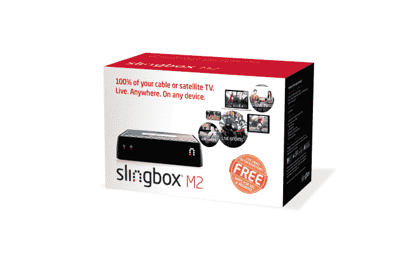
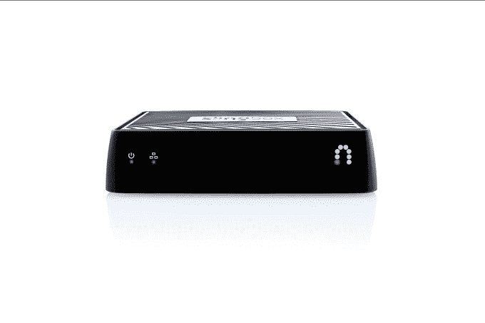
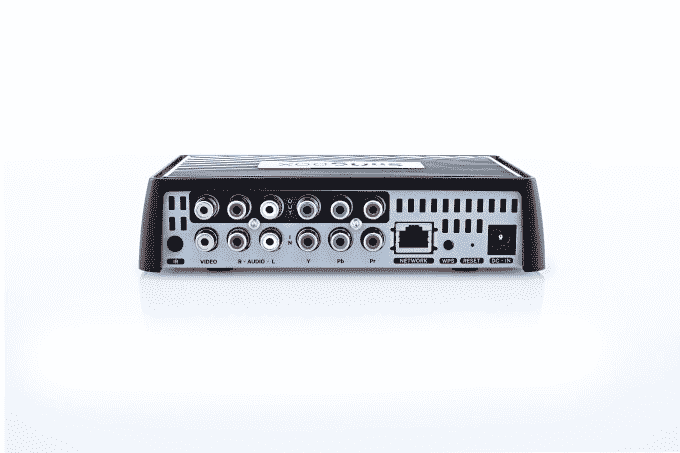

# Slingbox 首次推出用于“绳索拉伸器”的 M2 机顶盒，现在附带免费移动应用 

> 原文：<https://web.archive.org/web/https://techcrunch.com/2015/07/16/slingboxs-latest-cord-streching-streaming-media-player-now-comes-with-free-mobile-apps/>

Slingbox 是 T2 第一批通过引入允许用户通过互联网远程观看媒体的硬件来重新设想消费者如何看待电视的公司之一。今天，该公司作为 [EchoStar](https://web.archive.org/web/20221007154033/http://www.crunchbase.com/organization/echostar) 的子公司，希望通过其最新产品 [Slingbox M2](https://web.archive.org/web/20221007154033/http://www.slingbox.com/Products/SlingboxM2/Features.aspx) 更好地迎合流媒体电视消费者。该公司表示，这款新设备是该公司早期 Slingbox M1(T9)的升级版，但旨在反映观众不断变化的习惯。

199 美元的机顶盒将最吸引那些想要通过任何设备在互联网上观看付费电视节目的人。

但在这个时代，Slingbox 在新的流媒体领域面临着许多竞争对手。目前，付费电视提供商自己也在[开始](https://web.archive.org/web/20221007154033/https://beta.techcrunch.com/2015/07/13/comcast-debuts-stream-a-cable-tv-like-streaming-service-for-cord-cutters/)到[推出](https://web.archive.org/web/20221007154033/https://beta.techcrunch.com/2015/07/14/verizon-signs-up-vice-to-deliver-original-content-for-its-upcoming-mobile-video-service/)他们自己的[针对这种跨平台观看活动的](https://web.archive.org/web/20221007154033/https://www.sling.com/)解决方案；电视网络提供他们自己的点播应用程序；许多电视观众要么在付费电视上增加流媒体服务，要么干脆切断线路，转而通过网飞、亚马逊和 Hulu 观看。

这有点让你想知道 Slingbox 还在哪里。或许它最大的优势在于，它为付费电视用户提供了一种通过互联网观看体育或其他现场赛事的方式，即使他们不在家。与电视节目和电影不同，电视节目和电影在各种服务中都很丰富，找到(合法的)方式来直播重大比赛和其他像奥斯卡颁奖典礼这样的著名直播事件更具挑战性。

当然，也有一些客户群仍然喜欢他们的付费电视订阅，即使这些动态正在发生变化。最近的[研究](https://web.archive.org/web/20221007154033/http://www.businessinsider.com/how-much-tv-watching-is-streamed-2015-7)显示，直播电视现在占所有电视内容花费时间的 39%，而 28%是通过数字流发生的。

Slingbox 的想法是让那些想要访问直播、付费电视和 DVR 内容的人能够从任何地方点播这些内容。这是“脐带拉伸”，而不是“脐带切割”然而，解决方案在很大程度上是存在的，因为付费电视提供商已经错失良机太久了——现在这种情况正在改变。

首次购买后，Sling Media 不向 M2 用户收取月费或其他费用，该服务允许观众从世界任何地方观看他们的内容，因为不涉及地理屏蔽。

然而，弹弓 M2 比 M1 贵一点，后者售价 150 美元。Sling Media 表示，M2 的建议零售价为 199.99 美元。(可通过百思买、亚马逊市场和 slingbox.com 购买。)

尽管硬件价格上涨，这两个盒子并没有什么不同。

最大的变化是，与 Slingbox M1 不同，新的 M2 不再要求用户为他们使用的每台设备上的 Slingplayer 应用程序付费——这些下载过去需要 15 美元一个。此外，M2 将允许消费者通过 Apple TV、Chromecast、Fire TV 或 Roku 将内容从移动设备转移到其他电视上。

该公司引用了 2014 年爱立信移动[的一项研究](https://web.archive.org/web/20221007154033/http://www.ericsson.com/res/docs/2014/emr-november2014-regional-appendices-rnam.pdf)来解释为什么它已经摆脱了之前的设备成本壁垒。该报告发现，如今的普通家庭至少拥有五台联网设备。有了 M2，Sling Media 表示，消费者现在可以下载附带的 Slingplayer 应用程序，免费在任意多的设备上观看他们的家庭电视内容。

Sling Media 表示，无限制的免费应用程序下载是通过“集成广告位”来支持的，而不是通过下载来收费。在实践中，这意味着观众在加载应用程序时会被要求观看简短的前置广告，广告也会出现在应用程序的观看窗口中。然而，没有广告将被放置在视频本身的顶部。

这是 Slingbox 首次将广告整合到其应用程序中，但指出客户可以通过支付每个账户 15 美元的固定费用来选择退出广告。

为了在其他设备上观看家庭电视内容，用户首先将他们的 Slingbox M2 连接到他们的有线电视或卫星电视盒。对于 M2，该公司试图通过提供免费的实时视频设置服务来简化初始设置过程，帮助客户完成新硬件和软件的安装和使用。

配置完成后，Slingbox M2 的客户可以使用智能手机、平板电脑、Mac 或 PC 观看和控制直播电视，还可以播放和安排 DVR 录像。M2 还提供 Wi-Fi 连接和以太网端口，用于连接用户的家庭网络，并支持高达 1080p 的高清视频。

除了这次硬件更新，Sling Media 表示，今年晚些时候将为所有 Slingbox 型号推出新的 Slingplayer 移动应用程序。改版后的应用程序将包括视频质量的改进和画廊观看模式，在 iPhone 和 Android 设备上提供建议，类似于今天在 iPad 上提供的功能。此外，该应用程序将提供更快的频道指南加载时间和 20%的连接速度。

[YouTube https://www.youtube.com/watch?v=yFT6Yh93tYI]