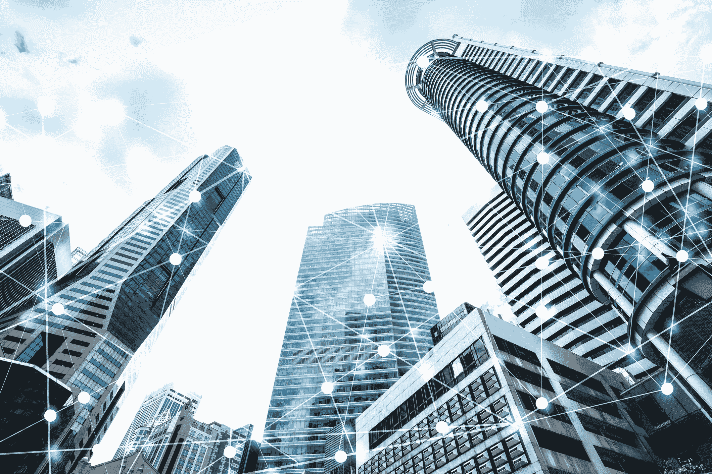
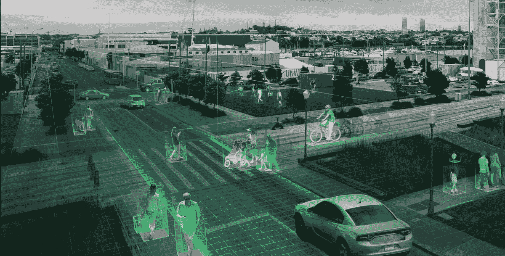

# 智慧城市很无聊。给我们响应的城市。

> 原文：<https://web.archive.org/web/https://techcrunch.com/2017/10/14/smart-cities-are-boring-give-us-responsive-cities/>

科林·安东内尔撰稿人

科林·安东内尔是微软的首席创新官

[Intersection](https://web.archive.org/web/20221024051522/https://www.intersection.com/)

.

More posts by this contributor

作为一名城市技术专家，我经常被要求举一个真实的人正在使用的引人注目的智能城市应用程序的例子。但老实说，目前还没有太多可指出的。城市可能变得越来越智能，但从用户的角度来看，它们并没有发生明显的变化。

似乎城市中的大多数数字进步都是无形的，并且集中在城市运营上，而不是人们可以看到、触摸和使用的城市部分。当然，城市管理者能够更好地识别漏水，或者更准确地预测建筑物未通过检查的可能性，这很重要，但这对城市居民没有直接的个人好处。所以有些人觉得没有太大进步是可以理解的。

作为城市居民，我们没有被变革性的*智能城市*应用所震撼的原因是智能城市很无聊。这和人们一想到数据仓库就面不改色是一个道理(好了，安静点，书呆子们)。智慧城市只是达到目的的一种手段；迈向真正数字城市的一步。

为了发展成为一个充分发挥互联网潜力的城市，为其居民带来实实在在的好处，城市将经历三个阶段:1)首先需要收集关于其环境的数据，2)需要处理这些数据，最后，3)需要采取相应的实时行动。我的简写是:看，想，做。

## 看——仪表化的城市

在过去的几十年里，我们一直生活在一个装有仪器的城市里。传感器上的传感器上的传感器——从你办公室的前门到自行车共享码头，再到街角的红绿灯，所有东西都有传感器。一切都被量化了，这是任何未来城市发展的基础。为了改变一些东西，你需要首先能够测量它。<

## 思考——智慧城市

那么我们如何处理这些数据呢？这是像 IBM、GE 和美国电话电报公司这样的公司在过去几年中努力的方向。在智慧城市中，洞察力来自于仪表化城市中生成的数据。这是通过使用数据平台、算法和数据科学来完成的，并使我们不仅能够理解我们测量的内容，还能理解它为什么重要。

我们可以开始建立相关性和因果关系，创建模型来预测和测试人类行为，并深入了解事情发生的原因以及变化可能受到的影响。人工智能将开始在分析海量数据和了解城市发生的事情方面发挥更大的作用。但在这一点上，一切都相当“后台”。把它想象成每个人都有电子邮件或 web 1.0 网站之前的互联网。是的，这很重要，它正在改变世界的运作方式，但我为什么要在乎呢？我能怎么做呢？

## do——响应迅速的城市

现在，这是事情变得有趣的地方，当事情开始实际发生时，人们会注意到并感觉到不同之处。这是最有发展机会和新产品的阶段。顾名思义，响应型城市就是对市民的需求、愿望和欲望做出响应的城市；不管他们是工人，居民，还是游客。所有这些都是实时完成的，而且它是活跃的，应用程序丰富。

基于在仪表化城市中生成的数据和在智能城市中开发的洞察力，响应型城市就像是在硬件、数据和基础服务之上的应用程序层。

在城市中，这些应用将专注于操纵基础设施或影响行为，以动态优化城市，实现任何数量的结果；安全、便利、高效，还有发现、快乐、社区。所有这些都有助于支持最初让城市变得伟大的因素——来自不同背景的积极参与的公民在同一时间共享同一空间。

这一切都依赖于数字化、可控的基础设施，而这一切即将到来。优步和 Lyft 是联网汽车的例子，它们根据预期的交通需求预先定位自己。

数字屏幕和动态街道设施也是响应式基础设施的早期例子——这些产品有可能像城市的增强现实层一样，在街景上叠加实时信息，以通知或影响人们，并以任何方式帮助他们；仅举几个例子，市民可以更好地在城市中移动，探索城市提供的一切，并实时获得紧急情况警报。

城市已经为这种转变做好了准备。随着数字基础设施、自动化和机器学习的发展，我们有能力同时对数百万人的需求做出预测性响应并优化结果。

今天，我们有一个巨大的机会让城市管理者、社会活动家和企业家创造新的经济机会，重塑行为，重新利用我们的资源，真正重新定义现代城市。这场革命所需的基础设施已经开始到位，但城市如何最终到达这一响应的最后阶段？

为了给有效响应的城市铺平道路，城市需要:

### 资源、访问和成果方面的合作伙伴

我们需要抛弃我们对城市可能性的先入为主的观念，从期望的结果开始。城市管理者需要确定未开发的资源或需要改造的基础设施，然后使其易于与私营部门合作。公私伙伴关系应该在互利的结果上保持一致，比如各种能力的人都能普遍获得资源，而不是专注于特定的解决方案或规定的采购。

### 理解人群并影响他们的行为

一个敏感的城市反映了城市中的人们。互联网向我们展示了个性化的可能性——向你推荐视频、产品或朋友。单身的人。但是城市体验本来就是一对多的。50 个人抬头看着一个标志，他们一起经历，有 50 种不同的背景，也许有同样多的个人目标。这开启了一个有趣的研究领域:理解人群以及他们如何对环境的实时变化做出反应。

无论是按需步行广场的动态封路，还是为活动指引不同移动需求的人到最快的路线，或者帮助他们发现刚刚开业的新业务；实时平衡人们的需求与城市的需求将是一个令人兴奋的新探索领域，将城市规划与用户体验设计和行为科学相结合。

### 让它实时

成为一个响应迅速的城市不是一个静态的目标，而是一个不断变化的目标。我们需要考虑过去固定的、单一用途的基础设施，并关注动态的、实时的数字基础设施，这些基础设施可以随着人和城市的变化而变化。重点不仅应该是随着城市在宏观尺度上的变化而保持相关性，还应该是从早上通勤到午餐的每时每刻都保持相关性。

互联网改变了我们所做的一切——我们的生活、工作和娱乐方式，所有这一切都是通过获取信息和相互交流实现的。但它并不总是实现其变革潜力。我们看到它制造了孤立和孤立的群体，滋生了不宽容。

此外，城市可能会变得陈旧、僵化——由远在今天的居民出生之前就去世的人设计，而变化是以十年规划实践来衡量的。城市很少能代表人们在其中使用、工作和生活的真实情况。

但是现在，随着互联网进入城市，我们有机会让互联网更人性化，让城市更有活力。

我们可以建立真正的社区体验，让不同文化、背景和能力的人们分享彼此以及他们所在城市的数字互动。我们有能力塑造我们的环境并实时共享信息，以更好地将人们彼此联系起来，并与资源联系起来。我们有机会建立一个包容性的数字城市体验，这从一个响应迅速的城市开始。