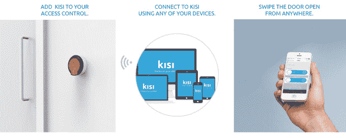
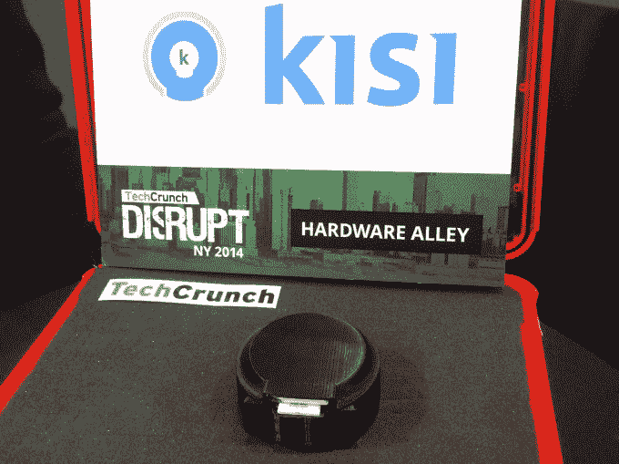

# 智能无钥匙进入系统 KISI 让你刷卡开门 

> 原文：<https://web.archive.org/web/https://techcrunch.com/2014/05/08/smart-keyless-access-system-kisi-lets-swipe-to-open-your-door/>

# 智能无钥匙进入系统 KISI 让你刷卡开门

本周，在 TechCrunch Disrupt NY 的硬件街上，智能无钥匙进入系统制造商 [KISI](https://web.archive.org/web/20221210044133/http://www.getkisi.com/) 展示了其移动连接设备，该设备允许你通过一个安装简单的系统控制进入一座建筑，该系统可以通过你的智能手机进行管理。自去年[推出](https://web.archive.org/web/20221210044133/https://beta.techcrunch.com/2013/04/30/kisi-launches-its-keyless-home-access-management-platform-on-indiegogo/)以来，KISI 已经在纽约和新泽西地区获得了许多客户，联合创始人马克西米利安·舒茨告诉我们，我们听说，他们已经接近该地区投资者大约 100 万美元的种子期。

作为背景，KISI 的设备与目前安装的任何门禁系统兼容，允许建筑业主以最小侵入性安装 KISI 的硬件来升级他们的系统。一旦安装完毕，你就不再需要使用钥匙卡或卡片来进入，而是通过电子邮件与其他人，如租户或员工共享钥匙。

使用在线仪表板，业主不仅可以启用和禁用用户的钥匙，他们还可以监控钥匙的使用，发送客人钥匙，处理远程打开，甚至限制在特定时间进入特定的门。

然后，钥匙接收人可以使用免费的 iOS 或 Android 应用程序滑动按钮，打开门。

Schuetz 说，他们目前正在追逐 B2B 市场，现在的客户包括总部位于纽约的房地产开发公司 Two Trees 和当地孵化器 T2 tech stars NY T3。他说，他们还升级了一个拥有[钢铁州造船厂](https://web.archive.org/web/20221210044133/http://ironstate.net/properties-the-shipyard.html)的大型住宅区。

KISI 设备的价格是 350 美元，企业主可以享受每个用户每月 2 美元起的订阅计划。

