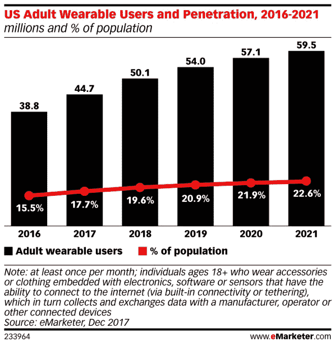
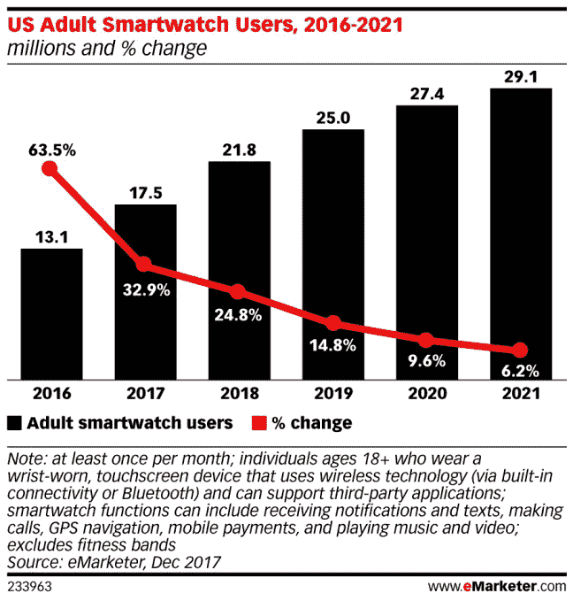

# 随着可穿戴设备需求放缓，智能扬声器在美国假期的销量将超过可穿戴设备 

> 原文：<https://web.archive.org/web/https://techcrunch.com/2017/12/21/smart-speakers-to-outsell-wearables-during-u-s-holidays-as-demand-for-wearables-slows/>

今年假期，智能音箱的销量可能会超过可穿戴设备。这是 eMarketer 分析师的最新预测，该公司预测美国健身追踪器和智能手表等设备的增长率将放缓。显然，可穿戴市场正在继续增长，但它很难成为主流。该公司表示，明年，只有 20%的美国成年人每月至少使用一次可穿戴设备。

请注意，eMarketer 在这里关注的是可穿戴设备的使用和市场渗透率，而不是销售额。

尽管如此，该公司估计，2018 年可穿戴设备的使用量将仅增长 11.9%，从 2017 年的 4470 万成人可穿戴用户增加到 2018 年的 5010 万。就人口比例而言，从 17.7%攀升至 19.6%。

如果预测属实，未来几年情况也不会有太大改善。2019 年增速将放缓至个位数。eMarketer 估计，到 2021 年，成人可穿戴用户将达到 5950 万，占总人口的 22.6%。

该公司将该领域的大部分增长归功于智能手表的新用户，如 Apple Watch，该市场目前由健身追踪器主导。

此前有报道称，eMarketer 大幅下调了对美国可穿戴设备使用量的预测，但这并不令人意外。

其他分析师也指出了可穿戴市场整体相对“温和”的增长。根据 IDC 的数据，全球市场在 2017 年第三季度仅增长了 7.3%，例如[。科纳仕公司 8 月份报告称](https://web.archive.org/web/20221004111426/http://www.businesswire.com/news/home/20171130005146/en/Worldwide-Wearables-Market-Grows-7.3-Q3-2017)[同比增长 8%](https://web.archive.org/web/20221004111426/https://beta.techcrunch.com/2017/08/10/wearables-are-still-growing-globally-thanks-to-xiaomi/)，这主要归功于小米。

与此同时，Gartner 预计 2017 年全球增长率为 17 %,但将蓝牙耳机(如 AirPods)、体戴相机和头戴显示器以及智能手表、健身追踪器、腕带和其他健康监测器列入其分组。

根据 eMarketer 的说法，美国可穿戴设备的问题，尤其是智能手表，是它们的高成本，加上它们没有真正向主流用户出售这些你根本不能没有的设备。

相反，他们仍然感觉更像是奢侈品——拥有这些东西很好，但不是必需的。

eMarketer 预测分析师辛迪·刘(Cindy Liu)表示:“除了早期用户，消费者还没有找到证明智能手表价格合理的理由，智能手表的价格有时可能与智能手机一样高。”“相反，在这个假期，我们预计智能扬声器将成为许多科技爱好者的首选礼物，因为它们的价格较低。”

在这一点上，智能音箱销量的假期增长几乎是必然的。例如，亚马逊在黑色星期五假日购物周末[的最大卖家是 Echo Dot](https://web.archive.org/web/20221004111426/https://beta.techcrunch.com/2017/11/28/amazon-sold-millions-of-alexa-devices-over-the-holiday-shopping-weekend/) ，而[策略分析公司最近预测](https://web.archive.org/web/20221004111426/https://www.strategyanalytics.com/strategy-analytics/news/strategy-analytics-press-releases/strategy-analytics-press-release/2017/10/12/smart-speakers-sales-head-towards-24-million-in-2017-despite-confusing-array-of-choice-says-strategy-analytics#.WjvYg1Q-eu4)2017 年第四季度销售了近 1200 万台智能扬声器，使全年总销量达到 2400 万台。

eMarketer 还[预测](https://web.archive.org/web/20221004111426/https://beta.techcrunch.com/2017/11/08/voice-enabled-smart-speakers-to-reach-55-of-u-s-households-by-2022-says-report/)到 2022 年，55%的美国家庭将拥有一台这样的设备。