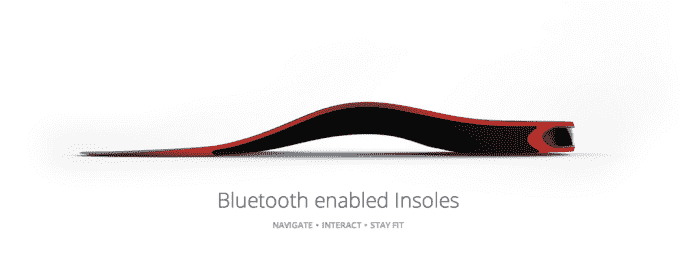

# 印度制造的智能鞋助你远行 

> 原文：<https://web.archive.org/web/https://techcrunch.com/2014/07/28/smartshoemadeinindia/>

# 用一双印度制造的智能鞋坚持到底

忘记谷歌眼镜或 Jawbone Up 吧，可穿戴技术的下一波浪潮可能只是来自印度的智能鞋。这款 [Lechal](https://web.archive.org/web/20221025222757/http://lechal.com/) 在印地语中的意思是“带我走”，它有一个支持蓝牙的鞋子插件，可以与谷歌地图挂钩，并发出嗡嗡声，让你知道在你选择的路线上该往哪个方向走。

这款鞋由[T4 的 Ducere Technologies Pvt 开发，它与一款应用程序挂钩，该应用程序可以与谷歌地图同步，跟踪你的步伐，并计算你燃烧的卡路里。这种鞋本身可以用来在镇上慢跑。](https://web.archive.org/web/20221025222757/http://www.duceretech.com/index.html)

在这一点上，你可能会认为这是某种针对跑步者的高科技，但 Lechal 的应用远不止这些。这个插件几乎可以放入你衣柜里的任何一只鞋子。想边开车边听曲子而不是 Siri 导航？Lechal 可以振动，让你知道什么时候该转弯。它可以用于免提骑自行车，徒步旅行，散步，游客也不想每五秒钟低头看一次地图。

这种鞋的最初想法实际上是为了帮助视力受损的人浏览他们周围的世界。根据世界卫生组织的数据，世界上大约 90%的视力受损者生活在发展中国家。仅在印度就有 20%左右。

正如下面的视频所示，用户还可以在手机上的地图上放一个大头针，以便在某个目的地与他人见面。这种鞋应用触觉反馈来引导穿着者在右转时去见朋友或去他们需要去的地方。

【YouTube https://www.youtube.com/watch?v=ucK6jhdRlUY&w=560&h=315]

这款 Lechal 鞋还配有一种名为 Smart Assist 的东西，如果你的手机不在附近，它会提醒你。

它实际上不是第一个智能鞋技术，但它是第一个具有导航功能的。 [Aetrex](https://web.archive.org/web/20221025222757/http://www.aetrex.com/aetrex-gps-shoe/?cat) 几年前创造了一种智能鞋来跟踪阿尔茨海默氏症和其他形式的痴呆症患者，但他们没有将其应用于触觉学习、导航或个人健身。

Lechal 的想法和设计来自两位受过美国教育的印度工程师，Krispian Lawrence 和 Anirudh Sharma。两人都是一生的朋友，2011 年他们回到印度，在新成立的 [Telengana](https://web.archive.org/web/20221025222757/http://en.wikipedia.org/wiki/Software_industry_in_Telangana) 邦成立了 [Ducere](https://web.archive.org/web/20221025222757/http://www.crunchbase.com/organization/ducere) 。该公司迅速发展到目前拥有 50 名员工。Lechal 是 Ducere 的首款产品，预计今年 9 月的零售价约为 100 至 150 美元。