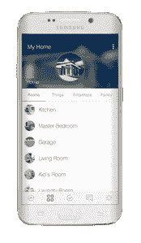

# SmartThings 推出全新智能家居中心 

> 原文：<https://web.archive.org/web/https://techcrunch.com/2015/09/03/smartthings-unveils-an-updated-smart-home-hub-and-lineup-of-sensors/>

截至今天，SmartThings 的智能家居设备变得更加时尚，功能也更加强大。

该公司今天发布了一系列更新的家庭传感器和一个新的更强大的中枢。此外，SmartThings 正在推出一个更加简化的应用程序，该程序以家中的特定事件和地点为中心，例如卧室和厨房的位置，以及入侵等事件。该公司还发布了一套新的开发工具，旨在使新设备与 SmartThings hub 的集成更容易。

“为了让它更简单，基本上，下一代产品旨在解决‘家里一切都好吗？’SmartThings 首席执行官亚历克斯·霍金森说。

Hawkinson 说，SmartThings 正在发布其五个传感器的更新，以使它们更具现代感，但 SmartThings 生态系统中有近 200 种兼容设备。SmartThings hub 的部分卖点是它附属于一个开放的生态系统，在这个生态系统中，技术不断发展，完全开放，社区中有超过 10，000 名开发人员。

这是该公司自去年 8 月被三星收购[以来发布的第一波产品。通过 SmartThings，三星找到了进入智能家居监控的方法，让自己在家庭中获得了立足点，就像谷歌通过](https://web.archive.org/web/20221209141014/https://beta.techcrunch.com/2014/08/14/smartthings-acquired-by-samsung-for-around-200-million/)[收购 Nest](https://web.archive.org/web/20221209141014/https://beta.techcrunch.com/2014/01/13/google-just-bought-connected-device-company-nest-for-3-2b-in-cash/) 找到了进入智能家居监控的方法一样。

新的中枢配备了一个更强大的处理器，可以进行视频监控，还有一个电池，如果停电，它可以工作长达 10 个小时。它还将保持与家中设备的连接，允许它使用 Zigbee、Z-wave 和本地 IP 连接设备处理一些进程，而无需实际连接到互联网。

这些新版本出现在互联设备越来越多地出现在家庭中的时候。谷歌收购了 Nest 和 Dropcam 等公司，以进入家庭。公司甚至试图开发像冰箱这样的智能电器。随着越来越多的联网设备的推出，三星收购 SmartThings 越来越有意义。

霍金森说:“我们在智能家居中发现，竞赛现在开始的原因是，一旦有人开始运行，你就会寻找兼容的东西，然后你就从那里扩展开来。”“你可能会让某人开始做家庭监控，但之后他们可能会对联网照明感兴趣。”

当然，房间里的大象是 HomeKit，苹果的智能家居平台。预计苹果公司[将在今年晚些时候](https://web.archive.org/web/20221209141014/https://beta.techcrunch.com/2015/08/27/apple-is-about-to-lay-down-its-tv-cards/)发布一款新的苹果电视，它很有可能成为智能家居设备的强大中心。但 SmartThings 已经建立了先发优势和庞大的开发者生态系统，以至于它可以让苹果的 HomeKit 平台相形见绌。

该公司还生产自己的传感器。有一个传感器检测运动，一个检测什么时候打开或关闭，一个检测什么时候有人离开或到达。还有一个插入电源插座的设备，可以打开和关闭设备，还有一个传感器，可以在漏水或洪水的情况下检测水。SmartThings 已经出售了这些传感器，但他们正在进行更新，以赋予它们更现代的外观。

例如，当一扇门被打开时，它可能会在应用程序中触发一个事件，表明有人进入了家中。它使用一个小型的多用途传感器，可以连接到门上来检测门是否打开，如果门在意想不到的时间打开，它可能会提醒主人入侵正在发生。

联网的 SmartThings 摄像头实际上不会一直向云端传输视频。相反，当通过应用程序观看时，它只会在互联网上播放录制内容。该设备还具有活动前后视频的缓冲区，因此用户可以看到活动前后发生的事情的剪辑——这是免费的，直到年底，然后成为每月 4.99 美元的高级服务。

所有这些连接到互联网的硬件当然会给用户的安全带来一定程度的风险。霍金森说，为了缓解这种情况，SmartThings 定期支付第三方审计费用。如果一个设备通过了 SmartThings 认证，那么它从设备到云、集线器和帐户“有一个非常锁定的路径”，SmartThings 还可以向它发布固件更新。

“我们所做的一切都是公开的，我们发布安全白皮书，我们有一个认证计划，”霍金森说。“当开发人员到来时，他们可以在沙盒中构建东西，但一旦他们想向他人公开，就要通过这些正式测试。”

该集线器售价 99 美元，传感器价格从 30 美元到 55 美元不等。它们将于今天在 [SmartThings](https://web.archive.org/web/20221209141014/http://shop.smartthings.com/) 和三星网站上出售。

