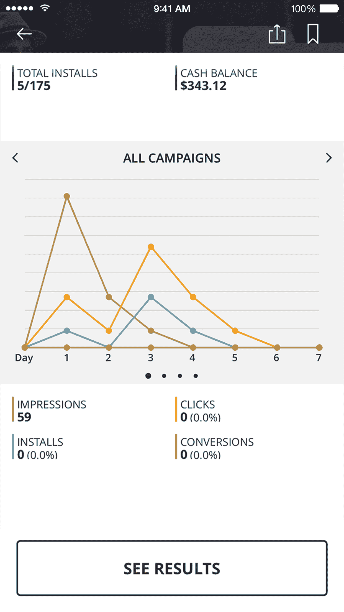
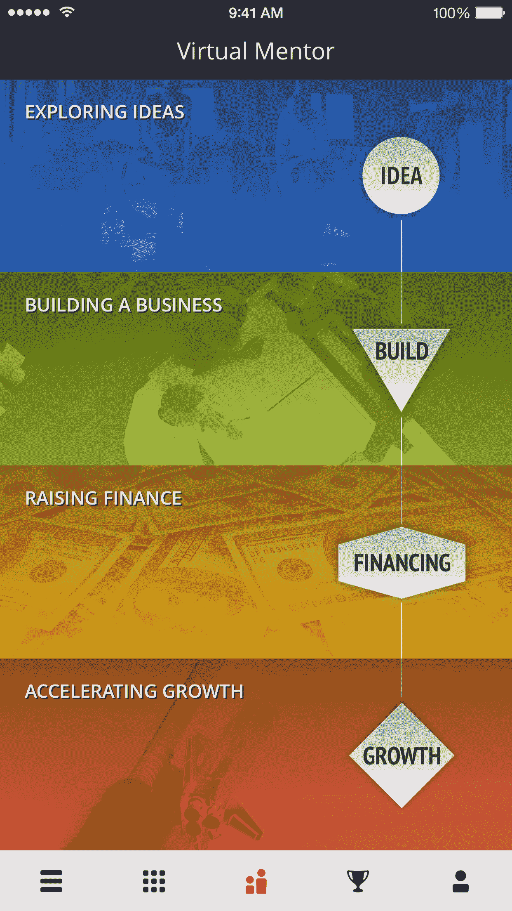
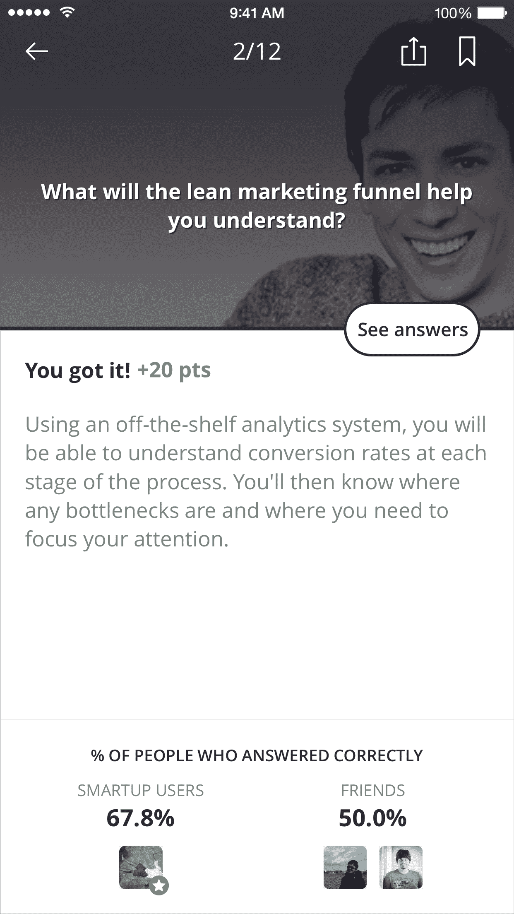
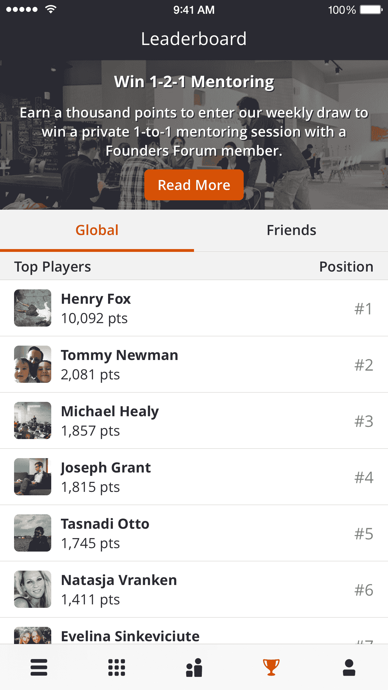

# SmartUp 应用程序实际上为新创业者提供指导，并可能带来资金 

> 原文：<https://web.archive.org/web/https://techcrunch.com/2015/06/29/smartup-app-virtually-mentors-new-entrepreneurs-and-could-lead-to-funding/>

每个人都知道现在全世界都有企业家，不仅仅是在发达国家。为什么？因为互联网和技术赋予了很多人权利。事实上，巴布森和伦敦政治经济学院 2013 年发布的一项调查发现，学习创业和商业的全球市场规模约为 5 . 5 亿多人。这还只是人口排名前 20 的国家。

但是对这些人来说，获得指导的机会往往少得可怜。(不，LinkedIn 不是指导。)我们需要的是，这些人能够以某种方式浮出水面，并接触到能给他们提供建议的有经验的人。我指的不仅仅是在推特和脸书上受到关注。

创始人论坛的幕后人员意识到了这一点，所以他们设计了一个产品来解决这个问题: [SmartUp](https://web.archive.org/web/20221208170727/http://smartup.io/) 。自然，这将是一个移动产品，可以满足全球潜在企业家的蓬勃发展。

我们的目标是建立一个可以大规模指导早期和未来企业家的东西。

但是有一个转折。这款应用通过向投资者和导师提出同样的问题来建立用户档案，如果他们亲自向他们提供建议的话。目的是提供见解和建议，帮助用户做出更好的决策。

因此，它有商业模拟，旨在帮助早期和未来的企业家做出更好的决策。

有趣的是它游戏化了。As 用户通过该应用程序，他们的决策会获得积分，然后进入全球排名榜。

该应用程序从脸书/LinkedIn 获取关于你的数据，然后询问关于你正在尝试做/解决什么的问题，然后提供有针对性的建议来帮助你做到这一点。一些模拟包括如何通过实践学习在线定价和营销等。

每天都有来自顶级创始人或投资者的新内容被推送到该应用程序。当人们在应用程序中达到 1000 分时，他们可以参加抽奖，随机选择专家接受创始人论坛成员的 1-2-1 现场指导。

这些人包括edwina·邓恩(邓恩·亨比)、hermann·豪泽(阿玛迪斯资本)、riccardo·扎克尼(king.com)、simon·帕特森(银湖合伙人+戴尔董事会)、布伦特·霍伯曼、艾米丽·布鲁克(布雷泽)、凯瑟琳·帕森斯(解码)等等。

最终，积分最高者将竞争获得机会，接受创始人论坛成员的实际指导。这款应用现在已经被苹果公司列入其商业类别。

现在，愤世嫉俗者可能会说，这只是这些专家获得交易流的一种方式。也许是这样，但由于这个应用是开放的，任何人都可以识别这些新的企业家，所以它并不像听起来那么封闭。

未来的功能将包括发布工作，发布想法，搜索人才和评论内容的能力。

SmartUp 的联合创始人是 Spotify 的前董事frank·米汉，以及 LastMinute.com 的联合创始人布伦特·霍伯曼。

SmartUp 应用的投资者包括霍伯曼(Hoberman)、埃德·雷(Ed Wray)、巴里·史密斯(Barry Smith)、卢克·约翰逊(Luke Johnson)、迈克尔·伯奇(Michael Birch)、哈姆普斯·雅各布森(Hampus Jacobsson)、陈俊澎和冯博(Ceyuan Ventures，中国)、迈克尔·林茨(Michael Lints)、金门风险投资公司(Golden Gate Ventures，新加坡)、亚历克斯·阿塞利(Alex Asseily)、格雷格·罗杰斯(Greg Rogers)、布雷特·阿克(Brett Akker)，以及许多其他人。

