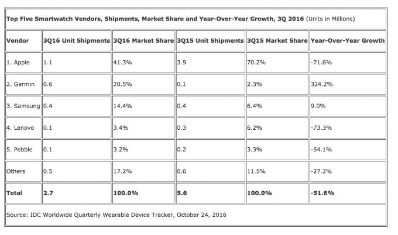

# 智能手表销量下滑

> 原文：<https://web.archive.org/web/https://techcrunch.com/2016/10/24/smartwatch-sales-are-tanking/>

也许不是每个人都相信他们需要一个智能手表？根据 IDC 今天早上发布的一份新的行业报告，智能手表的出货量在第三季度经历了“显著”下降，总出货量比去年同期下降了 51.6%。与 2015 年第三季度的 560 万部相比，2016 年第三季度的出货量仅为 270 万部。虽然 IDC 对销量下降的原因提供了几种解释，包括与发布时间、Android Wear 延迟等相关的问题，但这些数字仍然表明智能手表很难吸引大多数消费者。

当然，我们需要记住，Apple Watch 是智能手表中的市场领导者——其 Series One 设备占本季度出货量的大部分(出货量为 110 万部，同比下降 72%)。这意味着它的起伏将对整个行业的数字产生巨大的影响。

首先，IDC 指出，去年第三季度，Apple Watch 在有限的网上发布后，首次在零售市场广泛销售。这可能有助于提高其销量。

与此同时，由于消息泄露和报道，许多消费者知道[第二代 Apple Watch](https://web.archive.org/web/20230223153759/https://techcrunch.com/2016/09/07/apple-unveils-the-apple-watch-series-2/) 将于 9 月份发布。那些在苹果可穿戴设备市场上的人可能会推迟购买，直到新设备到来。IDC 说，这款手表只在 9 月的最后两周上市。

换句话说，我们还没有看到新款 Apple Watch 对更大的智能手表市场的影响。升级后的设备现在是防水的 T2，这可能会扩大它的吸引力。苹果做了许多改进来解决早期对其可穿戴设备的抱怨，从更快的应用程序启动到重新设计的界面到添加 GPS 等等。

随着假日购物季的临近，Apple Watch 的销量可能会在第四季度反弹，因为许多人会购买这款新设备作为礼物。

此外，谷歌在 Android Wear 2.0 上的决定也在这里发挥了作用。供应商们不得不做出选择，是在假期推出新设备，还是试图用运行旧操作系统的设备来满足消费者。IDC 还指出，三星 9 月份发布的 Gear S3 尚未发布。

尽管 Apple Watch Series 2 仍有帮助这些智能手表数量提高的空间，但 IDC 的结论是，这些设备未能吸引大量消费者。

“很明显，目前智能手表并不适合所有人，”IDC 移动设备追踪器高级研究分析师 Jitesh Ubrani 说。“有一个明确的目的和用例是最重要的，因此许多供应商都专注于健身，因为它简单。然而，展望未来，区分智能手表和智能手机的体验将是关键，随着手机集成度的提高以及商业受众开始试用这些设备，我们开始看到这方面的早期迹象。”

本季度其他值得注意的变化包括 Garmin 公布了最大的同比增长，这要归功于其支持 ConnectIQ 的智能手表，以及 fenix Chronos 的加入。由于稀缺问题和没有新产品推出，联想公布了最大的同比降幅。