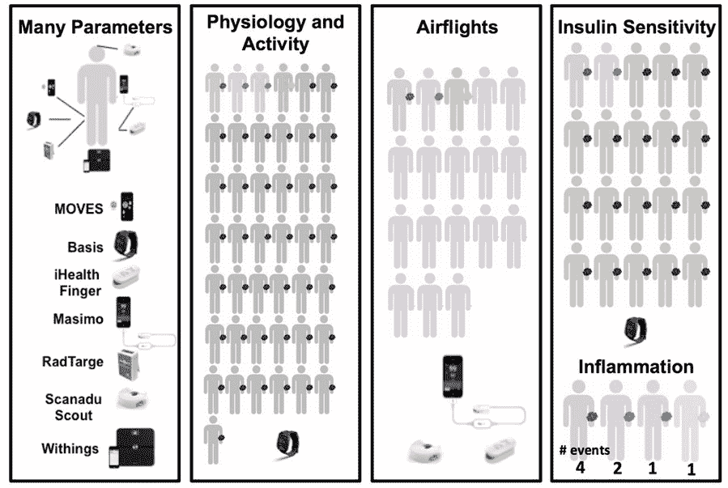

# 智能手表可以很快告诉你什么时候生病了

> 原文：<https://web.archive.org/web/https://techcrunch.com/2017/01/12/smartwatches-could-soon-tell-you-when-youre-getting-sick/>

# 智能手表可以很快告诉你什么时候生病了

许多人试图对自己的健康保持警惕，并留意他们可能生病的迹象——但谁有精力每天整天关注他们的心率、皮肤温度和其他迹象呢？可能没有人——除非他们的智能手表为他们做了这件事。

由斯坦福大学的迈克尔·斯奈德领导的一个研究小组刚刚发表了一项长期实验的结果，该实验旨在研究这些警惕的手腕设备是否可以帮助诊断和监测疾病。

43 人参加了这项为期两年的实验，在此期间，定期进行各种测量，并与现实世界中的事件如旅行、睡眠障碍、疾病等相关联。他们发现，一般来说，智能手表可能是一种非常有用的监测总体健康的方式——只要仔细考虑它们的作用。

论文中的图表显示了实验所追踪的不同设备和活动。

例如，在航空旅行中，人们往往表现出较低的血氧水平，导致疲劳。莱姆病的发病是可以追踪的，个人对胰岛素的敏感性(以及二型糖尿病的风险)也可以从生理测量中明显看出。

你也许能知道自己什么时候生病，但手表可能会在你注意到之前几个小时或几天告诉你。这本身并不是一个诊断，而只是一个警告，它的读数超出了正常范围——所以试着睡个好觉，也许你可以预防感冒。该团队目前正致力于创建能够可靠地做到这一点的算法。

“总的来说，这些结果表明，便携式生物传感器为监测个人活动和生理提供了有用的信息，”研究人员在发表于《公共科学图书馆生物学》的论文[中写道，“并且可能在管理健康和使传统上受社会经济阶层或偏远地理位置限制的群体能够获得负担得起的医疗保健方面发挥重要作用。”](https://web.archive.org/web/20230306065320/http://journals.plos.org/plosbiology/article?id=10.1371/journal.pbio.2001402)