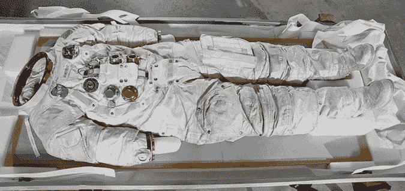

# 史密森尼向 Kickstarter 的巨大飞跃获得了回报 

> 原文：<https://web.archive.org/web/https://techcrunch.com/2015/07/27/smithsonians-giant-leap-into-kickstarter-pays-off/>

# 史密森尼对 Kickstarter 的巨大飞跃获得了回报

1969 年炎热的 7 月，数百万美国人聚集在小型黑白电视机旁，观看尼尔·阿姆斯特朗走下阿波罗 11 号宇宙飞船，左脚踩在未被触及的月球尘埃上。阿姆斯特朗将作为第一个在月球上行走的人而载入史册。

阿姆斯特朗的宇航服现在旧了很多，急需修补。因此，史密森尼博物馆发起了一项 [Kickstarter 活动](https://web.archive.org/web/20221210070425/https://www.kickstarter.com/projects/smithsonian/reboot-the-suit-bring-back-neil-armstrongs-spacesu)来筹集 50 万美元来保存这套衣服，并为 2019 年登月 50 周年做好准备。

联邦拨款通常包括史密森尼博物馆的资金，但不包括像这样的保护项目。这就是为什么占史密森尼博物馆资金约 30%的私人捐赠至关重要。这是史密森尼首次尝试众筹平台。

被称为“重启套装”的 Kickstarter 获得了回报，在 5 天内实现了目标。虽然大型慈善组织要求数以千计的私人捐款，但大多数支持者向该项目捐赠了 100 美元或更少。

该活动继续筹集资金，目标是 70 万美元，以保护宇航员艾伦·谢泼德穿过的宇航服。这是谢泼德作为第一个进入太空的美国人穿的衣服，它也将进入定于 2020 年开放的目的地月球画廊。

政府机构在私人平台上众筹非常有趣——这不仅是史密森尼博物馆的第一次，也是 Kickstarter 的第一次。“这是我们第一次以这种方式与博物馆合作，”Kickstarter 首席执行官 Yancey Strickler 在一份声明中说。

该平台让政府机构、博物馆和其他慈善项目能够接触到全球的捐助者，他们可以提供少量资金来支持大型的历史性项目，否则这些项目可能无法获得继续发展所需的资金。

史密森尼博物馆看到了这一成功，它表示计划在“明年”通过众筹平台做更多事情。据史密森学会称，这些项目的重点将是文物、展览和项目，让公众有机会决定他们最有兴趣支持什么。

[https://web.archive.org/web/20221210070425if_/https://www.youtube.com/embed/uqwH_ctXhQ4?feature=oembed](https://web.archive.org/web/20221210070425if_/https://www.youtube.com/embed/uqwH_ctXhQ4?feature=oembed)

视频