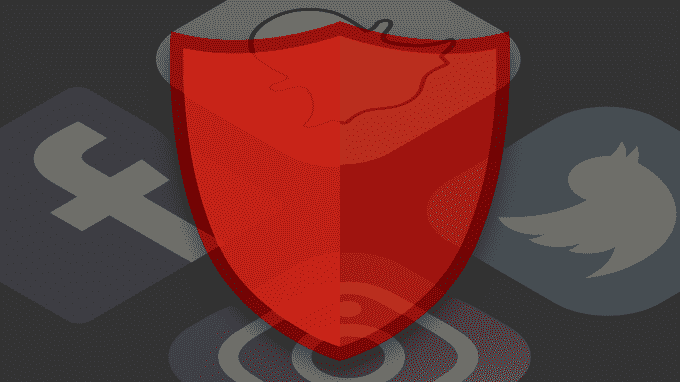

# Snap 联合竞争对手脸书和 YouTube 打击恐怖主义 

> 原文：<https://web.archive.org/web/https://techcrunch.com/2017/07/31/snap-fights-terrorism/>

Snap 公司已经加入了全球互联网反恐论坛，该论坛旨在让消费者互联网公司合作阻止恐怖主义和极端主义在网上的传播。脸书、谷歌和 YouTube、微软和推特[上个月成立了 GIFCT](https://web.archive.org/web/20221025222806/https://beta.techcrunch.com/2017/06/26/facebook-microsoft-youtube-and-twitter-form-global-internet-forum-to-counter-terrorism/) ，明天它将与其他技术公司以及政府和非政府组织一起举办第一次研讨会。

GIFCT 最初是共享行业哈希数据库的扩展，允许科技公司共享极端主义和恐怖主义内容的数字指纹，如照片和视频，这样一旦有人识别出一条被禁止的内容，所有其他人也可以阻止它的上传。这几乎就像一个疫苗项目，其中一家公司战胜了一种感染，然后与团队的其他成员分享如何生产抗体。

在由[脸书](https://web.archive.org/web/20221025222806/https://newsroom.fb.com/news/2017/07/global-internet-forum-to-counter-terrorism-to-hold-first-meeting-in-san-francisco/)、 [YouTube](https://web.archive.org/web/20221025222806/https://youtube.googleblog.com/2017/07/global-internet-forum-to-counter.html) 、 [Twitter](https://web.archive.org/web/20221025222806/https://blog.twitter.com/official/en_us/topics/insights/2017/Global-Internet-Forum-to-Counter-Terrorism-to-hold-first-meeting.html) 和[微软](https://web.archive.org/web/20221025222806/https://blogs.microsoft.com/on-the-issues/2017/07/31/global-internet-forum-counter-terrorism-first-meeting-aug-1/)发布的相同博客帖子中，GIFCT 写道“我们的任务是在尊重人权的同时，实质性地破坏恐怖分子利用互联网推进其事业的能力。"

8 月 1 日在旧金山举行的第一次 GIFCT 研讨会将邀请英国内政大臣 Amber Rudd 议员和美国国土安全部代理部长 Elaine Duke，以及欧盟、联合国、澳大利亚和加拿大的代表参加。该活动的目标是正式确定科技巨头如何与小公司合作，以及这些公司需要什么样的支持才能参与进来。

未来几个月，该组织的目标包括在新成员 Snap 和 JustPaste.it 之外，再增加三家科技公司加入哈希共享计划，让 50 家公司分享他们通过科技反恐项目打击极端主义的最佳实践，并计划举办四场知识共享研讨会。

提高自动审核和删除恐怖内容的能力，对于防止其从漏洞中逃脱至关重要。虽然像脸书这样的互联网巨头通常会雇佣数千名承包商来筛选报道的内容，但他们经常不得不非常快速地处理没完没了的令人不安的图像，这可能会让他们的情绪受到伤害。使用共享哈希数据库和最佳实践可以减轻人类的一些繁重工作，同时潜在地提高清除恐怖主义宣传的速度和准确性。

很高兴看到脸书和 Snap 为了一个好的理由而搁置他们的分歧。虽然 Snap 因其保密性而臭名昭著，脸书因其抄袭竞争对手而臭名昭著，但 GIFCT 看到它们公开分享数据和策略，以限制恐怖主义宣传在网上的传播。决定言论自由的终点和煽动暴力的起点有很多细微差别，因此合作可以改善所有成员公司的流程。

除了驱逐恐怖分子故意分享的内容，还有一个问题是，像脸书和 Twitter 这样通过算法排序的内容提要如何处理关于恐怖袭击的不间断的新闻洪流。人类进化倾向于寻找关于危险的信息。但是，当我们沉浸在世界各地任何恐怖袭击的悲惨细节中时，我们会开始认为这些袭击比实际情况更加频繁和危险。

正如前谷歌设计伦理学家特里斯坦·哈里斯讨论的那样，社交网络知道我们会被激怒的内容所吸引。随着 GIFCT 的发展，很高兴看到它研究如何通过监管算法最好地处理关于恐怖主义的新闻和评论，以允许自由言论、无偏见的信息分发和讨论，而不利用悲剧进行参与。