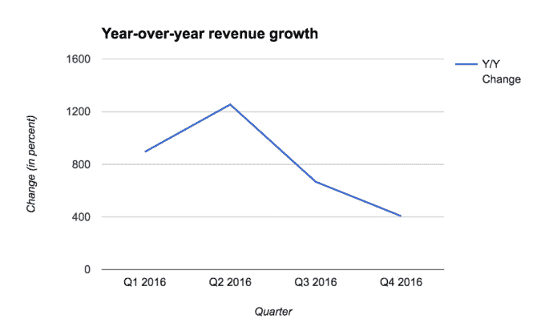
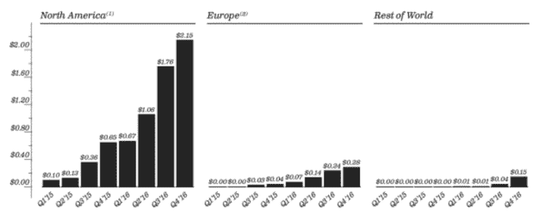
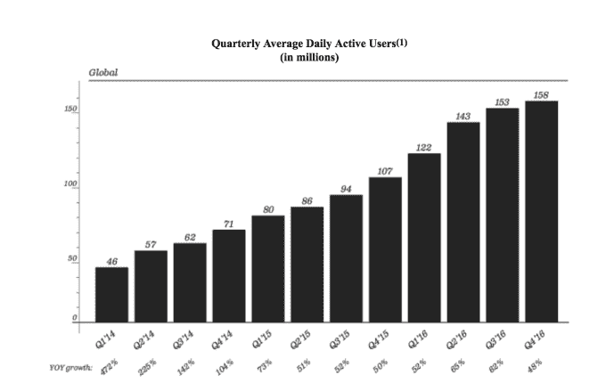
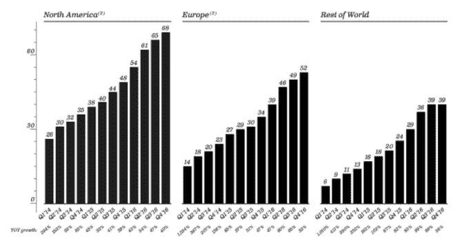

# Snap 终于公开申请其大规模 IPO 

> 原文：<https://web.archive.org/web/https://techcrunch.com/2017/02/02/snap-has-finally-filed-publicly-for-its-massive-ipo/>

到了！Snap 于去年年底秘密提交了 IPO 申请，并通过美国证券交易委员会(sec)发布了公开申请。它将作为“SNAP”在纽约证券交易所上市

这是上市过程中的又一个渐进步骤，但可能是最重要的一步，因为我们终于第一次看到了公司的财务实力。Snapchat 已经从一个年轻受众中的时代精神应用程序发展成为一个拥有超过 1.5 亿日常用户的应用程序，并且基于该应用程序的参与度，它对广告商具有强大的吸引力。

Snap 预计将在 3 月初以超过 250 亿美元的估值上市，这不仅是今年第一次科技 IPO，也是近期最大的 IPO 之一。这意味着 Snap 不仅是未来消费类科技公司 IPO 的领头羊，也是整个科技公司 IPO 市场的领头羊。我们还可以一窥 Snap 承认的对该公司的生存威胁，这可能会让我们对公开市场中广告驱动型公司的发展方向有所了解。

但是，现在我们有了数据，我们可以更好地了解应用程序的发展方向。当我们获得更多信息时，我们会更新这篇文章，所以请确保定期更新。我们开始吧！

## 金融

去年，泄露的文件显示，Snapchat 将在 2016 年产生 3.5 亿美元的收入，并预计 2017 年的收入为 10 亿美元。看起来该公司去年的收入超过了 4 亿美元左右的预期。这比 2015 年产生的 5900 万美元的收入增加了近 6 倍。

去年第四季度，Snap 带来了 1.657 亿美元的收入，高于 2015 年第四季度的 3270 万美元。然而，它的损失正在迅速扩大。第四季度，该公司亏损约 1.7 亿美元，高于 2015 年第四季度的约 9800 万美元。今年，Snap 亏损约 5.15 亿美元，高于 2015 年的 3.73 亿美元。

虽然 Snapchat 从其服务中赚钱的历史很短，这很自然，但它仍在以健康的速度增长收入——尽管这种增长开始大幅放缓。

国际收入也只占其业务的一小部分。Snap 去年第四季度从欧洲获得了 1470 万美元的收入，高于去年同期的 130 万美元。它在第四季度从欧洲和北美以外的世界其他地区获得了 570 万美元的收入，而去年同期实际上没有任何收入。

不足为奇的是，Snap 不仅不得不在研发和产品开发方面投入巨资，在基础设施方面也是如此。一个以通过使用视频和照片来吸引用户为荣的应用程序，将会有大量与运行实际服务和防止其崩溃相关的成本。

Snap 最大的投资是其研发部门，2016 年投入了 1.84 亿美元，高于 8200 万美元。去年，该公司在营销上花费了 1.24 亿美元，在一般管理费用上花费了 1.65 亿美元。该公司的总收入成本从 2015 年的 1.82 亿美元飙升至 2016 年的 4.52 亿美元。

净亏损线是惊人的，正如其加速亏损一样，但它也正确看待去年筹集的 18 亿美元——它需要雄厚的资金才能继续增长。上市本质上是除了给股东一些流动性之外，建立一个大的战争基金的一种方式。Snapchat 表示，它拥有约 10 亿美元的现金、现金等价物和有价证券。2015 年底至 2016 年底，Snap 的员工数量增加了两倍多，目前拥有 1859 名员工。

## 约会

对于这 1.61 亿每日活跃用户，Snap 的人均收入约为 1 美元。但正如所料，与世界其他地区相比，Snap 的每用户收入在北美遥遥领先。这可能并不令人惊讶，因为它仍然是一个早期的广告产品，而且它还没有完全锁定美国以外的货币化。下面是快速细分:

Snap 表示，其用户每天访问 Snapchat 的次数超过 18 次，60%的 dau 使用聊天服务。因此，尽管 Snap 没有其他平台那么庞大，但它证明了自己是最难上手的应用之一。平均而言，超过 25%的 Snap dau 每天都会发布他们的 Snapchat 故事，该公司表示，每天有超过 25 亿张快照被创建。

## 用户

Snap 强调其对日活跃用户(dau)的关注，作为其对投资者和广告商的宣传。这部分是因为它没有脸书那样疯狂的规模——就 dau 或 mau 而言。该公司正试图说服华尔街，其参与度指标使其成为一个更具吸引力的平台。因此，它可能没有庞大的数字，但有超过 1.5 亿的 dau 和比其他平台更强的参与度，它可能会成为广告预算更有趣的用途。

该公司表示，截至去年 12 月底，其日活跃用户数为 1.61 亿，高于 2015 年 12 月底的 1.1 亿。其大部分用户群自然是在北美，拥有 6900 万 dau。欧洲有 5300 万 dau，世界其他地区有 3900 万 dau。下面是该公司给出的季度平均日活跃用户数图表:

深入到国际市场，看起来该公司在所有三个类别的增长都非常相似。虽然美国的年同比增速没有那么快，但 Snap 的三大类别季度同比增速都超过了 40%。然而，我们确实看到所有类别的增长都在放缓，如果你看一下更多的季度环比基础——特别是在欧洲和北美以外，那里没有变化。

## 五金和眼镜

Snap 表示，今年将扩大 Spectacles 的分销，但除此之外没有提供太多的信息。

## 风险和其他生存威胁

Snapchat 的风险因素包括对其存在的大量样板威胁——留住人才、管理烧伤等等。但 Snap 特别承认了许多近年来越来越普遍的新问题。Snap 列出了该平台对以恐怖为中心的内容以及其他非法内容的使用情况。鉴于该公司在英国的业务，英国退出欧盟(或英国退出欧盟)的决定也给该公司蒙上了阴影

该公司列出的另一个有趣的风险因素是，鉴于 IPO 是无投票权股票的发行(创始人埃文·斯皮格尔和鲍比·墨菲基本上完全控制了公司)，它可能是不可预测的。这是一句名言:“ ***因此，我们无法预测我们的资本结构和创始人的集中控制可能对我们的股价或业务产生的影响。”***

随着 Instagram Stories 的推出，Snapchat 的增长[也迅速下滑。虽然我们不能确定 Instagram Stories 是罪魁祸首，但在 Instagram Stories 于 8 月推出后，Snap 的季度环比增长率降至较低的个位数百分点。](https://web.archive.org/web/20230204230952/https://techcrunch.com/2017/02/02/slowchat/)

## 谷歌云

作为 IPO 的一部分，Snap 展示了其对谷歌云的巨大依赖，以及在谷歌基础设施上存在的一些潜在问题。虽然使用谷歌云可能有助于保持低成本，但这也意味着它取决于公司可能做出的任何重大(尽管可能不太可能)改变。Snap 表示，将在 5 年内为谷歌云基础设施投资 20 亿美元。

## 获得

Snap 向我们提供了一些关于它在这一年中进行的一些收购的更多细节，其中该公司从未给出最终价格。Snap 为 Looksery 支付了 1.506 亿美元，为 Bitstrips 支付了 6420 万美元。它还为 Vurb 支付了 1.145 亿美元。

## 多样性

Snap 简要谈到了公司内部的多样性，该公司目前有近 2000 名员工。它没有透露具体细节，但表示该公司相信“多样性不仅仅是数字。”

## 联合创始人雷吉·布朗的诉讼

2014 年，Snap 与被驱逐的联合创始人雷吉·布朗(Reggie Brown)就涉嫌知识产权盗窃的重大诉讼达成和解，支付了 1.575 亿美元。金额从未被披露，所以我们终于看到了支票簿上发生的事情。