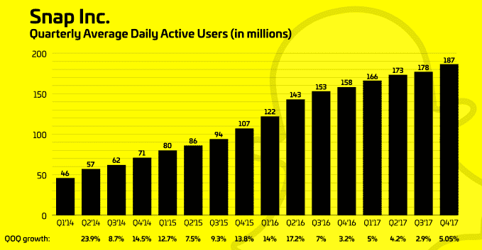
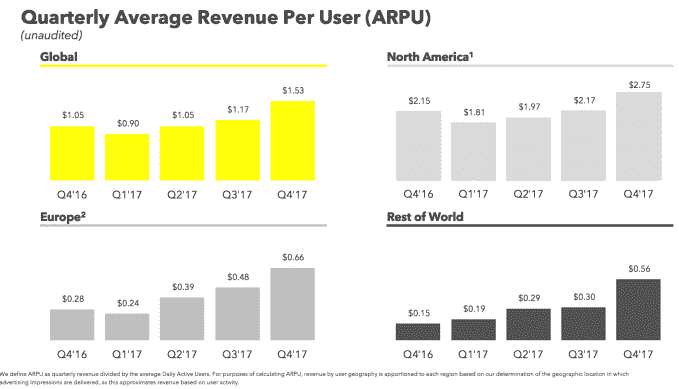

# 随着用户增长的恢复，Snap 股价在首次盈利时飙升

> 原文：<https://web.archive.org/web/https://techcrunch.com/2018/02/06/snap-inc-earnings-q4-2017/>

Snapchat 开始扭转局面，提振其低迷的用户增长率，并首次超出华尔街的预期，今天[发布了一鸣惊人的 2017 年第四季度财报。](https://web.archive.org/web/20230307142250/https://investor.snap.com/~/media/Files/S/Snap-IR/press-release/q4-17-earnings-release.pdf)

它的日活跃用户增加了 890 万，达到 1.87 亿，第四季度的季度环比增长率为 5.05%，而第三季度为 2.9%。这意味着 DAU 的年增长率为 18 %,而脸书为 14%。收入为 2.857 亿美元，同比增长 72%，每股收益调整后为-0.13 美元，而预期为 2.53 亿美元，调整后为-0.16 美元。

它成长的源泉？ **[经过多年的冷落，Snapchat 在发展中国家](https://web.archive.org/web/20230307142250/https://techcrunch.com/2018/02/06/snapchat-international/)赢了。**

Snap 损失了 3.5 亿美元，而上一季度为 4.4 亿美元，运营费用增长到 2.61 亿美元，但现金消耗下降到 2.25 亿美元，比上一季度下降了 49%。这使得 2017 年的亏损总额达到 34.5 亿美元。尽管如此，Snap Inc .的股价今天早些时候收盘上涨约 1.52%，至 14.06 美元。

在盘后交易中，收益公布后，股价立即飙升 26%，随后稳定在 19%的涨幅。华尔街显然乐于看到 Snapchat 的增长率在 Instagram Stories 推出以来的长期下滑后出现复苏。Snap 目前有 20 亿美元现金用于招聘、支出和收购。

## 洛基的重新设计显示了潜力

Snapchat 的[大改版](https://web.archive.org/web/20230307142250/https://techcrunch.com/2017/11/29/snapchat-redesign/)将在 2018 年 Q1 期间覆盖所有用户，目前用户数量为 4000 万。它本应全面推出，但由于在英国、澳大利亚和加拿大等国家的反响不佳而被推迟。在第一批评论更新的用户中，[83%的应用商店评论是负面的](https://web.archive.org/web/20230307142250/https://techcrunch.com/2018/01/11/snapchat-redesign-uninstall/)，理由是混乱的界面，通过故事混入收件箱的广告，以及没有关注你的人被推至发现部分。 我们希望在 Q &答中听到更多关于 [Snapchat 的重大改版](https://web.archive.org/web/20230307142250/https://techcrunch.com/2017/11/29/snapchat-redesign/)

在收益报告的准备发言中，埃文·斯皮格尔承认“我们的社区需要时间来适应”大改版带来的变化。然而，他表示，与旧设计相比，Discover 上的出版商故事增长了 40%，对于 35 岁以上的用户来说，核心指标的增长不成比例，这表明导航简化可能是成功的。

现在，Snapchat 上 97%的照片都是用该公司的相机拍摄的。美国 13 至 34 岁的人中，每周都有超过一半的人在玩 Snapchat 的 ar 镜头。这些统计数据证明了 Snapchat 通过赞助的创意工具编辑和添加增强现实到他们的照片和视频中来赚钱的潜力。与此同时，Snap 表示，2017 年它为其内容合作伙伴赚了 1 亿美元。

Spiegel 解释说，Snapchat 的 Android 应用程序性能的改善使用户保持率比一年前提高了近 20 %,这表明在该公司最初几年忽视 Android 之后，用户保持率有了稳步增长。Snap 还与十几个市场的无线运营商合作，通过数据折扣计划降低 Snapchat 的使用成本。接下来，Snapchat 希望扩展其嵌入式系统，将故事带出应用程序，以便快照可以出现在体育场的大屏幕和其他地方。

## 快照成为真正的业务

投资者听到超过 90%的 Snap 广告是通过程序购买的，肯定很兴奋，所以损害广告价格的向拍卖系统的转变在很大程度上已经成为该公司的过去。Snap 的效率也越来越高，每用户平均收入同比增长 46%，至 1.53 美元，而每用户成本仅增长 2%，至 0.98 美元。

值得注意的是，ARPU 在世界其他地区的发展中国家几乎翻了一番，从 0.30 美元增加到 0.56 美元。这表明 Snapchat 正在研究如何通过较慢的连接向旧手机提供广告，尽管该应用程序依赖于数据密集型视频。本季度，世界其他地区的总收入翻了一番。

Snap 广告展示同比增长 575 %,环比增长 90%。应用安装广告表现尤其出色，表明 Snapchat 可以让手机游戏玩家继续玩下去，而不是下载后就忘记。早在 2013 年，[应用安装广告让脸书建立了一个庞大的移动业务](https://web.archive.org/web/20230307142250/https://techcrunch.com/2013/05/01/facebook-app-install-ads/)，现在他们给了 Snapchat 一个巨大的推动。

收益上的一个瑕疵是 Snap 对第四季度 眼镜的销售保持沉默，尽管在网络上为视频眼镜做了积极的展示广告。它警告说，2018 年 Q1 的销售额将比 2017 年 Q1 的 800 万美元大幅下降，这仍然令人失望。看来 Snap 必须通过软件或增强现实硬件设备来赢得胜利，这种设备不仅仅是把摄像头放在你的脸上。

Snap 的招聘步伐明显放缓，由于效率提高，该公司仅增加了 100 名员工，仅为最近几个季度的三分之一。既然业务引擎已经开始运转，它需要更少的工人来推动。

## 为所有人构建 Snapchat

Snapchat 在第四季度最终修补了漏洞，提高了应用程序的性能和保留率，从发展中国家赚钱，并改变其应用程序以吸引老年用户。

回顾过去，Snapchat [在第四季度以不到 1 亿美元的价格收购了广告技术初创公司 Metamarkets](https://web.archive.org/web/20230307142250/https://techcrunch.com/2017/11/03/snap-metamarkets/) ，这可能有助于它从现有用户中获得更多收入，因为用户总数不再快速增长。Snap 还推出了一个新的[“动手增强现实”广告](https://web.archive.org/web/20230307142250/https://techcrunch.com/2017/11/24/anything-for-arpu/)，在这里你可以与一个品牌的产品互动。但我们可能需要等到 Q1，才能看到这些对收入的影响。Snapchat 预计将在 2018 年产生 11.8 亿美元的美国广告收入，比 2017 年增长 83%。这将使 Snapchat 在美国数字广告市场占有 1.3%的份额。

Snapchat 的新增强现实广告让你与产品互动

与此同时，尽管面临脸书 Instagram 和 WhatsApp 的激烈竞争，Snapchat 一直在竞相推出新功能，以保持用户的忠诚度。Snapchat 推出了 [Bitmoji 3D 世界镜头](https://web.archive.org/web/20230307142250/https://techcrunch.com/2017/09/14/snapchat-brings-bitmoji-to-the-real-world-with-world-lenses/)，你的个性化头像在你的照片中跳舞，并在第四季度推出了用于地理定位艺术的[增强现实平台](https://web.archive.org/web/20230307142250/https://techcrunch.com/2017/10/02/snapchat-art/)。Snapchat 用于创建 AR 体验的新镜头工作室在推出后的六周内已经创建了 3 万个镜头。

随着顶尖人才不断离开公司，让 Snapchat 的克隆大军更具竞争力可能会很困难。[产品副总裁 Tom Conrad](https://web.archive.org/web/20230307142250/https://techcrunch.com/2018/01/24/tom-conrad-leaves-snapchat/) ，首席执行官埃文·斯皮格尔的高级助手之一，继 TimeHop 创始人 Jonathan Wegener 等人之后于一月份离职。今天的股价上涨可能会让受欢迎的科技工作者对它更感兴趣。

总的来说，面对 Instagram 的便利，Snapchat 正在想方设法成为用户不可或缺的一部分。本季度的势头可能有助于它进行必要的招聘、收购和自信的产品变革，以巩固其作为*青少年通讯应用的地位，同时吸引那些在脸书长大的人。*

*关于 Snapchat 如何恢复增长的更多信息，请阅读我们的专题文章: **[“在被忽视多年后，Snapchat 在发展中国家胜出”](https://web.archive.org/web/20230307142250/https://techcrunch.com/2018/02/06/snapchat-international/)***