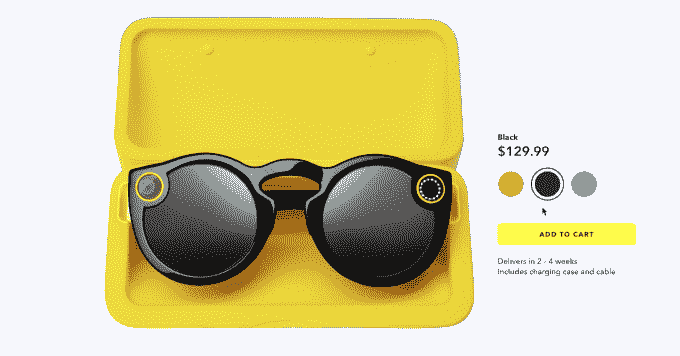

# Snap 售出不到 4.2 万副眼镜，在 Q2 下降了 35%

> 原文：<https://web.archive.org/web/https://techcrunch.com/2017/08/10/snap-spectacles-sales/>

# Snap 售出的眼镜不到 4.2 万副，在 Q2 下降了 35%

Snap 的眼镜太阳镜可能会被证明是一种时尚，而不是一种必备设备。Snap 在 Q2 收益疲软后的电话会议上透露，它产生了 540 万美元的“其他”收入，相当于大约 41，500 副价格为 130 美元的 Spectacles camera 太阳镜。相比之下，Q1 的其他收入为 830 万美元，不到 6.4 万副，这意味着眼镜销售额下降了约 35%。

Snap 最近开始在亚马逊和其他公司的零售店销售[眼镜，比如哈罗德百货，但这些销售要到第三季度收益才会显示出来。早在六月，Snap 就开始在欧洲通过其 Snapbot 自动售货机](https://web.archive.org/web/20221208232621/https://www.amazon.com/Spectacles-by-Snap-Inc-Black/dp/B01N9ECA5B/ref=sr_1_1?ie=UTF8&qid=1500391442&sr=8-1&keywords=snapchat%2Bspectacles&th=1)[在线销售眼镜。这意味着 41，500 辆可能受到了这一扩张的支撑，而美国的销量可能进一步下滑。](https://web.archive.org/web/20221208232621/https://beta.techcrunch.com/2017/06/01/snaps-spectacles-are-now-available-in-europe/)

Snap 可能需要一个完全不同的、配备 AR 的 Spectacles 版本 2 来重振兴趣，或者它可能需要寻找其他相机来销售。它最近以 1.5 亿至 2 亿美元的价格收购了中国悬停自拍无人机制造商 Zero Robotics。消息人士今天告诉 TechCrunch，交易已经完成。但更大的潜力可能在于人们可以放在口袋里的相机，如 360°相机。

【Snap 如何把自己从这个洞里挖出来？查看我们的列表: **[8 种修复 Snapchat 的方法](https://web.archive.org/web/20221208232621/https://beta.techcrunch.com/gallery/oh-snap/)**