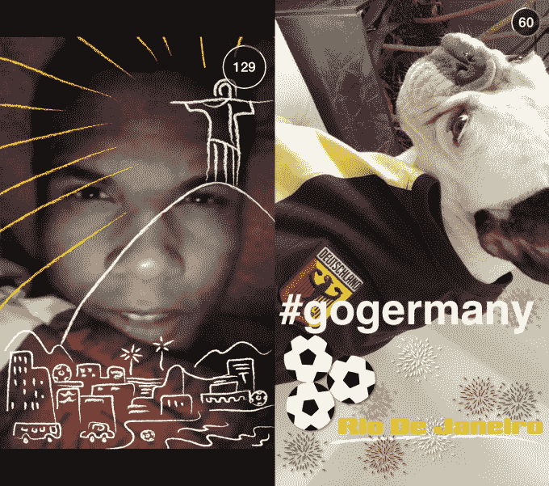

# Snapchat 为快速图像定位标签添加了地理过滤器，并带来了新的收入可能性

> 原文：<https://web.archive.org/web/https://techcrunch.com/2014/07/15/snapchat-adds-geofilters-for-quick-image-location-tags-and-a-new-revenue-possibility/>

# Snapchat 为快速图像定位标签增加了地理过滤器，并带来了新的收入可能性

【YouTube https://www.youtube.com/watch?v=nJx6R5zbIfk&w=480&h=270]

从今天开始，Snapchat 的应用程序增加了一项新功能，将根据您的位置提供特殊的图像过滤器。你需要做的就是在拍照后从预览屏幕向右滑动来激活它们，你会收到一个覆盖在你的照片上的文本或图形标签。Snapchat 在其[官方博客](https://web.archive.org/web/20230326024606/http://blog.snapchat.com/post/91847164170/introducing-geofilters)上表示，基于位置的过滤器最初是专门为洛杉矶和纽约的地点设计的。

这些要求 Snapchat 启用定位服务，但该公司表示不会存储任何用户信息。然而，这项新功能看起来确实像是 Snapchat 的一个潜在收入来源——上面宣传片视频中的一个 geofilters 展示了迪士尼乐园，并展示了一些沉重的主题公园/鼠标耳朵品牌推广。

我们已经联系了 Snapchat，看看他们是否真的已经或计划将 geofilters 货币化，但一位发言人表示，目前的 Geofilters 还没有付费，他们“不能就未来的货币化计划发表评论，但(Snapchat)认为 geo filters 真的很有趣，并对人们发现它们感到兴奋。”

在上面和下面，你可以看到 Snapchat 为洛杉矶和里约热内卢的社区提供的地理围栏过滤器的一些镜头。上面的视频还显示了具有自己过滤器的特定企业和地点，包括 SoulCycle、洛杉矶县艺术博物馆、盖蒂博物馆和迪士尼乐园。

 \ 

