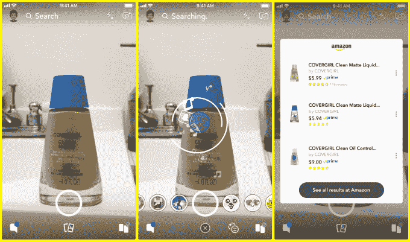

# Snapchat 让你拍下一件物品的照片，然后在亚马逊 TechCrunch 上购买

> 原文：<https://web.archive.org/web/https://techcrunch.com/2018/09/24/snapchat-amazon-visual-search/>

看，拍，卖。在亚马逊罕见的合作中，这家商业巨头将帮助 Snapchat 挑战 Instagram 和 Pinterest 的社交购物霸主地位。今天 Snapchat [宣布](https://web.archive.org/web/20230217015851/https://www.snap.com/en-US/news/post/introducing-visual-search/)它正在慢慢推出一个新的视觉产品搜索功能，证实了[TechCrunch 7 月份关于这个代号为“老鹰”的项目的独家报道](https://web.archive.org/web/20230217015851/https://techcrunch.com/2018/07/09/snapchat-camera-search/)

用户可以使用 Snapchat 的摄像头扫描实物或条形码，这会显示一张卡片，上面显示该商品和类似商品，以及它们的标题、价格、缩略图、平均评论分数和 Prime 可用性。当他们点击一个时，他们将被发送到亚马逊的应用程序或网站购买。Snapchat 会确定你是在扫描一首歌、二维码还是物体，然后亚马逊的机器视觉技术会识别标志、艺术品、包装封面或其他独特的识别标记来找到产品。在 Snap 考虑其他国家之前，它首先向一小部分美国用户推出。

Snap 拒绝透露合作的任何财务条款。它可以为你从亚马逊购买的每样东西赚取推荐费，也可以只是免费做跑腿工作来换取额外的效用。Snapchat 发言人告诉我，后者是动机(不排除前者)，因为 Snapchat 希望其摄像头成为新的光标——你在现实和数字世界之间的接口点。

随着 [Instagram 在 Stories 中推出购物标签，并在 Explore](https://web.archive.org/web/20230217015851/https://techcrunch.com/2018/09/17/instagram-shopping/) 中推出专门的购物频道，社交商务正在升温，而 Pinterest 则开放了 [Shop the Look](https://web.archive.org/web/20230217015851/https://marketingland.com/pinterest-gives-smbs-access-to-shop-the-look-pins-a-free-product-tagging-tool-for-organic-pins-248548) pins，每月点击[2.5 亿](https://web.archive.org/web/20230217015851/https://www.nytimes.com/2018/09/09/technology/pinterest-growth.html)用户。该功能应该很好地适应 Snap 的年轻和文化痴迷的观众。根据 Murphy Research 和 GfK 的研究，在美国，其用户进行移动购物的可能性比非用户高 20 %,冲动购物的可能性高 60%。

该功能的功能类似于 Pinterest 的镜头视觉搜索工具。在上面的视频演示中，你可以看到 Snapchat 识别安德玛的 HOVR 鞋(在其所有其他型号中)，以及 CoverGirl 的清洁哑光液体化妆品的条形码。这与我们根据 TechCrunch 爆料者 [Ishan Agarwal](https://web.archive.org/web/20230217015851/https://twitter.com/IshanAgarwal24) 从 Snapchat 的 Android 应用程序中挖掘出的代码获得的独家消息相吻合。Snapchat 的股价在我们发布该独家新闻的当天上涨了 3%，今天早上再次上涨，之后回落到涨幅的一半。

【T2

当你不知道你正在看的产品的名字时，这个功能会很有用，比如鞋子。这可能会把视觉搜索变成一种新形式的口碑营销，每次一个所有者展示一个产品，他们就有效地为它竖起了一个广告牌。最终，视觉搜索可以帮助用户跨越语言障碍购物。

亚马逊显然对社交伙伴关系越来越感兴趣，认识到自己在这方面的不足。除了被指定为 Snapchat 的官方搜索合作伙伴，它还将把 Alexa 语音控制带到[脸书的门户视频聊天屏幕](https://web.archive.org/web/20230217015851/https://techcrunch.com/2018/08/21/facebook-voice/)，据 Cheddar 的 Alex Heath 报道，该屏幕将于本周[首次亮相。](https://web.archive.org/web/20230217015851/http://cheddar.com/videos/facebooks-portal-video-chat-device-to-be-announced-next-week)

Snapchat 可能需要帮助。现在[正在失去用户和金钱](https://web.archive.org/web/20230217015851/https://techcrunch.com/2018/08/07/snapchat-earnings-q2-2018/)，上个季度日活跃用户从 1.91 亿下降到 1.88 亿，同时烧掉了 3.53 亿美元。合作而不是试图在内部构建所有的技术可以帮助减少财务损失，而增加的效用可以帮助用户增长。如果 Snap 可以说服广告商，他们可能会花钱教育人们如何用 Snapchat 扫描他们的产品。

Snap 一直说它想成为一家“相机公司”，但它实际上是一个增强现实软件层，通过它可以看到世界。问题将是它是否能改变我们的行为，以便当我们看到特殊的东西时，我们通过相机与它互动，而不仅仅是捕捉它。