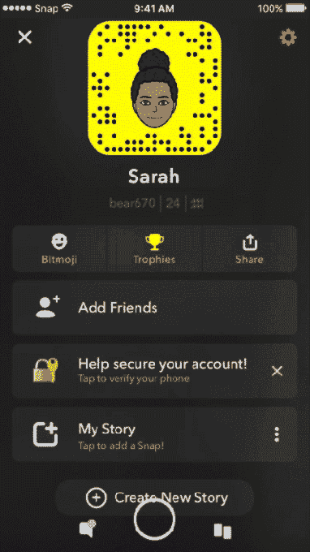
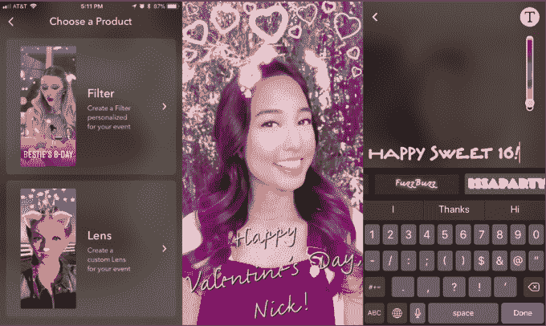
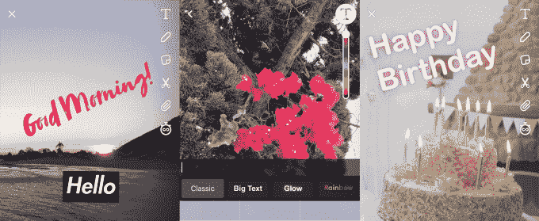

# Snapchat 开始为活动销售 10 美元以上带字幕的 AR 面具 

> 原文：<https://web.archive.org/web/https://techcrunch.com/2018/02/08/snapchat-custom-lenses/>

Snapchat 希望通过将增强现实与您可定制的字幕相结合，您可以分享更多生日和婚礼照片，同时赚点小钱。今天，Snapchat 推出了定制镜头，扩展了其 2016 年–[推出的按需 geofilter 计划](https://web.archive.org/web/20221210002248/https://beta.techcrunch.com/2017/06/28/snapchat-now-lets-you-create-custom-geofilters-right-in-the-app/)，这样你就可以制作临时的地理围栏 AR 效果，人们可以在特殊活动中添加到他们的照片中。[自制镜头制造商](https://web.archive.org/web/20221210002248/https://www.snapchat.com/create)现已在美国的网络和 iOS 应用程序的设置菜单中推出，并将很快在全球和安卓系统上推出。

用户可以从 150 个模板中选择，将动物耳朵、火花或 Snapchat 跳舞热狗添加到他们的脸上。然后他们添加一个自定义标题，如“生日快乐，乔希！”使用我们上周挖掘的 Snapchat 的新字体，包括笔刷、斜体、发光、渐变、彩虹、花式和古英语。然后，他们选择地理围栏，镜头将在 2 万到 500 万平方英尺的地图上可用，选择何时可用，并根据可用的时间和范围付费，价格从 9.99 美元起。

Snapchat 告诉我，这一定价既要让大众买得起，让定制镜头产生收入，又要阻止垃圾邮件和轻率使用该平台。例如，如果你想要一个定制的镜头，在纽约中央公园一整天都可以使用，那么它的价格是 1182 美元。旧金山教会区的一个街区一天的费用是 92 美元。

但真正的机会是 Snapchat 成为特殊场合最独特、最有趣的分享方式。它希望，如果你给客人配备一个预制的定制镜头，他们会使用它，而不是在 Instagram 等竞争应用程序上创建自己的特效。

明确地说，你不是在设计或编码你自己的 ar 体验。想要这样做并把你变成新动物的开发者可以使用去年 12 月推出的 Snapchat 的镜头工作室。如果用户只是想在随机拍摄的照片上使用很酷的新字体，他们现在在 iOS 和 Android 上推出了一个新系统，可以将文本格式化为贴纸，这样你就可以添加多个标题。

现在每天有 7000 万人使用隐形眼镜，平均玩 3 分钟以上，相当于每天玩 500 年。毕竟，彩虹呕吐物和狗耳朵面具让 Snapchat 成为一种文化主食。但自从 Instagram 和脸书添加了自己的 AR 面具后，Snapchat 一直在寻找差异化的方法。

早在 4 月份，我就写过物理世界太大，Snapchat 无法独自用增强现实来填充，而且有太多的方法可以使用 AR，让它自己想出来。如果它想通过自己的 AR 工作室领先于[脸书，它需要众包帮助。现在，在 Snapchat 面向开发者的 Lens Studio、面向用户的定制镜头以及在](https://web.archive.org/web/20221210002248/https://beta.techcrunch.com/2017/12/12/facebook-world-effects/)[一鸣惊人的收益报告](https://web.archive.org/web/20221210002248/https://beta.techcrunch.com/2018/02/06/snap-inc-earnings-q4-2017/)之后的新势头之间，Snapchat 似乎终于准备好反击其克隆产品了。